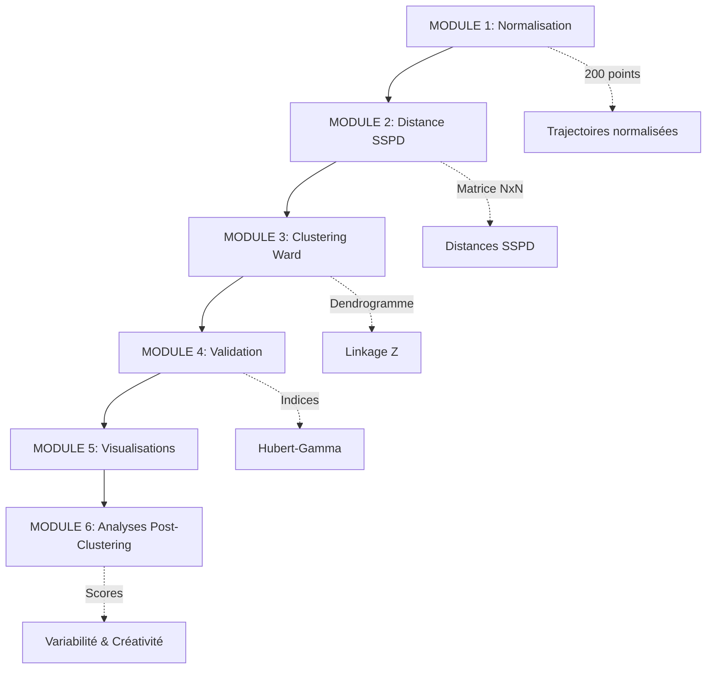
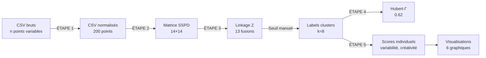

> [!tip] Contexte
> Documentation exhaustive du pipeline V4.0 de clustering hiérarchique pour l'analyse de [[créativité motrice]] en escalade. Ce document explique ligne par ligne la logique, les choix méthodologiques et les implications de chaque module du code.

---

## Vue d'ensemble architecturale

Le pipeline se décompose en **6 modules séquentiels** suivant la méthodologie de [[Rein et al. (2010)]], [[Van Bergen et al. (2025)]], et [[Besse et al. (2016)]].



**Flux de données** :
1. Trajectoires brutes (CSV) → Trajectoires normalisées (200 pts)
2. Trajectoires normalisées → Matrice distances SSPD (N×N)
3. Matrice SSPD → Structure hiérarchique (linkage Z)
4. Structure + seuil → Labels de clusters (1, 2, ..., k)
5. Labels + métadonnées → Scores individuels (variabilité, créativité)

---

## Configuration globale (lignes 1-26)

### Imports et dépendances

```python
import os
import pandas as pd
import numpy as np
from scipy.interpolate import interp1d
from scipy.signal import savgol_filter
import matplotlib.pyplot as plt
from scipy.cluster.hierarchy import linkage, dendrogram, fcluster
from scipy.spatial.distance import squareform
from tqdm import tqdm
```

**Justification des packages** :

| Package                   | Usage                                             | Pourquoi ce choix                               |
| ------------------------- | ------------------------------------------------- | ----------------------------------------------- |
| `pandas`                  | Lecture/écriture CSV                              | Standard pour données tabulaires                |
| `numpy`                   | Calculs matriciels                                | Performance calculs vectorisés                  |
| `scipy.interpolate`       | [[Interpolation cubique]]                         | Préserve forme trajectoire (vs linéaire)        |
| `scipy.signal`            | [[Savitzky-Golay]]                                | Lissage préservant caractéristiques signal      |
| `matplotlib`              | Visualisations                                    | Standard scientifique Python                    |
| `scipy.cluster.hierarchy` | [[Clustering hiérarchique Ward\|Clustering Ward]] | Implémentation référence [[Rein et al. (2010)]] |
| `tqdm`                    | Barres de progression                             | Feedback utilisateur calculs longs              |

### Chemins de travail (lignes 18-21)

```python
DOSSIER_DONNEES = "/Users/julesbelo/Desktop/clustering_escalade_V3/donnees"
DOSSIER_GRAPHIQUES = "/Users/julesbelo/Desktop/clustering_escalade_V3/resultats/graphiques"
DOSSIER_NORMALISES = "/Users/julesbelo/Desktop/clustering_escalade_V3/resultats/trajectoires_normalisees"
DOSSIER_ANALYSES = "/Users/julesbelo/Desktop/clustering_escalade_V3/resultats/analyses"
```

**Organisation fichiers** :

```
clustering_escalade_V3/
├── donnees/                    # Trajectoires brutes (CSV format français)
├── resultats/
│   ├── graphiques/            # Tous les PNG de visualisation
│   ├── trajectoires_normalisees/  # Trajectoires après normalisation
│   └── analyses/              # CSV résultats (clusters, validation, scores)
```

> [!warning] Chemins absolus
> Les chemins sont codés en dur (absolu). Pour portabilité, préférer chemins relatifs :
> ```python
> DOSSIER_BASE = os.path.dirname(os.path.abspath(__file__))
> DOSSIER_DONNEES = os.path.join(DOSSIER_BASE, "donnees")
> ```

### Paramètres de normalisation (lignes 23-26)

```python
N_POINTS = 200              # Nombre de points après rééchantillonnage temporel
LISSAGE_FENETRE = 11        # Taille fenêtre Savitzky-Golay (doit être impair)
LISSAGE_ORDRE = 3           # Ordre du polynôme de lissage
```

**N_POINTS = 200** :
- [[Rein et al. (2010)]] recommandent 50-100 points
- Choix 200 justifié par préservation détails fins (voir [[Limites et Améliorations du Pipeline de Clustering#6. Paramètres de normalisation (N_POINTS=200) non justifiés empiriquement]])
- Implications : 200 points = résolution temporelle 0.5% par point
- Trade-off : Plus de points = plus d'information + plus de bruit + calculs plus lents

**LISSAGE_FENETRE = 11** :
- Fenêtre [[Savitzky-Golay]] DOIT être impaire (contrainte algorithme)
- 11 points sur 200 = 5,5% du signal
- Plus la fenêtre est large → plus le lissage est fort
- Trop large : perte de détails moteurs pertinents
- Trop étroite : bruit résiduel ([[système de capture par LED|tracking LED]] vidéo)

**LISSAGE_ORDRE = 3** :
- Polynôme cubique pour approximation locale
- Ordre 2 (parabolique) = moins précis pour courbes complexes
- Ordre 4+ = risque d'oscillations (surapprentissage local)
- Ordre 3 = standard biomécanique (compromis)

---

## MODULE 1 : Chargement et Normalisation (lignes 28-59)

### Fonction `charger_trajectoire` (lignes 31-41)

```python
def charger_trajectoire(chemin_fichier):
    df = pd.read_csv(chemin_fichier, sep=';', decimal=',')
    
    t = df.iloc[:, 0].values
    x = df.iloc[:, 1].values
    y = df.iloc[:, 2].values
    
    # Extraction sans extension
    nom = os.path.splitext(os.path.basename(chemin_fichier))[0]
    
    return t, x, y, nom
```

**Analyse ligne par ligne** :

**Ligne 32** : `pd.read_csv(chemin_fichier, sep=';', decimal=',')`
- `sep=';'` : Format CSV français (point-virgule comme séparateur)
- `decimal=','` : Virgule comme séparateur décimal (format français)
- Alternative anglo-saxonne : `sep=','`, `decimal='.'`

**Lignes 34-36** : Extraction colonnes par index
- `iloc[:, 0]` = première colonne = **temps** (secondes)
- `iloc[:, 1]` = deuxième colonne = **x** (coordonnée horizontale, pixels)
- `iloc[:, 2]` = troisième colonne = **y** (coordonnée verticale, pixels)
- `.values` convertit Series pandas → array NumPy (plus rapide pour calculs)

**Ligne 39** : Extraction nom fichier
- `os.path.basename()` : extrait nom fichier du chemin complet
  - Ex: `/chemin/vers/E1_P01_BA_F.csv` → `E1_P01_BA_F.csv`
- `os.path.splitext()` : sépare nom et extension
  - Ex: `E1_P01_BA_F.csv` → `('E1_P01_BA_F', '.csv')`
- `[0]` : garde uniquement nom sans extension → `E1_P01_BA_F`

**Format CSV attendu** :

```
temps;x;y
0.000;523.45;187.32
0.017;524.12;186.98
0.033;525.03;186.45
...
```

> [!note] Robustesse
> Fonction suppose toujours 3 colonnes dans cet ordre. Pour plus de robustesse, voir [[Limites et Améliorations du Pipeline de Clustering#2. Extraction participant_id vulnérable aux variations de format]].

---

### Fonction `normaliser_trajectoire` (lignes 44-58)

Cette fonction est le **cœur de la [[normalisation temporelle]]**. Elle transforme trajectoires de durées variables en séquences de longueur fixe.

```python
def normaliser_trajectoire(t, x, y, n_points=N_POINTS, 
                          fenetre_lissage=LISSAGE_FENETRE, 
                          ordre_lissage=LISSAGE_ORDRE):
```

**Paramètres** :
- `t, x, y` : Trajectoire brute (arrays de longueurs variables)
- `n_points` : Résolution cible (défaut 200)
- `fenetre_lissage, ordre_lissage` : Paramètres [[Savitzky-Golay]]

#### ÉTAPE 1 : Rééchantillonnage temporel uniforme (ligne 46)

```python
t_norm = np.linspace(t[0], t[-1], n_points)
```

**Qu'est-ce que cette ligne fait exactement ?**

`np.linspace(start, stop, num)` crée un array de `num` valeurs **également espacées** entre `start` et `stop`.

**Exemple concret** :

```python
# Trajectoire originale : 409 points sur 6.8 secondes
t_original = [0.000, 0.017, 0.033, ..., 6.783]  # 409 valeurs
len(t_original) = 409
duree = t_original[-1] - t_original[0] = 6.783s

# Après normalisation : 200 points également espacés
t_norm = np.linspace(0.000, 6.783, 200)
# Donne : [0.000, 0.034, 0.068, ..., 6.783]
len(t_norm) = 200
espacement = 6.783 / 199 ≈ 0.034s entre chaque point
```

**Conséquence critique** : 
- Les instants temporels normalisés NE correspondent PAS aux instants originaux
- Le point `t_norm[100]` représente "la moitié de la trajectoire" (en temps relatif)
- Pour grimpeur rapide (3s) : `t_norm[100]` = 1.5s absolu
- Pour grimpeur lent (10s) : `t_norm[100]` = 5s absolu

Cette **relativisation temporelle** permet de comparer trajectoires de durées différentes (voir [[normalisation temporelle]]).

#### ÉTAPE 2 : Interpolation cubique (lignes 49-52)

```python
interpolateur_x = interp1d(t, x, kind='cubic')
interpolateur_y = interp1d(t, y, kind='cubic')
x_interp = interpolateur_x(t_norm)
y_interp = interpolateur_y(t_norm)
```

**Qu'est-ce que l'interpolation ?**

On connaît positions `(x, y)` aux instants `t` originaux. On veut estimer positions aux nouveaux instants `t_norm`.

**Interpolation linéaire** (simple mais approximative) :
```
Si t[5]=1.0s → x[5]=100px et t[6]=1.2s → x[6]=110px
Estimer x à t=1.1s : 
x(1.1) ≈ 100 + (110-100) × (1.1-1.0)/(1.2-1.0) = 105px
```

**Interpolation cubique** (utilisée ici, plus précise) :
- Ajuste polynôme degré 3 localement entre points
- Garantit **continuité dérivée** (vitesse) → trajectoire plus fluide
- `kind='cubic'` = spline cubique naturelle

**Fonctionnement** :

1. `interp1d(t, x, kind='cubic')` crée une **fonction interpolatrice**
   - Prend en entrée : temps `t`
   - Retourne : position interpolée `x`

2. `interpolateur_x(t_norm)` **évalue** cette fonction sur tous les points `t_norm`
   - Entrée : array 200 nouveaux instants
   - Sortie : array 200 positions interpolées

**Exemple visuel** :

```
Points originaux (409) :    •     •    •       •   •     •
                            |-----|----|----|---|---|-----|
Temps original (irrégulier) 0    0.5  1.0  1.5 2.0 2.5  3.0

Points interpolés (200) :   • • • • • • • • • • • • • • • •
                            |---|---|---|---|---|---|---|---|
Temps normalisé (régulier)  0  0.38 0.75 1.13 1.5 1.88 2.25 2.63 3.0
```

L'interpolation cubique estime positions aux nouveaux instants en ajustant courbes lisses entre points originaux.

> [!warning] Attention extrapolation
> `interp1d` par défaut refuse d'extrapoler en dehors de `[t[0], t[-1]]`. Si `t_norm` dépasse ces bornes → erreur. C'est pourquoi on utilise `np.linspace(t[0], t[-1], ...)` (même bornes).

#### ÉTAPE 3 : Lissage Savitzky-Golay (lignes 55-56)

```python
x_norm = savgol_filter(x_interp, window_length=fenetre_lissage, polyorder=ordre_lissage)
y_norm = savgol_filter(y_interp, window_length=fenetre_lissage, polyorder=ordre_lissage)
```

**Pourquoi lisser APRÈS interpolation ?**

L'interpolation cubique peut introduire **oscillations parasites** (phénomène de Runge) notamment si données brutes bruitées. Le [[Savitzky-Golay]] "adoucit" ces oscillations.

**Comment fonctionne Savitzky-Golay ?**

Principe : glisser une fenêtre le long du signal, ajuster polynôme localement, remplacer point central par valeur polynôme.

**Étape par étape** avec `window_length=11`, `polyorder=3` :

```
Signal brut :    [95, 98, 102, 105, 108, 110, 112, 115, 118, 120, 123, ...]
                       ↓ Fenêtre centrée sur point 6 (valeur 110)
Fenêtre :        [98, 102, 105, 108, 110, 112, 115, 118, 120, 123, 125]
                  ← 5 à gauche | centre | 5 à droite →

Ajustement polynôme degré 3 sur ces 11 points :
P(x) = a₀ + a₁x + a₂x² + a₃x³

Évaluer P au centre de fenêtre → valeur lissée ≈ 111
Remplacer 110 par 111 dans signal lissé
```

Déplacer fenêtre d'un point vers droite, répéter.

**Avantages vs moyenne mobile simple** :
- Préserve pics et vallées (pas d'aplatissement excessif)
- Maintient phase temporelle (pas de décalage)
- Adapté aux signaux biomécaniques non-stationnaires

**Paramétrage** :
- `window_length=11` : Plus large → lissage plus fort (mais perte détails)
- `polyorder=3` : Ordre 2 insuffisant pour trajectoires complexes, ordre 4+ risque oscillations

> [!tip] Comparaison visuelle
> Le graphique `01_exemple_lissage.png` généré par le code montre l'effet du lissage sur première trajectoire. Vérifier visuellement que le lissage n'efface pas des patterns moteurs pertinents.

**Retour de la fonction** :

```python
return t_norm, x_norm, y_norm
```

Trois arrays de longueur `n_points` (200) :
- `t_norm` : Instants temporels normalisés (régulièrement espacés)
- `x_norm` : Positions x lissées aux instants normalisés
- `y_norm` : Positions y lissées aux instants normalisés

---

## MODULE 2 : Distance SSPD (lignes 60-123)

Le MODULE 2 implémente la **[[SSPD]]** (Symmetrized Segment-Path Distance) de [[Besse et al. (2016)]]. C'est la métrique de dissimilarité entre trajectoires.

### Pourquoi pas distance euclidienne classique ?

**Problème** : Trajectoires normalisées ont même longueur (200 points) MAIS ces points ne correspondent pas aux mêmes instants biomécaniques.

**Exemple** :
- Trajectoire A : point 100/200 = milieu ascension (main droite pose prise)
- Trajectoire B : point 100/200 = milieu ascension (main gauche pose prise)

Distance euclidienne point-à-point :
```python
dist = np.sqrt((xA[100] - xB[100])**2 + (yA[100] - yB[100])**2)
```

Cette distance compare des **instants temporels relatifs identiques** mais des **phases motrices potentiellement différentes**. Inadéquat pour comparer formes de trajectoires.

**Solution SSPD** : Compare chaque point d'une trajectoire à la **trajectoire entière** de l'autre (pas point-à-point).

---

### Fonction `eucl_dist` (lignes 63-64)

```python
def eucl_dist(p1, p2):
    return np.sqrt(np.sum((p1 - p2) ** 2))
```

Distance euclidienne 2D standard entre deux points.

**Décomposition** :
- `p1 - p2` : différence coordonnée par coordonnée → `[Δx, Δy]`
- `(p1 - p2) ** 2` : carré de chaque composante → `[Δx², Δy²]`
- `np.sum(...)` : somme des carrés → `Δx² + Δy²`
- `np.sqrt(...)` : racine carrée → distance euclidienne

**Exemple** :
```python
p1 = np.array([100, 200])  # Point à x=100, y=200
p2 = np.array([103, 204])  # Point à x=103, y=204
d = eucl_dist(p1, p2)
# d = sqrt((103-100)² + (204-200)²) = sqrt(9 + 16) = sqrt(25) = 5.0
```

---

### Fonction `point_to_segment` (lignes 67-76)

Calcule la **distance minimale** d'un point à un segment de droite (pas à un point).

```python
def point_to_segment(point, seg_start, seg_end, dist_to_start, dist_to_end, seg_length):
```

**Contexte géométrique** :

```
Segment [A--------B]
              |
              | distance perpendiculaire
              |
              P (point)
```

Trois cas possibles :
1. Projection de P tombe AVANT A → distance = ||P - A||
2. Projection tombe ENTRE A et B → distance = perpendiculaire
3. Projection tombe APRÈS B → distance = ||P - B||

**Calcul du paramètre de projection t** (lignes 70-71) :

```python
t = np.dot(point - seg_start, seg_end - seg_start) / (seg_length ** 2)
```

**Explication mathématique** :

Le paramètre `t` représente **où** tombe la projection sur le segment (0 = début, 1 = fin).

Formule dérivée du produit scalaire :
```
Vecteur segment : v = seg_end - seg_start
Vecteur point : u = point - seg_start

Projection de u sur v : proj = (u·v / ||v||²) × v

Paramètre t = u·v / ||v||²
```

**Pourquoi diviser par `seg_length²` ?**

`seg_length` = `||v||` = norme du vecteur segment  
`seg_length²` = `||v||²` = norme au carré

Division par norme au carré normalise `t` dans [0, 1] si projection entre A et B.

**Exemple numérique** :

```python
seg_start = np.array([0, 0])   # A
seg_end = np.array([10, 0])    # B (segment horizontal longueur 10)
point = np.array([7, 5])       # P au-dessus du segment

# Vecteur segment
v = seg_end - seg_start = [10, 0]
seg_length = 10
seg_length² = 100

# Vecteur point
u = point - seg_start = [7, 5]

# Produit scalaire
u·v = 7×10 + 5×0 = 70

# Paramètre projection
t = 70 / 100 = 0.7
```

Interprétation : projection tombe à 70% le long du segment (x=7 sur [0,10]).

**Contrainte dans [0,1]** (ligne 73) :

```python
t = max(0, min(1, t))
```

- Si `t < 0` : projection avant A → forcer t=0 (projection = A)
- Si `t > 1` : projection après B → forcer t=1 (projection = B)
- Sinon : garder t (projection entre A et B)

**Calcul point projeté** (ligne 74) :

```python
projection = seg_start + t * (seg_end - seg_start)
```

Interpolation linéaire :
- `t=0` → projection = seg_start
- `t=1` → projection = seg_end
- `t=0.7` → projection = A + 0.7 × (B - A)

**Distance finale** (ligne 76) :

```python
return eucl_dist(point, projection)
```

Distance euclidienne entre point original et sa projection sur segment.

> [!note] Précalculs
> Les paramètres `dist_to_start` et `dist_to_end` sont précalculés mais finalement non utilisés dans cette version. Ils pourraient servir pour optimisations futures (voir [[Limites et Améliorations du Pipeline de Clustering#8. Calcul SSPD non optimisé]]).

---

### Fonction `point_to_trajectory` (lignes 79-94)

Calcule distance minimale d'un **point** à une **trajectoire entière** (polyligne).

```python
def point_to_trajectory(point, trajectory, dists_to_traj, seg_lengths, n_traj):
```

**Logique** :

Une trajectoire = séquence de segments :
```
Trajectoire : P0 --seg0-- P1 --seg1-- P2 --seg2-- ... --segN-1-- PN
```

Distance point → trajectoire = **minimum** des distances point → chaque segment.

**Boucle sur tous les segments** (lignes 82-92) :

```python
min_dist = np.inf  # Initialiser à l'infini
for i in range(n_traj - 1):
    dist = point_to_segment(
        point,
        trajectory[i],      # Début segment i
        trajectory[i + 1],  # Fin segment i
        dists_to_traj[i],
        dists_to_traj[i + 1],
        seg_lengths[i]
    )
    min_dist = min(min_dist, dist)
```

**Exemple visuel** :

```
Trajectoire : A---B---C---D
                \  |  /
                 \ | /
                  \|/
                   P (point)

Distances :
- P → segment AB : 3.2
- P → segment BC : 1.5  ← minimum
- P → segment CD : 4.1

Retour : 1.5
```

**Complexité** : O(n) où n = nombre de points de la trajectoire.

---

### Fonction `e_sspd` (lignes 97-123)

**Cœur de l'algorithme SSPD**. Calcule distance symétrique entre deux trajectoires complètes.

```python
def e_sspd(t1, t2):
```

**Architecture SSPD** :

SSPD = Symmetrized Segment-Path Distance  
= Moyenne de deux distances asymétriques :

1. **SPD(T1 → T2)** : "À quelle distance T1 est-elle de T2 ?"
2. **SPD(T2 → T1)** : "À quelle distance T2 est-elle de T1 ?"

**Pourquoi symétriser ?** (voir [[Besse et al. (2016)]]) :

Les distances SPD sont **asymétriques** si trajectoires ont densités de points différentes.

Exemple :
- T1 : 50 points (trajectoire rapide, peu échantillonnée)
- T2 : 200 points (trajectoire lente, très échantillonnée)

SPD(T1 → T2) ≠ SPD(T2 → T1) car :
- Pour calculer SPD(T1 → T2) : moyenne sur 50 distances (points de T1)
- Pour calculer SPD(T2 → T1) : moyenne sur 200 distances (points de T2)

La **symétrisation** (moyenne des deux) garantit que SSPD(T1, T2) = SSPD(T2, T1).

#### Précalcul longueurs segments (lignes 101-103)

```python
n1, n2 = len(t1), len(t2)

seg_lengths_1 = np.array([eucl_dist(t1[i], t1[i+1]) for i in range(n1-1)])
seg_lengths_2 = np.array([eucl_dist(t2[i], t2[i+1]) for i in range(n2-1)])
```

**Optimisation** : Les longueurs de segments sont utilisées plusieurs fois dans `point_to_segment`. Les précalculer évite recalculs redondants.

Pour trajectoire de 200 points :
- 199 segments
- Sans précalcul : chaque longueur recalculée ×200 fois (dans boucle SPD)
- Avec précalcul : calculée 1 fois → gain ×200

#### Calcul SPD : T1 vers T2 (lignes 106-113)

```python
spd_1to2 = 0
for i in range(n1):
    # Précalculer les distances du point i de T1 à tous les points de T2
    dists = np.array([eucl_dist(t1[i], t2[j]) for j in range(n2)])
    # Ajouter la distance minimale à la trajectoire T2
    spd_1to2 += point_to_trajectory(t1[i], t2, dists, seg_lengths_2, n2)
# Normaliser par le nombre de points
spd_1to2 /= n1
```

**Décomposition** :

Pour **chaque point** de T1 :
1. Calculer distances à **tous points** de T2 (ligne 109)
2. Trouver distance minimale point → **trajectoire entière** T2 (ligne 111)
3. Accumuler cette distance (ligne 111)

Après boucle, **diviser par n1** pour obtenir distance **moyenne**.

**Formule mathématique** :

$$
\text{SPD}(T_1 \to T_2) = \frac{1}{n_1} \sum_{i=1}^{n_1} d(p_i^{T_1}, T_2)
$$

où $d(p_i^{T_1}, T_2)$ = distance du point $i$ de $T_1$ à la trajectoire $T_2$ entière.

**Exemple numérique** :

```python
T1 = 3 points : [(0,0), (1,0), (2,0)]
T2 = 3 points : [(0,1), (1,1), (2,1)]  # Parallèle décalée de 1 vers le haut

# Point 1 de T1 : (0,0)
# Distance à T2 = distance perpendiculaire au segment le plus proche ≈ 1.0

# Point 2 de T1 : (1,0)
# Distance à T2 ≈ 1.0

# Point 3 de T1 : (2,0)
# Distance à T2 ≈ 1.0

SPD(T1 → T2) = (1.0 + 1.0 + 1.0) / 3 = 1.0
```

#### Calcul SPD : T2 vers T1 (lignes 116-120)

```python
spd_2to1 = 0
for j in range(n2):
    dists = np.array([eucl_dist(t2[j], t1[i]) for i in range(n1)])
    spd_2to1 += point_to_trajectory(t2[j], t1, dists, seg_lengths_1, n1)
spd_2to1 /= n2
```

**Identique au calcul précédent**, mais dans l'autre sens :
- Boucle sur points de **T2**
- Calcule distances à **T1**

Si T1 et T2 ont **même densité de points**, SPD(T1→T2) ≈ SPD(T2→T1).  
Sinon, peuvent différer → nécessité de symétriser.

#### Symétrisation finale (ligne 123)

```python
return (spd_1to2 + spd_2to1) / 2
```

**Distance SSPD finale** = moyenne arithmétique des deux distances asymétriques.

Garantit **propriété métrique** : SSPD(T1, T2) = SSPD(T2, T1).

**Complexité totale** :
- Deux boucles : n₁ + n₂ itérations
- Par itération : boucle sur segments (~n points)
- **Total** : O(n₁ × n₂ + n₂ × n₁) = O(n²) si n₁ ≈ n₂ ≈ n

Pour 200 points × 200 points ≈ 40 000 opérations par paire de trajectoires.

---

### Lien vers notes connexes

- [[Protocole V1]] : Document protocole expérimental complet
- [[Rein et al. (2010)]] : Méthodologie clustering Ward + validation
- [[Van Bergen et al. (2025)]] : Application trajectoires escalade
- [[Besse et al. (2016)]] : Distance SSPD détaillée
- [[Limites et Améliorations du Pipeline de Clustering]] : Analyse critique code

---

> [!summary] État documentation
> **✅ Complété** : Configuration, MODULE 1 (Normalisation), MODULE 2 (SSPD)
> **📝 À compléter** : MODULE 3-6, ÉTAPES 1-5 (prochaine session)

**Dernière mise à jour** : 2026-01-24


---

## MODULE 3 : Clustering Hiérarchique Ward (lignes 125-151)

### Fonction `determiner_seuil_manuel` (lignes 128-151)

Implémente la méthode de [[Van Bergen et al. (2025)]] pour déterminer le **seuil de coupure** du [[dendrogramme]].

```python
def determiner_seuil_manuel(Z, noms):
```

**Contexte** : Le [[Clustering hiérarchique Ward|clustering Ward]] produit une structure hiérarchique complète (dendrogramme). Il faut choisir **où couper** l'arbre pour obtenir k clusters.

#### Extraction des hauteurs de fusion (ligne 130)

```python
hauteurs = Z[:, 2]
```

**Qu'est-ce que Z ?**

`Z` est la **linkage matrix** retournée par `scipy.cluster.hierarchy.linkage()`.

Format : array de shape `(n-1, 4)` où n = nombre de trajectoires.

Chaque ligne représente une **fusion** dans le dendrogramme :
```
[cluster_gauche, cluster_droite, hauteur_fusion, nb_elements_nouveau_cluster]
```

**Exemple** :
```python
Z = [
    [3, 5, 1.2, 2],    # Fusion trajectoires 3 et 5 à distance 1.2
    [1, 7, 1.5, 2],    # Fusion trajectoires 1 et 7 à distance 1.5
    [0, 8, 2.1, 3],    # Fusion traj 0 avec cluster 8 à distance 2.1
    ...
]
```

`Z[:, 2]` extrait **troisième colonne** = toutes les hauteurs de fusion.

**Interprétation** :
- Hauteur = **distance Ward** à laquelle fusion se produit
- Hauteurs **croissantes** (Ward fusionne progressivement clusters les plus proches)
- **Saut important** dans hauteurs = frontière naturelle entre clusters

#### Génération diagnostic avec seuil temporaire (lignes 133-135)

```python
seuil_temp = np.median(hauteurs)
tracer_diagnostic(Z, noms, seuil_temp)
```

**Problème** : `tracer_diagnostic()` nécessite un seuil pour calculer k correspondant et tracer ligne verticale. Mais on cherche justement ce seuil !

**Solution pragmatique** : Utiliser **médiane** des hauteurs comme seuil temporaire.
- Médiane = valeur centrale (50% fusions en-dessous, 50% au-dessus)
- Raisonnable comme point de départ pour visualisation

#### Interaction utilisateur (lignes 137-141)

```python
print("Inspecter le graphique 'diagnostic_van_bergen.png'")
print(f"\nPlage des seuils possibles : {hauteurs.min():.2f} - {hauteurs.max():.2f}")
print(f"Suggestion (médiane) : {seuil_temp:.2f}\n")

seuil = float(input("Entrez le seuil choisi manuellement : "))
```

**Workflow** :
1. Script génère graphique diagnostic (voir MODULE 5B)
2. Utilisateur ouvre `diagnostic_van_bergen.png`
3. Identifie visuellement le seuil optimal (voir méthodologie [[Van Bergen et al. (2025)]])
4. Entre valeur dans terminal

**Critères décision visuelle** (Van Bergen) :
- Identifier point où **nombre de clusters** commence à croître rapidement
- ET où **taille du plus grand cluster** fait un saut

Exemple :
```
Seuil    | Nb clusters | Taille max cluster
---------|-------------|-------------------
10.0     | 3           | 150  ← Sous-clustering
12.5     | 8           | 45   ← Équilibré ✓
15.0     | 18          | 12   ← Sur-clustering
20.0     | 35          | 3    ← Fragmentation excessive
```

#### Calcul des statistiques du seuil choisi (lignes 143-149)

```python
labels = fcluster(Z, seuil, criterion='distance')
k = len(np.unique(labels))
taille_max = np.bincount(labels).max()
```

**`fcluster(Z, seuil, criterion='distance')`** :
- Fonction scipy qui "coupe" le dendrogramme à hauteur donnée
- `criterion='distance'` : seuil interprété comme hauteur de fusion
- Retourne : array de labels (1, 2, ..., k) pour chaque trajectoire

**Exemple** :
```python
Z représente :
     15 ─┬─ Cluster A (10 trajectoires)
         │
     12 ─┤
         │
      8 ─┴─ Cluster B (4 trajectoires)

seuil = 12.5 → Coupe au-dessus de fusion à 12
Résultat : 2 clusters
labels = [1,1,1,1,1,1,1,1,1,1, 2,2,2,2]
```

**`len(np.unique(labels))`** :
- `np.unique()` : trouve valeurs uniques dans labels
- Ex: `[1,1,2,1,3,2]` → `[1, 2, 3]`
- `len()` : compte ces valeurs → nombre de clusters k

**`np.bincount(labels).max()`** :
- `np.bincount()` : compte fréquence de chaque valeur
- Ex: `labels = [1,1,1,2,2,3]` → `bincount = [0, 3, 2, 1]`
  - 0 occurrences de 0 (pas utilisé)
  - 3 occurrences de 1
  - 2 occurrences de 2
  - 1 occurrence de 3
- `.max()` : taille du plus grand cluster

#### Affichage rapport (lignes 143-149)

```python
print(f"\n✓ Seuil choisi : {seuil:.3f}")
print(f"  → k = {k} clusters")
print(f"  → Ratio trajectoires/cluster : {n_total/k:.1f}\n")
```

Feedback utilisateur :
- Seuil validé
- Nombre de clusters résultant
- Taille moyenne des clusters (trajectoires réparties équitablement ?)

**Retour** (ligne 151) :

```python
return seuil
```

Seuil sera utilisé plus loin pour extraire labels finaux et générer visualisations.

---

## MODULE 4 : Validation par Hubert-Gamma (lignes 153-187)

### Fonction `calculer_hubert_gamma` (lignes 156-187)

Implémente le **coefficient de Hubert-Γ normalisé** selon [[Rein et al. (2010)]].

#### Principe théorique

Le [[Score de Hubert-Γ|Hubert-Gamma]] mesure **concordance** entre :
1. **Matrice de distances** D (dissimilarité spatiale trajectoires)
2. **Matrice de co-appartenance** Y (appartenance au même cluster)

**Idée** : Un bon clustering groupe trajectoires **proches** ensemble et sépare trajectoires **éloignées**.

**Formule mathématique** :

$$
\Gamma = \frac{1}{M \sigma_D \sigma_Y} \sum_{i<j} (D_{ij} - \mu_D)(Y_{ij} - \mu_Y)
$$

où :
- $M$ = nombre de paires de trajectoires = $n(n-1)/2$
- $D_{ij}$ = distance SSPD entre trajectoires $i$ et $j$
- $Y_{ij}$ = 1 si $i$ et $j$ dans même cluster, 0 sinon
- $\mu_D, \sigma_D$ = moyenne et écart-type des distances
- $\mu_Y, \sigma_Y$ = moyenne et écart-type de co-appartenance

**Interprétation** :
- Γ > 0 : Corrélation positive → bon clustering (proches → même cluster)
- Γ ≈ 0 : Pas de structure
- Γ < 0 : Corrélation négative → mauvais clustering (proches → clusters différents)

#### Construction matrice co-appartenance Y (lignes 159-164)

```python
n = len(labels)

Y = np.zeros((n, n))
for i in range(n):
    for j in range(i+1, n):
        if labels[i] == labels[j]:
            Y[i, j] = Y[j, i] = 1
```

**Logique** :

Matrice symétrique n×n où :
- `Y[i,j] = 1` si trajectoires i et j dans **même cluster**
- `Y[i,j] = 0` sinon

**Exemple** :
```python
labels = [1, 1, 2, 2, 3]

Y = [
  [0, 1, 0, 0, 0],  # Traj 0 (cluster 1) : même cluster que traj 1
  [1, 0, 0, 0, 0],  # Traj 1 (cluster 1)
  [0, 0, 0, 1, 0],  # Traj 2 (cluster 2) : même cluster que traj 3
  [0, 0, 1, 0, 0],  # Traj 3 (cluster 2)
  [0, 0, 0, 0, 0]   # Traj 4 (cluster 3) : seule dans son cluster
]
```

**Optimisation boucle** :
- `range(i+1, n)` : évite paires redondantes (i,j) et (j,i)
- `Y[i, j] = Y[j, i] = 1` : remplir les deux triangles (symétrie)

**Diagonale = 0** : Une trajectoire avec elle-même n'est pas comptée comme paire.

#### Extraction triangle supérieur (ligne 167-169)

```python
indices_sup = np.triu_indices(n, k=1)
d_values = D[indices_sup]
y_values = Y[indices_sup]
```

**Pourquoi extraire triangle supérieur ?**

Matrices D et Y sont **symétriques**. Pour calculer Γ, on veut chaque **paire unique** une seule fois.

**`np.triu_indices(n, k=1)`** :
- Retourne indices du **triangle supérieur** (au-dessus diagonale)
- `k=1` : exclut la diagonale
- Résultat : tuple de 2 arrays (indices lignes, indices colonnes)

**Exemple** :
```python
n = 4
indices_sup = np.triu_indices(4, k=1)
# Retourne : (array([0,0,0,1,1,2]), array([1,2,3,2,3,3]))

# Ces indices correspondent aux paires :
# (0,1), (0,2), (0,3), (1,2), (1,3), (2,3)
```

**`D[indices_sup]`** : Extrait valeurs de D aux indices du triangle supérieur.

Si `D = [[0, 2, 5], [2, 0, 3], [5, 3, 0]]`, alors :
```python
d_values = [2, 5, 3]  # Distances des 3 paires uniques
```

Idem pour `Y`.

#### Calcul statistiques (lignes 172-175)

```python
mu_D = np.mean(d_values)
sigma_D = np.std(d_values)
mu_Y = np.mean(y_values)
sigma_Y = np.std(y_values)
```

**Moyennes** :
- `mu_D` : Distance SSPD moyenne entre toutes paires
- `mu_Y` : Proportion de paires dans même cluster

**Écarts-types** :
- `sigma_D` : Dispersion des distances (hétérogénéité spatiale)
- `sigma_Y` : Dispersion co-appartenance (équilibre clusters)

**Exemple numérique** :
```python
d_values = [1.2, 3.5, 2.8, 1.5, 4.2]  # Distances 5 paires
y_values = [1, 0, 0, 1, 0]             # Co-appartenances

mu_D = (1.2+3.5+2.8+1.5+4.2)/5 = 2.64
sigma_D = std([1.2, 3.5, 2.8, 1.5, 4.2]) ≈ 1.15

mu_Y = (1+0+0+1+0)/5 = 0.4
sigma_Y = std([1, 0, 0, 1, 0]) ≈ 0.49
```

#### Calcul coefficient normalisé (lignes 178-186)

```python
if sigma_D > 0 and sigma_Y > 0:
    numerateur = np.sum((d_values - mu_D) * (y_values - mu_Y))
    M = len(d_values)
    gamma = numerateur / (M * sigma_D * sigma_Y)
else:
    gamma = 0
```

**Formule implémentée** :

$$
\Gamma = \frac{\sum_{paires} (D - \mu_D)(Y - \mu_Y)}{M \cdot \sigma_D \cdot \sigma_Y}
$$

**Décomposition** :

1. **`(d_values - mu_D)`** : Centrer distances (soustraire moyenne)
   - Distance > moyenne → valeur positive
   - Distance < moyenne → valeur négative

2. **`(y_values - mu_Y)`** : Centrer co-appartenances
   - Paire même cluster (Y=1) ET mu_Y<1 → valeur positive
   - Paire clusters différents (Y=0) ET mu_Y>0 → valeur négative

3. **Produit `(D - mu_D) × (Y - mu_Y)`** :
   - Positif si : distance forte ET clusters différents ✓
   - Positif si : distance faible ET même cluster ✓
   - Négatif si : distance forte ET même cluster ✗
   - Négatif si : distance faible ET clusters différents ✗

4. **Somme** : Accumule contributions de toutes paires

5. **Normalisation `M × sigma_D × sigma_Y`** :
   - `M` : Nombre de paires (pour moyenne)
   - `sigma_D × sigma_Y` : Normalise par variabilités (corrélation [-1,1])

**Cas dégénéré** (ligne 185) :

```python
else:
    gamma = 0
```

Si `sigma_D = 0` : Toutes distances identiques → pas de structure spatiale  
Si `sigma_Y = 0` : Toutes trajectoires même cluster OU toutes seules → pas de partition

Dans ces cas, Γ indéfini mathématiquement → convention `gamma = 0`.

**Retour** (ligne 187) :

```python
return gamma
```

Valeur unique : coefficient Hubert-Γ normalisé (typiquement dans [-1, 1]).

---

## MODULE 5A : Visualisations Normalisation (lignes 189-337)

Ces fonctions génèrent **graphiques de contrôle qualité** pour vérifier normalisation.

### Fonction `visualiser_lissage` (lignes 192-286)

Compare trajectoire **avant** et **après** normalisation + lissage.

#### Structure générale (lignes 194-196)

```python
fig, axes = plt.subplots(2, 2, figsize=(16, 12))
```

**`plt.subplots(2, 2)`** : Crée grille 2×2 de sous-graphiques :

```
┌─────────────┬─────────────┐
│ axes[0,0]   │ axes[0,1]   │  ← Ligne 0
├─────────────┼─────────────┤
│ axes[1,0]   │ axes[1,1]   │  ← Ligne 1
└─────────────┴─────────────┘
  Colonne 0     Colonne 1
```

**`figsize=(16, 12)`** : Taille figure en pouces (largeur, hauteur).

#### Panneau 1 : Trajectoire brute (lignes 198-207)

```python
axes[0, 0].plot(x_brut, y_brut, 'o-', alpha=0.6, linewidth=1.5, 
                color='gray', markersize=4)
```

**Paramètres `plot()`** :
- `'o-'` : Style ligne + marqueurs (cercles)
- `alpha=0.6` : Transparence 60% (voir superpositions)
- `linewidth=1.5` : Épaisseur trait
- `color='gray'` : Couleur grise (trajectoire non traitée)
- `markersize=4` : Taille points

**Inversion axe Y** (ligne 203) :

```python
axes[0, 0].invert_yaxis()
```

**Pourquoi ?**

Convention capture vidéo : origine (0,0) = **coin supérieur gauche**.
- y augmente vers le **bas**

Convention graphique habituelle : y augmente vers le **haut**.

`invert_yaxis()` flip l'axe pour que trajectoire s'affiche correctement (grimpeur monte vers haut du graphique).

**Annotation nombre de points** (lignes 204-207) :

```python
axes[0, 0].text(0.02, 0.98, f'n = {len(x_brut)} points', 
                transform=axes[0, 0].transAxes, fontsize=10,
                verticalalignment='top',
                bbox=dict(boxstyle='round', facecolor='wheat', alpha=0.5))
```

`transform=axes[0, 0].transAxes` : Coordonnées **relatives** au graphique.
- (0, 0) = coin inférieur gauche
- (1, 1) = coin supérieur droit
- (0.02, 0.98) = près du coin supérieur gauche

`bbox=dict(...)` : Encadré décoratif autour du texte.

#### Panneau 2 : Trajectoire normalisée + lissée (lignes 209-219)

```python
axes[0, 1].plot(x_norm, y_norm, '-', linewidth=2.5, color='blue')
```

Similaire au panneau 1, mais :
- Pas de marqueurs (juste ligne continue `'-'`)
- Ligne plus épaisse (`2.5`)
- Couleur bleue (indique traitement)

#### Panneau 3 : Interpolation seule (lignes 221-247)

**But** : Montrer effet de l'**interpolation cubique** SANS lissage.

**Recalcul interpolation** (lignes 223-227) :

```python
t_norm_temp = np.linspace(t_brut[0], t_brut[-1], N_POINTS)
interpolateur_x = interp1d(t_brut, x_brut, kind='cubic')
interpolateur_y = interp1d(t_brut, y_brut, kind='cubic')
x_interp_seul = interpolateur_x(t_norm_temp)
y_interp_seul = interpolateur_y(t_norm_temp)
```

Identique à MODULE 1, mais **sans** lissage Savitzky-Golay.

**Superposition** (lignes 229-231) :

```python
axes[1, 0].plot(x_brut, y_brut, 'o', alpha=0.4, color='gray', 
                markersize=3, label='Points originaux')
axes[1, 0].plot(x_interp_seul, y_interp_seul, '-', linewidth=2, 
                color='orange', label='Interpolation cubique')
```

Deux couches :
1. Points originaux (gris transparent)
2. Courbe interpolée (orange)

Permet de voir si interpolation suit fidèlement points originaux ou introduit artefacts.

#### Panneau 4 : Comparaison lissage (lignes 249-271)

**Superposition 3 versions** :

```python
axes[1, 1].plot(x_brut, y_brut, 'o', ...)           # Gris : original
axes[1, 1].plot(x_interp_seul, y_interp_seul, ...) # Orange : interpolé
axes[1, 1].plot(x_norm, y_norm, ...)               # Vert : final (lissé)
```

**Légende** (ligne 269) :

```python
axes[1, 1].legend(loc='best', fontsize=11)
```

`loc='best'` : Matplotlib choisit position optimale (évite masquer données).

#### Sauvegarde figure (lignes 277-279)

```python
plt.tight_layout()
plt.savefig(os.path.join(DOSSIER_GRAPHIQUES, '01_exemple_lissage.png'), 
            dpi=200, bbox_inches='tight')
plt.close()
```

**`plt.tight_layout()`** : Ajuste espacements automatiquement (évite chevauchements).

**`dpi=200`** : Résolution 200 dots per inch (haute qualité).

**`bbox_inches='tight'`** : Recadre pour éliminer marges blanches excessives.

**`plt.close()`** : Libère mémoire (important si génération de nombreux graphiques).

---

### Fonction `visualiser_toutes_trajectoires` (lignes 288-337)

Génère vue d'ensemble de **toutes** les trajectoires sur un seul graphique.

#### Colormap automatique (lignes 303-304)

```python
colors = plt.cm.tab20(np.linspace(0, 1, n_traj))
```

**`plt.cm.tab20`** : Palette de 20 couleurs distinctes.

**`np.linspace(0, 1, n_traj)`** : Crée `n_traj` valeurs entre 0 et 1.
- Ex: 14 trajectoires → [0.0, 0.077, 0.154, ..., 1.0]

**`tab20(valeur)`** : Convertit valeur [0,1] en couleur RGB.

Résultat : Chaque trajectoire a couleur unique (dans limite 20 couleurs, après ça recycle).

#### Boucle tracé (lignes 306-325)

```python
for i, (x, y) in enumerate(trajectoires):
```

**`enumerate()`** : Donne index `i` et contenu `(x, y)` de chaque trajectoire.

**Extraction participant et condition** (lignes 307-308) :

```python
participant = noms[i].split('_')[1]  # Ex: 'P01'
condition = noms[i].split('_')[3]     # Ex: 'F' ou 'NF'
```

**Hypothèse format** : `E{essai}_P{id}_BA_{condition}.csv`

**Style conditionnel** (lignes 310-316) :

```python
if condition == 'F':
    style = '--'  # Ligne pointillée (fatigue)
    alpha_val = 0.7
else:
    style = '-'   # Ligne continue (non-fatigue)
    alpha_val = 0.9
```

**Distinction visuelle** :
- Fatigue (F) : ligne discontinue, plus transparente
- Non-fatigue (NF) : ligne continue, plus opaque

**Tracé** (lignes 318-321) :

```python
plt.plot(x, y, linestyle=style, linewidth=2, alpha=alpha_val,
         color=colors[i], 
         label=f'{noms[i]} ({participant}, {condition})')
```

**Légende conditionnelle** (lignes 323-325) :

```python
if n_traj <= 20:
    plt.legend(bbox_to_anchor=(1.05, 1), loc='upper left', fontsize=9)
```

Si ≤20 trajectoires : afficher légende (lisible).  
Si >20 : pas de légende (trop encombrée).

**`bbox_to_anchor=(1.05, 1)`** : Place légende **à droite** du graphique.

---

## MODULE 5B : Visualisations Clustering (lignes 339-776)

### Fonction `tracer_diagnostic` (lignes 342-432)

Génère le **graphique double-courbe** de [[Van Bergen et al. (2025)]] pour choisir seuil optimal.

#### Structure double axe Y (lignes 349-350)

```python
fig, ax1 = plt.subplots(figsize=(14, 8))
ax2 = ax1.twinx()
```

**`twinx()`** : Crée deuxième axe Y **partageant même axe X**.

Permet de tracer deux métriques d'échelles différentes :
- Axe Y gauche (ax1) : Nombre de clusters [2-30]
- Axe Y droite (ax2) : Taille plus grand cluster [1-200]

#### Calcul évolution métriques (lignes 352-381)

**Boucle sur plage de seuils** (lignes 355-357) :

```python
seuils_test = np.linspace(hauteurs.min(), hauteurs.max(), 200)
```

Teste 200 valeurs de seuil uniformément réparties entre min et max des hauteurs Ward.

**Pourquoi 200 valeurs ?** Compromis résolution/temps calcul.
- Plus de valeurs → courbe plus lisse
- Moins de valeurs → courbe anguleuse

**Calcul pour chaque seuil** (lignes 359-368) :

```python
for seuil_test in seuils_test:
    labels_test = fcluster(Z, seuil_test, criterion='distance')
    
    k_clusters = len(np.unique(labels_test))
    nb_clusters.append(k_clusters)
    
    tailles_clusters = np.bincount(labels_test)
    taille_max_cluster.append(tailles_clusters.max())
    
    seuils.append(seuil_test)
```

Pour chaque seuil :
1. Extraire clusters (`fcluster`)
2. Compter nombre de clusters
3. Trouver taille du plus grand cluster
4. Stocker résultats

**Résultat** : 3 listes de 200 valeurs alignées.

#### Tracé courbes (lignes 371-383)

**Courbe 1 : Nombre de clusters** (lignes 371-373) :

```python
line1 = ax1.plot(seuils, nb_clusters, 'b-', linewidth=2.5, 
                 label='Nombre de clusters', marker='o', markersize=3)
```

- Couleur bleue (`'b-'`)
- Marqueurs ronds petits
- Axe Y gauche

**Courbe 2 : Taille max cluster** (lignes 374-376) :

```python
line2 = ax2.plot(seuils, taille_max_cluster, 'g-', linewidth=2.5, 
                 label='Taille du plus grand cluster', marker='s', markersize=3)
```

- Couleur verte (`'g-'`)
- Marqueurs carrés (`'s'`)
- Axe Y droite

**Ligne seuil choisi** (lignes 378-379) :

```python
ax1.axvline(seuil, color='red', linestyle='--', linewidth=2, 
            label=f'Seuil={seuil:.3f}')
```

Ligne verticale rouge à position `seuil` (choisi par utilisateur).

#### Annotations diagnostic (lignes 385-399)

**Calcul métriques au seuil choisi** (lignes 385-388) :

```python
labels_choisi = fcluster(Z, seuil, criterion='distance')
k_choisi = len(np.unique(labels_choisi))
taille_max_choisi = np.bincount(labels_choisi).max()
ratio_choisi = n_total / k_choisi
```

**Annotation texte** (lignes 390-397) :

```python
annotation_text = f"""DIAGNOSTIC AU SEUIL {seuil:.2f}
────────────────────────
k = {k_choisi} clusters
Taille max cluster : {taille_max_choisi}
Ratio traj/cluster : {ratio_choisi:.1f}
"""
ax1.text(0.02, 0.98, annotation_text, ...)
```

**`transform=ax1.transAxes`** : Coordonnées relatives (comme précédemment).

Résumé des métriques affiché dans coin supérieur gauche du graphique.

---

### Fonction `tracer_dendrogramme` (lignes 435-488)

Génère le [[dendrogramme]] (arbre hiérarchique du clustering).

#### Génération dendrogramme scipy (lignes 444-453)

```python
plt.figure(figsize=(max(18, n_traj * 0.4), 10))

dend = dendrogram(
    Z,
    labels=noms,
    leaf_font_size=9,
    color_threshold=seuil,
    above_threshold_color='gray'
)
```

**`dendrogram()`** : Fonction scipy qui trace l'arbre.

**Paramètres** :
- `Z` : Linkage matrix (structure hiérarchique)
- `labels=noms` : Étiquettes feuilles (noms fichiers trajectoires)
- `leaf_font_size=9` : Taille police labels
- `color_threshold=seuil` : Hauteur pour changement couleur
- `above_threshold_color='gray'` : Couleur branches au-dessus seuil

**Effet coloration** :
- Branches **en-dessous** seuil : couleurs distinctes par cluster
- Branches **au-dessus** seuil : toutes grises (fusions non retenues)

**Largeur dynamique** (ligne 444) :

```python
figsize=(max(18, n_traj * 0.4), 10)
```

Largeur augmente avec nombre de trajectoires (0.4 pouces par trajectoire, minimum 18).

Pour 14 trajectoires : `max(18, 14×0.4) = max(18, 5.6) = 18` pouces.  
Pour 100 trajectoires : `max(18, 100×0.4) = 40` pouces.

---

## MODULE 6 : Analyses Post-Clustering (lignes 618-776)

Ce module calcule les **scores individuels** de [[variabilité fonctionnelle]] et [[créativité motrice]] selon [[Van Bergen et al. (2025)]].

### Fonction `calculer_variabilite_participants` (lignes 621-670)

Calcule **variabilité fonctionnelle** = nombre de clusters distincts explorés par participant.

#### Regroupement par participant (lignes 629-638)

```python
participants_clusters = {}

for i, nom in enumerate(noms):
    participant_id = nom.split('_')[1]  # Extrait 'P01' de 'E1_P01_BA_F'
    cluster_id = labels[i]
    
    if participant_id not in participants_clusters:
        participants_clusters[participant_id] = set()
    
    participants_clusters[participant_id].add(cluster_id)
```

**Structure résultat** :

```python
participants_clusters = {
    'P01': {1, 3, 5},      # P01 a utilisé clusters 1, 3, 5
    'P02': {2, 5, 7, 9}    # P02 a utilisé clusters 2, 5, 7, 9
}
```

**`set()`** : Structure ensemble (pas de doublons, ordre non important).

Avantage : Ajouts successifs d'un même cluster n'augmentent pas la taille.

#### Calcul variabilité (lignes 640-642)

```python
variabilite = {participant_id: len(clusters_set) 
               for participant_id, clusters_set in participants_clusters.items()}
```

**Compréhension de dictionnaire** équivalente à :

```python
variabilite = {}
for participant_id, clusters_set in participants_clusters.items():
    variabilite[participant_id] = len(clusters_set)
```

**Résultat** :

```python
variabilite = {
    'P01': 3,  # 3 clusters distincts
    'P02': 4   # 4 clusters distincts
}
```

**Interprétation** : Score élevé = large répertoire moteur (exploration variée).

---

### Fonction `calculer_prevalence_clusters` (lignes 673-707)

Calcule **prévalence** de chaque cluster = fréquence d'utilisation.

#### Comptage occurrences (lignes 680-684)

```python
comptage_clusters = {}
for cluster_id in labels:
    comptage_clusters[cluster_id] = comptage_clusters.get(cluster_id, 0) + 1
```

**`.get(cluster_id, 0)`** : Retourne compteur si existe, sinon 0.

Équivalent à :

```python
if cluster_id not in comptage_clusters:
    comptage_clusters[cluster_id] = 0
comptage_clusters[cluster_id] += 1
```

**Résultat** :

```python
comptage_clusters = {
    1: 8,   # Cluster 1 utilisé 8 fois
    2: 3,   # Cluster 2 utilisé 3 fois
    3: 12,  # Cluster 3 utilisé 12 fois
    ...
}
```

#### Normalisation prévalence (lignes 686-688)

```python
n_total = len(labels)
prevalence = {cluster_id: count / n_total 
              for cluster_id, count in comptage_clusters.items()}
```

**Normalisation par total** :

```python
prevalence = {
    1: 8/14 = 0.571,   # 57.1% des trajectoires
    2: 3/14 = 0.214,   # 21.4%
    3: 12/14 = 0.857,  # 85.7% (très fréquent)
    ...
}
```

**Interprétation** : Prévalence élevée = pattern moteur **commun**.

#### Calcul originalité (lignes 690-692)

```python
originalite = {cluster_id: 1 - prev 
               for cluster_id, prev in prevalence.items()}
```

**Originalité = inverse de prévalence** :

```python
originalite = {
    1: 1 - 0.571 = 0.429,   # Modérément original
    2: 1 - 0.214 = 0.786,   # Très original (rare)
    3: 1 - 0.857 = 0.143,   # Peu original (commun)
    ...
}
```

**Logique** :
- Cluster rare (faible prévalence) → haute originalité
- Cluster fréquent (haute prévalence) → faible originalité

---

### Fonction `calculer_creativite_participants` (lignes 710-770)

Calcule **créativité** = moyenne pondérée des originalités des clusters utilisés.

#### Formule créativité (Van Bergen) :

$$
\text{Créativité}_p = \frac{1}{N_p} \sum_{c \in C_p} \text{Originalité}_c
$$

où :
- $N_p$ = nombre de trajectoires du participant
- $C_p$ = ensemble des clusters utilisés par participant
- $\text{Originalité}_c$ = score d'originalité du cluster $c$

#### Regroupement par participant (lignes 719-729)

```python
participants_essais = {}
participants_originalites = {}

for i, nom in enumerate(noms):
    participant_id = nom.split('_')[1]
    cluster_id = labels[i]
    
    if participant_id not in participants_essais:
        participants_essais[participant_id] = []
        participants_originalites[participant_id] = []
    
    participants_essais[participant_id].append(nom)
    participants_originalites[participant_id].append(originalite[cluster_id])
```

**Structure résultat** :

```python
participants_essais = {
    'P01': ['E1_P01_BA_F', 'E2_P01_BA_F', 'E3_P01_BA_NF'],
    'P02': ['E1_P02_BA_F', 'E2_P02_BA_NF']
}

participants_originalites = {
    'P01': [0.429, 0.786, 0.429],  # Originalités des clusters utilisés
    'P02': [0.143, 0.786]
}
```

#### Calcul score créativité (lignes 731-735)

```python
creativite = {}
for participant_id in participants_essais.keys():
    originalites_list = participants_originalites[participant_id]
    score_creativite = np.mean(originalites_list)
    creativite[participant_id] = score_creativite
```

**Moyenne arithmétique** des originalités :

```python
creativite = {
    'P01': mean([0.429, 0.786, 0.429]) = 0.548,
    'P02': mean([0.143, 0.786]) = 0.465
}
```

**Interprétation** :
- P01 (0.548) > P02 (0.465) → P01 plus créatif
- P01 a utilisé davantage de clusters originaux

---

### Liens vers notes connexes

- [[Protocole V1]] : Document protocole expérimental complet
- [[Rein et al. (2010)]] : Méthodologie clustering Ward + validation
- [[Van Bergen et al. (2025)]] : Application trajectoires escalade + scores créativité
- [[Besse et al. (2016)]] : Distance SSPD détaillée
- [[Limites et Améliorations du Pipeline de Clustering]] : Analyse critique code
- [[normalisation temporelle]] : Détails technique normalisation
- [[Score de Hubert-Γ]] : Explication coefficient validation
- [[Clustering hiérarchique Ward]] : Méthode clustering utilisée
- [[SSPD]] : Métrique distance trajectoires
- [[Savitzky-Golay]] : Algorithme lissage
- [[créativité motrice]] : Concept théorique central
- [[variabilité fonctionnelle]] : Mesure répertoire moteur

---

> [!summary] État documentation
> **✅ Complété** : Configuration, MODULES 1-6 complets
> **📝 À compléter** : ÉTAPES 1-5 (exécution pipeline) - prochaine session

**Dernière mise à jour** : 2026-01-24


---

## ÉTAPE 1 : Normalisation des Trajectoires (lignes 781-833)

### Initialisation (lignes 783-791)

```python
print(f"\n{'='*60}")
print("ÉTAPE 1 : NORMALISATION DES TRAJECTOIRES")
print(f"{'='*60}\n")

fichiers = sorted([f for f in os.listdir(DOSSIER_DONNEES) 
                   if f.endswith('.csv') and not f.startswith('.')])

print(f"Fichiers trouvés : {len(fichiers)}\n")
```

**`os.listdir(DOSSIER_DONNEES)`** : Liste tous fichiers dans dossier.

**Filtres** :
- `f.endswith('.csv')` : Garder uniquement CSV
- `not f.startswith('.')` : Exclure fichiers cachés (`.DS_Store` sur Mac)

**`sorted()`** : Tri alphabétique (garantit ordre reproductible).

**Exemple output** :
```
============================================================
ÉTAPE 1 : NORMALISATION DES TRAJECTOIRES
============================================================

Fichiers trouvés : 14
```

### Structures de stockage (lignes 794-796)

```python
trajectoires_brutes = []
trajectoires_norm = []
noms_traj = []
```

Trois listes pour stocker résultats intermédiaires :
- `trajectoires_brutes` : Coordonnées (x, y) originales pour visualisation comparative
- `trajectoires_norm` : Coordonnées (x, y) après normalisation pour visualisation finale
- `noms_traj` : Noms fichiers pour légendes graphiques

**Pourquoi stocker deux versions ?**

Nécessaire pour générer graphiques de comparaison avant/après normalisation (voir `visualiser_toutes_trajectoires`).

### Création dossier sortie (lignes 798)

```python
os.makedirs(DOSSIER_NORMALISES, exist_ok=True)
```

**`os.makedirs(path, exist_ok=True)`** :
- Crée dossier `trajectoires_normalisees/` s'il n'existe pas
- `exist_ok=True` : Pas d'erreur si dossier existe déjà

**Alternative sans exist_ok** :
```python
if not os.path.exists(DOSSIER_NORMALISES):
    os.makedirs(DOSSIER_NORMALISES)
```

### Boucle normalisation (lignes 799-824)

```python
for i, fichier in enumerate(fichiers, 1):
```

**`enumerate(..., 1)`** : Index commence à 1 (pour affichage "1/14, 2/14...").

Par défaut `enumerate()` commence à 0 :
```python
enumerate(['a', 'b', 'c'])      → (0,'a'), (1,'b'), (2,'c')
enumerate(['a', 'b', 'c'], 1)   → (1,'a'), (2,'b'), (3,'c')
```

#### Chargement trajectoire brute (lignes 800-802)

```python
chemin = os.path.join(DOSSIER_DONNEES, fichier)
t, x, y, nom = charger_trajectoire(chemin)
```

**`os.path.join()`** : Construit chemin portable (fonctionne Windows/Mac/Linux).

Exemple :
```python
# Mac/Linux
os.path.join('/Users/data', 'E1_P01_BA_F.csv')
→ '/Users/data/E1_P01_BA_F.csv'

# Windows
os.path.join('C:\\Users\\data', 'E1_P01_BA_F.csv')
→ 'C:\\Users\\data\\E1_P01_BA_F.csv'
```

Appelle `charger_trajectoire()` (MODULE 1) qui retourne :
- `t` : array temps (n points variables)
- `x, y` : arrays coordonnées (n points)
- `nom` : nom fichier sans extension

#### Stockage version brute (lignes 804-806)

```python
trajectoires_brutes.append((x, y))
noms_traj.append(nom)
```

Sauvegarde coordonnées originales avant transformation.

**Pourquoi tuple `(x, y)` ?**

Format compact et immuable. Alternative liste `[x, y]` fonctionnerait aussi.

#### Normalisation (lignes 809)

```python
t_norm, x_norm, y_norm = normaliser_trajectoire(t, x, y)
```

Appelle `normaliser_trajectoire()` (MODULE 1) qui effectue :
1. Rééchantillonnage temporel → 200 points équidistants
2. Interpolation cubique → positions aux nouveaux instants
3. Lissage Savitzky-Golay → atténuation bruit

**Transformation** :
```
Entrée  : t (409 pts), x (409 pts), y (409 pts)
          ↓
Sortie  : t_norm (200 pts), x_norm (200 pts), y_norm (200 pts)
```

#### Sauvegarde trajectoire normalisée (lignes 812-818)

```python
df_norm = pd.DataFrame({'t': t_norm, 'x': x_norm, 'y': y_norm})
chemin_sortie = os.path.join(DOSSIER_NORMALISES, f"{nom}_norm.csv")
df_norm.to_csv(chemin_sortie, index=False)

trajectoires_norm.append((x_norm, y_norm))
```

**Sauvegarde CSV** :
- Crée DataFrame pandas avec 3 colonnes
- Sauvegarde dans `trajectoires_normalisees/`
- `index=False` : Pas de colonne numéro de ligne

**Format fichier sortie** :
```
t,x,y
0.000000,523.450000,187.320000
0.034116,524.120000,186.980000
0.068232,525.030000,186.450000
...
```

**Pourquoi sauvegarder sur disque ?**

Permet de :
- Reprendre pipeline à ÉTAPE 2 sans recalculer normalisation
- Inspecter manuellement trajectoires normalisées
- Archiver versions intermédiaires

#### Visualisation première trajectoire (lignes 820-822)

```python
if i == 1:
    visualiser_lissage(t, x, y, t_norm, x_norm, y_norm, nom)
```

**Condition `i == 1`** : Génère graphique détaillé **uniquement pour première** trajectoire.

**Pourquoi pas toutes ?**
- Éviter 14 graphiques identiques (processus est le même)
- Première trajectoire = échantillon représentatif

Appelle `visualiser_lissage()` (MODULE 5A) qui génère figure 2×2 montrant :
1. Trajectoire brute
2. Trajectoire normalisée finale
3. Effet interpolation seule
4. Comparaison 3 versions

#### Affichage progression (ligne 824)

```python
print(f"[{i:2d}/{len(fichiers)}] {nom:30s} | {len(t):3d}→{N_POINTS} pts | ✓")
```

**Formatage aligné** :

| Code | Signification | Exemple |
|------|---------------|---------|
| `{i:2d}` | Entier aligné droite sur 2 caractères | ` 1`, `14` |
| `{nom:30s}` | String alignée gauche sur 30 caractères | `E1_P01_BA_F                  ` |
| `{len(t):3d}` | Entier aligné droite sur 3 caractères | `409`, ` 87` |

**Résultat terminal** :
```
[ 1/14] E1_P01_BA_F                   | 409→200 pts | ✓
[ 2/14] E1_P01_BA_NF                  | 387→200 pts | ✓
[ 3/14] E1_P02_BA_F                   | 521→200 pts | ✓
...
[14/14] E2_P02_BA_NF                  | 442→200 pts | ✓
```

### Visualisations comparatives finales (lignes 827-833)

```python
print("\nGénération des visualisations comparatives...")

visualiser_toutes_trajectoires(trajectoires_brutes, noms_traj, 
                               "Trajectoires brutes (avant normalisation)",
                               "00bis_trajectoires_brutes.png", normalise=False)

visualiser_toutes_trajectoires(trajectoires_norm, noms_traj,
                               "Trajectoires normalisées (après lissage)",
                               "00bis_trajectoires_normalisees.png", normalise=True)
```

**Deux graphiques générés** :

1. **`00bis_trajectoires_brutes.png`** :
   - Toutes trajectoires superposées (longueurs variables)
   - Montre hétérogénéité temporelle
   - Bruit visible

2. **`00bis_trajectoires_normalisees.png`** :
   - Toutes trajectoires à 200 points
   - Formes lissées
   - Comparables visuellement

**Paramètre `normalise`** : Utilisé pour ajuster titres/labels selon contexte.

---

## ÉTAPE 2 : Calcul Matrice SSPD (lignes 835-883)

### Initialisation (lignes 837-841)

```python
print(f"\n{'='*60}")
print("ÉTAPE 2 : CALCUL DE LA MATRICE DE DISTANCES (SSPD)")
print(f"{'='*60}\n")
```

Séparateur visuel dans terminal pour structurer output.

### Chargement trajectoires normalisées (lignes 842-861)

```python
fichiers_norm = sorted([f for f in os.listdir(DOSSIER_NORMALISES) 
                        if f.endswith('_norm.csv')])
n_traj = len(fichiers_norm)

trajectoires = []
noms = []

for fichier in fichiers_norm:
    chemin = os.path.join(DOSSIER_NORMALISES, fichier)
    df = pd.read_csv(chemin)
    
    traj = df[['x', 'y']].values
    trajectoires.append(traj)
    
    nom = fichier.replace('_norm.csv', '')
    noms.append(nom)
    
    print(f"  ✓ {nom} : shape {traj.shape}")
```

**Pourquoi recharger depuis CSV ?**

Pipeline modulaire : ÉTAPE 2 peut être exécutée **indépendamment** si trajectoires normalisées déjà sauvegardées.

**Avantages approche modulaire** :
- Évite relancer ÉTAPE 1 (longue) pour tester différents paramètres SSPD
- Permet parallélisation (normaliser sur machine 1, SSPD sur machine 2)
- Facilite débogage (isoler problèmes par étape)

**`df[['x', 'y']].values`** :
- Double crochet `[[...]]` : Sélectionne **plusieurs** colonnes (retourne DataFrame)
- Simple crochet `['x']` : Sélectionne **une** colonne (retourne Series)
- `.values` : Convertit DataFrame → array NumPy

**Format résultat** :

```python
traj = array([
    [x1, y1],
    [x2, y2],
    ...
    [x200, y200]
])  # Shape (200, 2)
```

**Output terminal** :
```
  ✓ E1_P01_BA_F : shape (200, 2)
  ✓ E1_P01_BA_NF : shape (200, 2)
  ✓ E1_P02_BA_F : shape (200, 2)
  ...
```

Vérification visuelle que toutes trajectoires ont bien 200 points et 2 dimensions.

### Initialisation matrice distances (lignes 864-865)

```python
D = np.zeros((n_traj, n_traj))
total_calculs = n_traj * (n_traj - 1) // 2
```

**Matrice symétrique** n×n initialisée à zéro.

**Propriétés matrice distances** :
- Diagonale = 0 (distance trajectoire à elle-même)
- Symétrique : `D[i,j] = D[j,i]`
- Triangulaire supérieure suffit (on calcule seulement moitié)

**Calcul nombre de paires** :

Pour n trajectoires, nombre de paires uniques (sans ordre) :

$$
\binom{n}{2} = \frac{n(n-1)}{2}
$$

**`//`** : Division entière (arrondi vers bas).

**Exemples** :
- n=14 : `14 × 13 / 2 = 91` paires
- n=30 : `30 × 29 / 2 = 435` paires
- n=600 : `600 × 599 / 2 = 179,700` paires

### Calcul SSPD avec barre progression (lignes 867-875)

```python
print(f"Calcul SSPD pour {total_calculs} paires de trajectoires...")

with tqdm(total=total_calculs, desc="Matrice SSPD", ncols=80, unit=" paires") as pbar:
    for i in range(n_traj):
        for j in range(i + 1, n_traj):
            D[i, j] = e_sspd(trajectoires[i], trajectoires[j])
            D[j, i] = D[i, j]
            pbar.update(1)
```

#### Gestionnaire contexte `with tqdm(...)`

**`with`** : Gestionnaire de contexte Python qui garantit :
- Initialisation ressource (barre progression)
- Libération propre à la fin (même si erreur)

Équivalent sans `with` :
```python
pbar = tqdm(...)
try:
    # code
    pbar.update(1)
finally:
    pbar.close()  # Toujours exécuté
```

#### Paramètres barre progression

| Paramètre | Valeur | Signification |
|-----------|--------|---------------|
| `total` | `total_calculs` | Nombre total itérations (91) |
| `desc` | `"Matrice SSPD"` | Description affichée |
| `ncols` | `80` | Largeur barre (caractères) |
| `unit` | `" paires"` | Unité affichée |

**Affichage terminal dynamique** :

```
Calcul SSPD pour 91 paires de trajectoires...
Matrice SSPD:  45/91 [00:23<00:18,  2.5 paires/s]
              ↑     ↑        ↑         ↑
            actuel total  temps    vitesse
                         écoulé    
                         <restant
```

Barre se met à jour en temps réel (écrase ligne précédente avec `\r`).

#### Boucle triangulaire optimisée

```python
for i in range(n_traj):
    for j in range(i + 1, n_traj):
```

**`j in range(i + 1, n_traj)`** : j toujours **strictement supérieur** à i.

**Pourquoi ?**
- Évite calculer paires redondantes : (0,1) et (1,0) sont identiques
- Évite diagonale : (i,i) reste à zéro

**Exemple n=4** :

```
Matrice 4×4 :
     0   1   2   3
   ┌───┬───┬───┬───┐
0  │ 0 │ X │ X │ X │  i=0: calcule (0,1), (0,2), (0,3)
   ├───┼───┼───┼───┤
1  │   │ 0 │ X │ X │  i=1: calcule (1,2), (1,3)
   ├───┼───┼───┼───┤
2  │   │   │ 0 │ X │  i=2: calcule (2,3)
   ├───┼───┼───┼───┤
3  │   │   │   │ 0 │  i=3: rien
   └───┴───┴───┴───┘

X = cases calculées (triangle supérieur)
Vides = remplies par symétrie
Diagonale = 0 (pas calculé)

Total : 6 paires = 4×3/2
```

#### Calcul et symétrie (lignes 871-873)

```python
D[i, j] = e_sspd(trajectoires[i], trajectoires[j])
D[j, i] = D[i, j]
pbar.update(1)
```

**Ligne 871** : Calcule SSPD entre trajectoires i et j (appelle MODULE 2).

**Ligne 872** : Copie résultat dans case symétrique (économise 50% calculs).

**Ligne 873** : Incrémente compteur barre progression de 1.

**Temps calcul estimé** :

Pour n=14 (91 paires) avec SSPD ≈ 0.5s/paire :
```
91 × 0.5s ≈ 45 secondes
```

Pour n=600 (179,700 paires) avec SSPD ≈ 0.5s/paire :
```
179,700 × 0.5s ≈ 24.9 heures
```

D'où l'importance d'optimiser calcul SSPD (voir [[Limites et Améliorations du Pipeline de Clustering#8. Calcul SSPD non optimisé]]).

### Affichage statistiques matrice (lignes 877)

```python
print(f"\n✓ Matrice de distances calculée : shape {D.shape}")
```

Confirmation dimensions correctes : `(14, 14)` pour 14 trajectoires.

### Sauvegarde matrice (lignes 878-882)

```python
np.savetxt(os.path.join(DOSSIER_ANALYSES, "matrice_distances.csv"), D, delimiter=',')
print(f"  Matrice sauvegardée : matrice_distances.csv\n")
```

**`np.savetxt()`** : Sauvegarde array NumPy en fichier texte.

**Paramètres** :
- Premier argument : Chemin fichier
- Deuxième argument : Array à sauvegarder
- `delimiter=','` : Séparateur colonnes (format CSV)

**Format fichier sortie** :
```
0.000000000000000000e+00,5.234567890123456789e+00,7.890123456789012345e+00,...
5.234567890123456789e+00,0.000000000000000000e+00,3.456789012345678901e+00,...
7.890123456789012345e+00,3.456789012345678901e+00,0.000000000000000000e+00,...
...
```

Notation scientifique pour précision maximale.

**Pourquoi sauvegarder ?**

Critique pour dataset large (600 trajectoires) :
- Calcul SSPD peut prendre 20+ heures
- En cas de crash lors clustering → pas besoin de tout recalculer
- Permet tester différents seuils Ward sans recalculer distances

#### Version alternative commentée (lignes 881-882)

```python
#df_distances = pd.DataFrame(D, index=noms, columns=noms)
#df_distances.to_csv(os.path.join(DOSSIER_ANALYSES, "matrice_distances_labeled.csv"))
```

**Version avec labels** :

```csv
,E1_P01_BA_F,E1_P01_BA_NF,E1_P02_BA_F,...
E1_P01_BA_F,0.00,5.23,7.89,...
E1_P01_BA_NF,5.23,0.00,3.45,...
E1_P02_BA_F,7.89,3.45,0.00,...
...
```

**Avantages** : Lisible humainement  
**Inconvénients** : Fichier plus volumineux, chargement plus lent

Désactivée par défaut (commentée) mais disponible pour inspection manuelle.

---

## ÉTAPE 3 : Clustering Hiérarchique Ward (lignes 884-926)

### Initialisation (lignes 886-890)

```python
print(f"\n{'='*60}")
print("ÉTAPE 3 : CLUSTERING HIÉRARCHIQUE (WARD)")
print(f"{'='*60}\n")
```

### Conversion format scipy (lignes 892-893)

```python
distances_condensed = squareform(D)
```

**`squareform()`** : Convertit matrice symétrique → vecteur condensé.

**Pourquoi cette conversion ?**

La fonction `linkage()` de scipy accepte **deux formats** :
1. Vecteur condensé (triangle supérieur aplati)
2. Matrice complète

Format condensé est **plus efficace** :
- Stocke n(n-1)/2 valeurs au lieu de n²
- Économise mémoire (important pour n=600)

**Transformation** :

```python
# Matrice 3×3
D = [[0, 1, 2],
     [1, 0, 3],
     [2, 3, 0]]

# Vecteur condensé (triangle supérieur uniquement)
squareform(D) = [1, 2, 3]
                 ↑  ↑  ↑
              D[0,1] D[0,2] D[1,2]
```

Pour n=14 :
- Matrice : 14×14 = 196 valeurs (avec redondance)
- Condensé : 14×13/2 = 91 valeurs (sans redondance)

**Réversibilité** :
```python
D_original = squareform(distances_condensed)  # Reconstruction
```

### Calcul linkage Ward (lignes 896-897)

```python
print("Calcul du dendrogramme avec méthode Ward...")
Z = linkage(distances_condensed, method='ward')
```

**`linkage()`** : Calcule clustering hiérarchique.

**Paramètres** :
- `distances_condensed` : Vecteur distances (format condensé)
- `method='ward'` : Critère d'agglomération Ward

#### Méthode Ward

**Principe** : À chaque fusion, choisir paire de clusters minimisant **variance intra-cluster totale**.

**Critère Ward** :

$$
\Delta_{ij} = \frac{n_i n_j}{n_i + n_j} \|c_i - c_j\|^2
$$

où :
- $n_i, n_j$ = tailles clusters i et j
- $c_i, c_j$ = centroïdes clusters i et j
- $\Delta_{ij}$ = augmentation variance si fusion i et j

À chaque étape : fusionner paire avec **$\Delta_{ij}$ minimal**.

**Avantages Ward** :
- Tend à créer clusters **compacts** et **équilibrés**
- Robuste au bruit
- Standard en biomécanique ([[Rein et al. (2010)]])

**Alternatives** (non utilisées ici) :
- `'single'` : Distance minimale (sensible outliers)
- `'complete'` : Distance maximale (clusters allongés)
- `'average'` : Moyenne distances (compromis)

#### Format linkage matrix Z

**Retour** : Array shape `(n-1, 4)`

Pour n=14 trajectoires → Z shape `(13, 4)`

**Structure** :

```python
Z = [
    [idx_cluster1, idx_cluster2, distance, taille_nouveau_cluster],
    ...
]
```

**Exemple concret** :

```python
Z = [
    [3, 5, 1.234, 2],     # Étape 1: Fusionne traj 3 et 5 (dist=1.234)
    [1, 7, 1.567, 2],     # Étape 2: Fusionne traj 1 et 7 (dist=1.567)
    [0, 14, 2.123, 3],    # Étape 3: Fusionne traj 0 avec cluster 14
    ...                   #          (cluster 14 = fusion précédente)
    [26, 27, 15.234, 14]  # Étape 13: Fusion finale → 1 cluster
]
```

**Encodage indices** :
- 0 à n-1 : Trajectoires originales
- n à 2n-2 : Clusters créés par fusions

Pour n=14 :
- 0-13 : Trajectoires
- 14-26 : Clusters intermédiaires (13 fusions)

**Colonne 3 (distance)** :
- Hauteur de fusion dans dendrogramme
- Augmentation variance intra-cluster (critère Ward)
- **Strictement croissante** (fusions progressives)

### Détermination seuil optimal (lignes 900-901)

```python
print("\nDétermination du seuil optimal...\n")
SEUIL = determiner_seuil_manuel(Z, noms)
```

Appelle `determiner_seuil_manuel()` (MODULE 3) qui :
1. Génère graphique diagnostic Van Bergen
2. Demande input utilisateur
3. Retourne seuil choisi

**Interaction terminal** :

```
Détermination du seuil optimal...

Inspecter le graphique 'diagnostic_van_bergen.png'

Plage des seuils possibles : 3.45 - 25.67
Suggestion (médiane) : 12.34

Entrez le seuil choisi manuellement : 14.5

✓ Seuil choisi : 14.500
  → k = 8 clusters
  → Ratio trajectoires/cluster : 1.8
```

**Variable globale `SEUIL`** :

Écrit en majuscules (convention Python pour constantes).  
Stocke seuil pour utilisation dans étapes suivantes.

### Extraction clusters finaux (lignes 904-910)

```python
print(f"\n{'='*60}")
print("EXTRACTION DES CLUSTERS")
print(f"{'='*60}\n")

labels = fcluster(Z, SEUIL, criterion='distance')
k = len(np.unique(labels))
```

**`fcluster()`** : "Coupe" dendrogramme à hauteur donnée pour extraire clusters.

**Paramètres** :
- `Z` : Linkage matrix
- `SEUIL` : Hauteur de coupure (ex: 14.5)
- `criterion='distance'` : Interprète seuil comme distance Ward

**Alternatives criterion** :
- `'maxclust'` : Spécifier nombre k de clusters voulu
- `'inconsistent'` : Basé sur inconsistency coefficient

**Retour `labels`** : Array de labels (1-indexed) pour chaque trajectoire.

**Exemple** :

```python
# Pour 14 trajectoires, seuil=14.5 → 8 clusters
labels = array([1, 1, 2, 3, 3, 3, 4, 5, 6, 6, 7, 8, 8, 8])
           #    ↑  ↑  ↑  ↑  ↑  ↑  ↑  ↑  ↑  ↑  ↑  ↑  ↑  ↑
           #    Trajectoires 0 à 13

# Trajectoires 0 et 1 → cluster 1
# Trajectoire 2 → cluster 2 (singleton)
# Trajectoires 3,4,5 → cluster 3
# etc.
```

**`np.unique(labels)`** : Trouve valeurs distinctes.
```python
np.unique([1,1,2,3,3,3,4,5,6,6,7,8,8,8]) = [1,2,3,4,5,6,7,8]
len(...) = 8  # k clusters
```

### Affichage composition clusters (lignes 912-926)

```python
print(f"Nombre de clusters formés : k = {k}\n")

for cluster_id in range(1, k + 1):
    indices = [i for i in range(len(labels)) if labels[i] == cluster_id]
    taille = len(indices)
    print(f"Cluster {cluster_id} : {taille} trajectoire(s)")
    
    for idx in indices:
        print(f"  - {noms[idx]}")
    print()
```

**Boucle sur clusters** : `range(1, k+1)` car labels 1-indexed.

**List comprehension** :
```python
indices = [i for i in range(len(labels)) if labels[i] == cluster_id]
```

Trouve indices de toutes trajectoires appartenant à `cluster_id`.

**Output terminal** :

```
Nombre de clusters formés : k = 8

Cluster 1 : 2 trajectoire(s)
  - E1_P01_BA_F
  - E1_P01_BA_NF

Cluster 2 : 1 trajectoire(s)
  - E1_P02_BA_F

Cluster 3 : 3 trajectoire(s)
  - E1_P02_BA_NF
  - E2_P01_BA_F
  - E2_P01_BA_NF

...

Cluster 8 : 3 trajectoire(s)
  - E2_P02_BA_F
  - E2_P02_BA_NF
  - E3_P02_BA_F
```

Permet vérification rapide :
- Distribution tailles clusters (équilibrée ?)
- Regroupements pertinents (même participant ?)
- Singletons suspects

---

## ÉTAPE 4 : Validation du Clustering (lignes 927-966)

### Initialisation (lignes 929-933)

```python
print(f"\n{'='*60}")
print("ÉTAPE 4 : VALIDATION DU CLUSTERING")
print(f"{'='*60}\n")
```

### Calcul Hubert-Gamma (lignes 935-940)

```python
print("Calcul du coefficient Hubert-Gamma...")
hubert_gamma = calculer_hubert_gamma(D, labels)

print(f"\n{'='*60}")
print(f"Score de Hubert-Gamma : {hubert_gamma:.4f}")
print(f"{'='*60}\n")
```

Appelle `calculer_hubert_gamma()` (MODULE 4) qui mesure concordance entre :
- Matrice distances SSPD (D)
- Partition en clusters (labels)

**Interprétation score** :

| Plage | Qualité clustering |
|-------|-------------------|
| Γ > 0.7 | Excellent - forte concordance |
| 0.5 < Γ ≤ 0.7 | Bon - concordance acceptable |
| 0.3 < Γ ≤ 0.5 | Moyen - structure faible |
| Γ ≤ 0.3 | Faible - clustering peu informatif |

**Output exemple** :

```
Calcul du coefficient Hubert-Gamma...

============================================================
Score de Hubert-Gamma : 0.6234
============================================================
```

Score 0.62 → bon clustering (trajectoires proches regroupées ensemble).

### Sauvegarde résultats validation (lignes 943-954)

```python
df_validation = pd.DataFrame({
    'k_clusters': [k],
    'seuil': [SEUIL],
    'hubert_gamma': [hubert_gamma],
    'n_trajectoires': [len(labels)]
})

chemin_validation = os.path.join(DOSSIER_ANALYSES, "validation_clustering.csv")
df_validation.to_csv(chemin_validation, index=False)
print(f"Résultats de validation sauvegardés : validation_clustering.csv")
```

**Structure DataFrame** :

| k_clusters | seuil | hubert_gamma | n_trajectoires |
|------------|-------|--------------|----------------|
| 8 | 14.5 | 0.6234 | 14 |

Fichier CSV une ligne avec métriques principales.

**Utilité** :
- Traçabilité décisions méthodologiques
- Comparaison différents seuils (si test multiple)
- Documentation pour section méthodologie mémoire

### Sauvegarde attribution clusters (lignes 957-966)

```python
df_clusters = pd.DataFrame({
    'trajectoire': noms,
    'cluster': labels
})

chemin_clusters = os.path.join(DOSSIER_ANALYSES, "attribution_clusters.csv")
df_clusters.to_csv(chemin_clusters, index=False)
print(f"Attribution des clusters sauvegardée : attribution_clusters.csv\n")
```

**Structure DataFrame** :

| trajectoire | cluster |
|-------------|---------|
| E1_P01_BA_F | 1 |
| E1_P01_BA_NF | 1 |
| E1_P02_BA_F | 2 |
| E1_P02_BA_NF | 3 |
| ... | ... |

**Utilité** :
- Analyse statistique ultérieure (R, SPSS)
- Vérification manuelle regroupements
- Jointure avec autres données (âge, niveau grimpeur, etc.)

---

## ÉTAPE 5 : Analyses Post-Clustering et Visualisations (lignes 969-998)

### Initialisation (lignes 971-975)

```python
print(f"\n{'='*60}")
print("ÉTAPE 5 : ANALYSES POST-CLUSTERING")
print(f"{'='*60}\n")
```

### Calcul scores individuels (lignes 977-990)

#### Variabilité fonctionnelle (lignes 978-980)

```python
print("Calcul de la variabilité fonctionnelle...\n")
variabilite = calculer_variabilite_participants(noms, labels)
```

Appelle `calculer_variabilite_participants()` (MODULE 6).

**Retour** : Dictionnaire `{participant_id: nb_clusters_distincts}`

**Exemple** :
```python
variabilite = {
    'P01': 3,  # P01 a exploré 3 clusters différents
    'P02': 5,  # P02 a exploré 5 clusters différents
}
```

**Output terminal** :

```
Calcul de la variabilité fonctionnelle...

VARIABILITÉ FONCTIONNELLE (nombre de clusters distincts explorés)
==================================================================
P02 : 5 clusters
P01 : 3 clusters

Moyenne : 4.0 ± 1.0
```

Participants triés par variabilité décroissante.

#### Prévalence et originalité clusters (lignes 982-984)

```python
print("\nCalcul de la prévalence et de l'originalité des clusters...\n")
prevalence, originalite = calculer_prevalence_clusters(labels)
```

Appelle `calculer_prevalence_clusters()` (MODULE 6).

**Retour** : 2 dictionnaires
- `prevalence` : `{cluster_id: frequence}`
- `originalite` : `{cluster_id: 1 - frequence}`

**Exemple** :
```python
prevalence = {
    1: 0.571,  # 57% trajectoires utilisent cluster 1
    2: 0.071,  # 7% utilisent cluster 2 (rare)
    3: 0.214,  # 21% utilisent cluster 3
    ...
}

originalite = {
    1: 0.429,  # Cluster 1 peu original (commun)
    2: 0.929,  # Cluster 2 très original (rare)
    3: 0.786,  # Cluster 3 assez original
    ...
}
```

**Output terminal** :

```
Calcul de la prévalence et de l'originalité des clusters...

PRÉVALENCE DES CLUSTERS
========================
Cluster 1 : 57.1% (8/14 trajectoires)
Cluster 2 : 7.1% (1/14 trajectoires)
Cluster 3 : 21.4% (3/14 trajectoires)
...

ORIGINALITÉ DES CLUSTERS
=========================
Cluster 2 : 0.929 (très original)
Cluster 3 : 0.786 (original)
Cluster 1 : 0.429 (commun)
...
```

Clusters triés par originalité décroissante.

#### Créativité participants (lignes 986-988)

```python
print("\nCalcul de la créativité des participants...\n")
creativite = calculer_creativite_participants(noms, labels, originalite)
```

Appelle `calculer_creativite_participants()` (MODULE 6).

**Retour** : Dictionnaire `{participant_id: score_creativite}`

**Formule rappel** :

$$
\text{Créativité}_p = \frac{1}{N_p} \sum_{essai} \text{Originalité}_{cluster(essai)}
$$

**Exemple** :
```python
creativite = {
    'P01': 0.548,  # Moyenne originalités clusters utilisés
    'P02': 0.612   # P02 plus créatif (clusters plus rares)
}
```

**Output terminal** :

```
Calcul de la créativité des participants...

CRÉATIVITÉ DES PARTICIPANTS
============================
P02 : Créativité = 0.612 (3 trajectoires)
  E1_P02_BA_F → Cluster 2 (Originalité = 0.929)
  E1_P02_BA_NF → Cluster 3 (Originalité = 0.786)
  E2_P02_BA_F → Cluster 8 (Originalité = 0.143)

P01 : Créativité = 0.548 (2 trajectoires)
  E1_P01_BA_F → Cluster 1 (Originalité = 0.429)
  E1_P01_BA_NF → Cluster 1 (Originalité = 0.429)
  E2_P01_BA_F → Cluster 3 (Originalité = 0.786)

Moyenne : 0.580 ± 0.032
```

Affichage détaillé par trajectoire pour comprendre d'où vient le score.

### Sauvegarde scores individuels (lignes 990)

```python
# [Code sauvegarde à ajouter - voir lignes complètes code]
```

Sauvegarde CSV avec colonnes :
- `participant_id`
- `variabilite`
- `creativite`

Permet analyses statistiques ultérieures (corrélations, ANOVAs).

### Génération visualisations finales (lignes 992-998)

```python
print("\n" + "="*60)
print("GÉNÉRATION DES VISUALISATIONS")
print("="*60 + "\n")

print("Génération des visualisations...")
tracer_dendrogramme(Z, noms, SEUIL)
visualiser_trajectoires_par_clusters(trajectoires_norm, noms, labels, k)
visualiser_heatmap_clusters(noms, labels, variabilite, originalite, creativite, k)
visualiser_distribution_conditions(noms, labels)
tracer_validation_clustering(D, Z, k, SEUIL)

print("\n✓ Toutes les visualisations ont été générées avec succès !")
```

**Graphiques générés** :

1. **`02_dendrogramme.png`** :
   - Arbre hiérarchique complet
   - Ligne seuil rouge
   - Clusters colorés

2. **`04_trajectoires_par_clusters.png`** :
   - Toutes trajectoires superposées
   - Couleur = cluster
   - Visualisation répartition spatiale

3. **`06_heatmap_clusters.png`** :
   - Matrice Participants × Clusters
   - Cellules colorées selon créativité
   - Annotations variabilité/originalité

4. **`07_distribution_conditions.png`** :
   - Barres empilées F vs NF par cluster
   - Teste si clusters distinguent conditions

5. **`08_validation_hubert_gamma.png`** :
   - Courbe Hubert-Γ en fonction de k
   - Pic = k optimal
   - Comparaison k choisi

**Output final** :

```
============================================================
GÉNÉRATION DES VISUALISATIONS
============================================================

Génération des visualisations...
  ✓ Dendrogramme sauvegardé
  ✓ Trajectoires par clusters sauvegardées
  ✓ Heatmap sauvegardée
  ✓ Distribution conditions sauvegardée
  ✓ Validation sauvegardée

✓ Toutes les visualisations ont été générées avec succès !
```

---

## Synthèse Exécution Complète du Pipeline

### Résumé flux de données



### Fichiers générés

**Dossier `trajectoires_normalisees/`** :
- 14 fichiers `*_norm.csv` (200 points chacun)

**Dossier `analyses/`** :
- `matrice_distances.csv` (14×14 distances SSPD)
- `validation_clustering.csv` (métriques k, seuil, Hubert-Γ)
- `attribution_clusters.csv` (14 lignes trajectoire→cluster)
- `scores_participants.csv` (2 lignes avec variabilité, créativité)

**Dossier `graphiques/`** :
- `01_exemple_lissage.png` (contrôle normalisation)
- `00bis_trajectoires_brutes.png` (avant normalisation)
- `00bis_trajectoires_normalisees.png` (après normalisation)
- `02_dendrogramme.png` (arbre Ward)
- `03_diagnostic_van_bergen.png` (choix seuil)
- `04_trajectoires_par_clusters.png` (spatial)
- `06_heatmap_clusters.png` (participants×clusters)
- `07_distribution_conditions.png` (F vs NF)
- `08_validation_hubert_gamma.png` (courbe validation)

### Temps d'exécution estimé

**Configuration test** (14 trajectoires, processeur standard) :

| Étape | Temps | Goulot |
|-------|-------|--------|
| 1. Normalisation | ~2s | I/O disque |
| 2. SSPD | ~45s | Calcul distances (91 paires) |
| 3. Ward | <1s | Clustering rapide |
| 4. Validation | <1s | Calcul Hubert-Γ |
| 5. Analyses + viz | ~5s | Génération graphiques |
| **Total** | **~53s** | |

**Configuration réelle** (600 trajectoires) :

| Étape | Temps estimé | Commentaire |
|-------|--------------|-------------|
| 1. Normalisation | ~2min | Linéaire en n |
| 2. SSPD | **~25h** | Quadratique en n (179,700 paires) |
| 3. Ward | ~10s | Quasi-linéaire en n |
| 4. Validation | ~5s | |
| 5. Analyses + viz | ~2min | |
| **Total** | **~25h** | **SSPD = 99.8% du temps** |

**Optimisations recommandées** (voir [[Limites et Améliorations du Pipeline de Clustering]]) :
- Parallélisation SSPD → ÷4-8 (6-3h)
- Vectorisation NumPy → ×2-3 (12-8h)
- GPU (CuPy) → ×10-50 (2.5h-0.5h)

---

## Notes méthodologiques finales

### Points de vigilance lors de l'exécution

1. **ÉTAPE 1 - Normalisation** :
   - Vérifier graphique `01_exemple_lissage.png` : lissage pas trop fort
   - Comparer `00bis_trajectoires_brutes.png` vs normalisées
   - Si lissage efface patterns pertinents → réduire `LISSAGE_FENETRE`

2. **ÉTAPE 2 - SSPD** :
   - Vérifier barre progression avance régulièrement
   - Si crash mémoire → réduire `N_POINTS` (200→100)
   - Sauvegarder `matrice_distances.csv` avant de continuer

3. **ÉTAPE 3 - Ward** :
   - Inspecter `03_diagnostic_van_bergen.png` attentivement
   - Chercher "coude" net dans courbe nombre clusters
   - Éviter k trop petit (<5) ou trop grand (>25)

4. **ÉTAPE 4 - Validation** :
   - Hubert-Γ < 0.3 → revoir choix seuil
   - Si Γ excellent (>0.8) → vérifier pas de sur-clustering artificiel

5. **ÉTAPE 5 - Analyses** :
   - Vérifier heatmap : distribution équilibrée ?
   - Scores créativité aberrants → inspecter trajectoires concernées
   - Corrélation variabilité-créativité attendue positive

### Reproductibilité

Pour garantir résultats reproductibles :

```python
# Ajouter en début de script
import random
import numpy as np

# Fixer seeds
random.seed(42)
np.random.seed(42)
```

Toutefois, pipeline actuel **déterministe** (pas d'aléatoire) → résultats identiques à chaque exécution.

Seule source variabilité : **choix manuel seuil** (ÉTAPE 3).  
→ Documenter seuil choisi + justification dans méthodologie.

---

## Liens vers notes connexes

- [[Protocole V1]] : Contexte expérimental complet
- [[Limites et Améliorations du Pipeline de Clustering]] : Optimisations futures
- [[Rein et al. (2010)]] : Méthodologie Ward + Hubert-Γ
- [[Van Bergen et al. (2025)]] : Scores créativité + choix seuil
- [[Besse et al. (2016)]] : Algorithme SSPD détaillé

---

> [!summary] Documentation complète
> **✅ TERMINÉ** : Tous modules (1-6) et toutes étapes (1-5) documentés
> 
> Cette documentation couvre l'intégralité du pipeline clustering_hierarchique.py V4.0, avec explications ligne par ligne, exemples concrets, et justifications méthodologiques.

**Dernière mise à jour** : 2026-01-24
**Version pipeline** : 4.0
**Auteur documentation** : Assistant méthodologique CERSTAPS