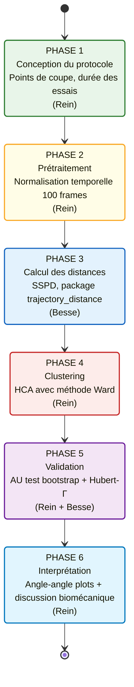

![[🧗Bloc olympique.png]]
# Protocole Expérimental : Effets de la <mark style="background: #ABF7F7A6;">Fatigue Musculaire</mark> sur la <mark style="background: #FFB86CA6;">Créativité</mark> en <mark style="background: #BBFABBA6;">Escalade</mark>

---
## 1. CADRE METHODOLOGIQUE

### 1.1 Objectifs

L'objectif principal consiste à explorer les effets de la [[fatigue musculaire]] induite par un [[protocole creativite escalade|protocole de fatigue]] [[État physiologique|physiologique]] sur la [[créativité motrice]] en [[escalade de bloc olympique|escalade de bloc]], tout en examinant le rôle modulateur du [[profil psychologique]] des grimpeurs (promotion vs. prévention).
### 1.2 Hypothèses opérationnelles

**H1** : La fatigue musculaire diminue la capacité des grimpeurs à produire des trajectoires créatives (réduction de la variabilité fonctionnelle et du score de créativité).
>[!tip] Pourra être discutée dans le cadre du [[Couplage perception-action]], notamment avec les [[capacités d'action]] évoquées dans [[Van Knobelsdorff et al. (2020)]]

**H2** : Les grimpeurs présentant une [[orientation régulatrice]] orientée « promotion » maintiennent des scores de créativité statistiquement supérieurs à ceux orientés « prévention », indépendamment de l'[[fatigue musculaire|état de fatigue]].

### 1.3 Design expérimental

![[📸diagramme étude.png|650]]

---
## 2. PARTICIPANTS

### 2.1 Critères d'inclusion

Les participants doivent satisfaire les critères suivants, établis conformément aux recommandations de [[Draper et al. (2015)]] pour la caractérisation du niveau d'expertise en escalade :

| Critère           | Spécification                                  | Justification                                                                         |
| ----------------- | ---------------------------------------------- | ------------------------------------------------------------------------------------- |
| Âge               | 18-40 ans                                      | Homogénéité physiologique                                                             |
| [[Échelle IRCRA]] | ≥ 18 (équivalent 7a+ français)                 | Niveau "avancé" à "élite" permettant l'expression de la créativité motrice            |
| Expérience        | ≥ 3 ans de pratique régulière                  | Répertoire moteur développé                                                           |
| Santé             | Absence de blessure dans les 6 mois précédents | Capacité à réaliser le protocole de fatigue, pas d'émergence de stratégie d'évitement |
>[!warning] Points à préciser
>- Pour le niveau des grimpeurs, on suit la méthode de [[Van Bergen et al. (2025)]] ? 
>>- Avancé = IRCRA : 18-24
>>- Elite = > 24
>- L'experience des grimpeurs est importante à prendre en compte, mais est-ce que l'on demande aussi s'ils ont participé à des compétitions (comme [[Medernach et al. (2025)]]) ?

### 2.2 Caractérisation du niveau d'expertise

Si l'on suit la méthode de [[Medernach et al. (2025)]] et [[Van Bergen et al. (2025)]], le niveau d'escalade sera estimé selon trois critères complémentaires :  
	1. **Niveau IRCRA autodéclaré**
	2. **Expérience en années**
	3. **Expérience compétitive**

### 2.3 Taille d'échantillon

N = 28 participants, calculé via G$^*$Power (test t apparié, α = .05, puissance = .80) en anticipant une taille d'effet d ≈ 1.9 basée sur les différences de créativité observées entre experts et avancés dans[[ Medernach et al. (2025)]].

---
## 3. PASSATION DES QUESTIONNAIRES

### 3.1 Temporalité et modalités
Les questionnaires psychologiques seront administrés **la veille de l'expérimentation** via la plateforme [[LimeSurvey]]. 

### 3.2 Questionnaire d'Orientation Régulatrice en Sport ([[Questionnaire d'Orientation Régulatrice en Sport (QORS)]])

**Description** : Instrument validé en français ([[Debanne (2022)]]) comprenant 12 items évaluant les deux orientations régulatrices (promotion vs. prévention) sur une échelle de Likert à 7 items.

**Objectif** : Le score différentiel sera calculé. Les participants seront répartis en deux groupes par séparation médiane.

### 3.3 Epstein Creativity Competencies Inventory for Individuals - Version Française ([[ECCI-i-FR]])

**Description** : Questionnaire validé en français ([[Delpech et al. (2020)]]) comprenant 26 items évaluant la créativité générale selon quatre dimensions.

**Objectif** : Établir la corrélation entre le trait de [[créativité générale|créativité]] et la [[créativité motrice|créativité contextuelle]] (comportement : observable en escalade).

---
## 4. PROCÉDURE EXPÉRIMENTALE

### 4.1 Chronologie de la passation
La session expérimentale pour chaque participant se déroule sur une durée totale de 90 à 120 minutes selon le schéma suivant :

```mermaid
stateDiagram-v2
    [*] --> Accueil

    Accueil : Accueil et consentement<br/>(10 min)
    Accueil --> Echauffement

    Echauffement : Échauffement standardisé<br/>(15 min)
    Echauffement --> Installation

    Installation : Installation équipement tracking<br/>(5 min)
    Installation --> LectureBloc1

    LectureBloc1 : PHASE 1<br/>Lecture Bloc 1<br/>(4 min)
    LectureBloc1 --> CompetitionBloc1

    CompetitionBloc1 : PHASE 2<br/>Réalisation Bloc 1<br/>Compétition<br/>(4 min)
    CompetitionBloc1 --> ExplorationBloc1

    ExplorationBloc1 : PHASE 3<br/>Réalisation Bloc 1<br/>Exploration<br/>(10 min)
    ExplorationBloc1 --> Transition1

    Transition1 : Transition<br/>(2 min)
    Transition1 --> Fatigue

    Fatigue : PHASE 4<br/>Protocole d'induction de fatigue<br/>(15–20 min)
    Fatigue --> Transition2

    Transition2 : Transition<br/>(2 min)
    Transition2 --> LectureBloc2

    LectureBloc2 : PHASE 5<br/>Lecture Bloc 2<br/>(4 min)
    LectureBloc2 --> CompetitionBloc2

    CompetitionBloc2 : PHASE 6<br/>Réalisation Bloc 2<br/>Compétition<br/>(4 min)
    CompetitionBloc2 --> ExplorationBloc2

    ExplorationBloc2 : PHASE 7<br/>Réalisation Bloc 2<br/>Exploration<br/>(10 min)
    ExplorationBloc2 --> Entretien

    Entretien : Entretien post-escalade<br/>(5–10 min)
    Entretien --> [*]
    
style Accueil fill:#E8F5E9,stroke:#2E7D32,stroke-width:2px
style Echauffement fill:#E8F5E9,stroke:#2E7D32,stroke-width:2px
style Installation fill:#E8F5E9,stroke:#2E7D32,stroke-width:2px

style LectureBloc1 fill:#FFFDE7,stroke:#FFB86CA6,stroke-width:2px
style CompetitionBloc1 fill:#FFFDE7,stroke:#FFB86CA6,stroke-width:2px
style ExplorationBloc1 fill:#FFFDE7,stroke:#FFB86CA6,stroke-width:2px

style LectureBloc2 fill:#FFFDE7,stroke:#FFB86CA6,stroke-width:2px
style CompetitionBloc2 fill:#FFFDE7,stroke:#FFB86CA6,stroke-width:2px
style ExplorationBloc2 fill:#FFFDE7,stroke:#FFB86CA6,stroke-width:2px
style Fatigue fill:#FDECEA,stroke:#C62828,stroke-width:2px
```


### <mark style="background: #BBFABBA6;">4.2 Échauffement standardisé</mark>

Les participants réaliseront leur routine d’échauffement habituelle. Dans le cas où ils n’en ont pas, une routine leur sera proposée (cf Annexes 5).

>[!Note] 
>Pour les participants sans routine personnelle, une routine standardisée sera proposée (cf. [[Fiche d'échauffement guidé|Annexe 5]] du dossier CERSTAPS). Le protocole d'échauffement suit les recommandations de la littérature en escalade (Levernier & Laffaye, 2019) tout en permettant aux participants expérimentés de personnaliser certains aspects.

### 4.3 Installation de l'équipement de suivi

Conformément aux recommandations des articles et au matériel disponible, deux options sont envisageables : 

##### Option A : Système Simi Aktisys 

Le système [[Simi Aktisys]] comprend :
- LEDs actives fixées au participant
- Caméras Simi Motion synchronisées
- Logiciel d'analyse intégré
> [!note]
**Avantages** : Tracking automatisé précis, synchronisation simple (trigger manuel possible).
**Inconvénients** : Coût élevé des caméras, installation complexe.

##### Option B : Système LED + GoPro

Cette solution, utilisée par [[Van Bergen et al. (2025)]], à l'avantage du meilleur rapport coût/efficacité :

| Composant       | Spécification                                   |
| --------------- | ----------------------------------------------- |
| Caméra          | GoPro Hero4                                     |
| Résolution      | 1080p                                           |
| Fréquence       | 60 fps                                          |
| LED             | Ampoule rouge (type Simi Aktisys ou équivalent) |
| Position LED    | Milieu de la hanche (L4-L5)                     |
| Position caméra | 0.80 m de hauteur, 4 m du mur                   |
| Distorsion      | Mode "Linear FOV"                               |
**Fixation de la LED** : La [[LED]] est fixée sur une ceinture / baudrier au niveau des vertèbres lombaires L4-L5 du grimpeur. Cette position anatomique correspond approximativement à la projection du centre de masse du corps humain (Winter, 2009), permettant ainsi de capturer la trajectoire globale du grimpeur au cours de chaque tentative de résolution du bloc.

---
## 5. LECTURE DU BLOC

### 5.1 Protocole

Conformément aux règlements IFSC et au protocole de [[Medernach et al. (2025)]], la phase de lecture du bloc se déroule comme suit :

1. **Durée** : 2 minutes.
2. **Consignes** : Le participant observe le bloc depuis le sol, peut se déplacer autour de la zone de départ, mais ne doit pas toucher les prises ni tenter de mouvements.
>[!tip] Exemple d'instructions verbales
>*"Vous disposez de 2 minutes pour observer ce bloc. Pendant cette période, essayez de planifier votre stratégie d'ascension. Vous pouvez vous déplacer et regarder le bloc sous différents angles, mais vous ne devez pas toucher les prises. Réfléchissez aux différentes façons possibles de réaliser ce bloc."*


>[!warning] #### 5.2 Option complémentaire : Eye-tracking 
>
>En se basant sur les recommandations de  [[Medernach et al. (2025)]], l'intégration du suivi des fixations visuelles pendant la lecture permet d'explorer les mécanismes perceptivo-cognitifs sous-tendant la créativité ([[Complexité visuo-motrice]]). Aucune étude antérieure n'a observé l'impact de la fatigue dans un environnement [[Approche écologique-dynamique|écologique]] tel que celui-ci.

---
## 6. RÉALISATION DU BLOC

### 6.1 Conception des blocs

Les blocs doivent être conçus pour offrir **plusieurs solutions motrices fonctionnelles** de niveaux de difficulté comparables. Conformément à [[Van Bergen et al. (2025)]], les caractéristiques suivantes sont recommandées :

| Paramètre            | Spécification                           | Justification                                                              |
| -------------------- | --------------------------------------- | -------------------------------------------------------------------------- |
| Niveau de difficulté | Niveau max participant - 1 cotation     | Éviter effet plafond/plancher                                              |
| Nombre de prises     | 7-12 prises                             | Offrir suffisamment d'options                                              |
| Diversité des prises | ≥ 3 types différents                    | Multiplier les [[affordances]]                                             |
| Inclinaison du mur   | 23-37° (devers modéré)                  | Configuration classique en bloc et respectant [[Van Bergen et al. (2025)]] |
| Solutions multiples  | ≥ 3 trajectoires distinctes identifiées | Critère important pour l'étude                                             |

**Validation des blocs** : Les blocs seront créés par un ou des ouvreurs professionnels (niveau [[Échelle IRCRA|IRCRA]] ≥ 27) et testés préalablement pour confirmer l'existence de solutions multiples de niveaux comparables.

### 6.2 Phase compétition (4 minutes)

Cette première phase reproduit les conditions de compétition officielle [[escalade de bloc olympique|IFSC]] :

1. **Objectif** : Réaliser le bloc avec un minimum de tentatives.
2. **Consignes** : 
>[!tip] Exemple
>*"Vous disposez de 4 minutes pour réaliser ce bloc. Comme en compétition, vous pouvez effectuer autant de tentatives que nécessaire. Votre objectif est de réussir le bloc. Une fois que vous avez réussi, descendez et attendez les instructions suivantes."*
3. **Enregistrement** : Toutes les tentatives sont filmées (mais pas forcément traitées). Seule la première tentative réussie est retenue pour l'analyse de cette phase.

### 6.3 Phase [[Exploration motrice|exploration créative]] (10 minutes)

Cette phase, directement inspirée du test de variabilité fonctionnelle de [[Van Bergen et al. (2025)]], en appliquant les travaux de [[Moraru et al. (2016)]] sur les [[tâche d'action divergente]] et constitue le cœur de l'évaluation de la créativité :

1. **Objectif** : Résoudre le bloc d'autant de **manières différentes** que possible.

2. **Consignes** : 
>[!tip] Exemple
>*"Vous disposez maintenant de 10 minutes pour explorer toutes les façons différentes de réaliser ce bloc. Votre objectif n'est plus simplement de réussir, mais de trouver le maximum de solutions différentes. Essayez de sortir des sentiers battus. Les échecs ne comptent pas. À chaque fois que vous réussissez avec une méthode différente, redescendez et essayez une nouvelle approche."*

3. **Critère de succès** : Une trajectoire est considérée comme "réussie" si le participant atteint le top. Les trajectoires échouées sont enregistrées mais exclues de l'analyse de créativité (critère de fonctionnalité selon [[Orth et al. (2017)]]).

4. **Encouragements** : L'expérimentateur peut relancer le participant verbalement (*"Avez-vous essayé d'autres options ?"*, *"Y a-t-il d'autres façons de faire ?"*) sans suggérer de solutions spécifiques.

### 6.4 Enregistrement vidéo

| Paramètres          | Valeur                                                                                        |
| ------------------- | --------------------------------------------------------------------------------------------- |
| Position            | 0.80 m de hauteur, 4 m du mur d'escalade                                                      |
| Résolution          | 1080p                                                                                         |
| Fréquence           | 60 fps                                                                                        |
| Mode FOV            | Linear (correction de distorsion)                                                             |
| Grille de référence | 3 marqueurs au centre du mur espacés de 1 m(horizontal et vertical) pour calibration spatiale |

**Numérotation des essais** : Chaque essai est numéroté séquentiellement (P01_B1_E01 pour Participant 01, Bloc 1, Essai 01). Un assistant note l'heure de début de chaque essai pour faciliter la synchronisation.

---
## 7. PROTOCOLE D'INDUCTION DE FATIGUE

(Voir :[[Protocole fatigue]])


### 7.1 Accueil et recueil de données démographiques 
Les participants se sont rendus dans la salle d'escalade correspondante lors d'une seule journée. <font color="#ff0000">Ils ont d'abord rempli un formulaire afin de fournir des informations démographiques (âge, sexe, taille, poids, niveau et expérience en escalade).</font>

### 7.2 Echauffement : 
Ensuite, un échauffement standardisé et autonome a été réalisé afin d'augmenter la fréquence cardiaque et la température musculaire et de préparer les tissus aux tests à venir.

### 7.3 Protocole d'induction de fatigue

- **Phase 1 : Activation cardiovasculaire**
Course à pied en régime aérobie modéré à une vitesse constante de 10 km/h (allure d'endurance fondamentale) <font color="#ff0000">+ 1km/h toutes les seconde</font> sur un parcours carré, durée : 5 minutes.

- **Phase 2 : Échauffement spécifique**
Échauffement standardisé sur poutre [[SmartBoard]] selon le protocole habituel.

- **Phase 3 : Potentialisation progressive**
Montée en charge progressive jusqu'à l'intensité maximale, pour chauffer le fléchisseur est potentialiser les fibres neuromusculaires. Réalisation de séries de suspensions unilatérales sur réglette de 12 mm (SmartBoard), avec un maximum de 6 répétitions par membre supérieur, en alternance ainsi que de monté en charge (10% du PDC /15% du PDC /20% du PDC /25% du PDC /30% du PDC /35% du PDC).

>[!note]
>Possibilité de privilégier le ressenti plutôt que du poids de corps: «10% de tes capacité», 20%, 30%, 40% et 1 fois 75%

- **Phase 4 : Évaluation de la force maximale volontaire**
Test de [[NOTES PERMANENTES/Concepts/CMV]] (Contraction Volontaire Maximale) en suspension unilatérale sur réglette de 12 mm, effectué de manière bilatérale (bras droit et bras gauche). Réalisation du test de fatigue :

- ***Effort fatigue général*** : 
	- Dans un premier temps le participant va réaliser en l’espace de 30s <font color="#ff0000">(45s)</font> le nombre maximal de tractions possible sur une prise large « baquets ». L’enregistrement de la force permettra d’évaluer la perte de puissance du participant.
	
- ***Effort fatigue fléchisseur*** : 
	- Dans un deuxième temps le grimpeur devra se suspendre sur la prise 12mm et exercer 80% de sa [[Force des doigts|force maximale]] en alternant une phase de suspension de 10<font color="#ff0000">(7)</font> secondes et une phase de repos de 6<font color="#ff0000">(3)</font> secondes pendant 24 suspensions. Une fois que la fatigue intervient et même s’il n’y arrive plus, le sujet doit exercer son maximum pour atteindre le niveau de 80%. La cinétique de fatigue enregistrée au bout de 24 contractions permettra de déterminer le pourcentage de perte de force de l’individu. <font color="#ff0000">(Potentiellement inclure de l’isométrique (bras à 90° comme Mermier et al. 2000) car le participant va potentiellement se reposer au niveau des gros muscles pendant la série de suspension)</font>

---
## 8. ENTRETIEN POST-ESCALADE

### 8.1 Objectifs

L'entretien post-escalade, inspiré de [[Medernach et al. (2025)]], permet de :
- Comparer des données objectives (trajectoires) avec les perceptions subjectives
- Évaluation de la conscience des différentes solutions (cécité d'inattention)
- Identification des prises potentiellement manquées

### 8.2 Questions structurées

Exemple de questions possibles. A savoir que [[Medernach et al. (2025)]] n'ont posé que des questions binaires.

| Question                                                                    | Type de réponse   | Objectif                               |
| --------------------------------------------------------------------------- | ----------------- | -------------------------------------- |
| *"Aviez-vous une solution précise avant de tenter le bloc ?"*               | Binaire (Oui/Non) | Évaluer le niveau de planification     |
| *"À quel point avez-vous eu de la difficulté à développer une solution ?"*  | Likert 1-5        | Charge cognitive perçue                |
| *"Combien de solutions différentes pensez-vous avoir trouvées ?"*           | Numérique         | Métacognition                          |
| *"Y a-t-il des prises que vous n'avez pas vues ou utilisées ?"*             | Ouvert            | Identification cécité inattentionnelle |
| *"Comment décririez-vous votre état de fatigue avant/après le protocole ?"* | Likert 1-10       | Validation subjective de la fatigue    |

### 8.3 Procédure

L'entretien est mené après la phase d'exploration du second bloc, avant que le participant ne quitte l'espace expérimental. Les réponses sont enregistrées par l'expérimentateur.

---
## 9. ANALYSE DES TRAJECTOIRES

### 9.1 Extraction des données via Kinovea

Le logiciel [[Kinovea]] (version 0.8.27 ou supérieure) sera utilisé pour transformer les enregistrements vidéo en données de position 2D, conformément au protocole de [[Van Bergen et al. (2025)]] :

#### Procédure d'extraction

1. **Calibration spatiale** : Utilisation de la grille de perspective (3 marqueurs espacés de 1 m au centre du mur) pour convertir les pixels en coordonnées réelles (mètres).

2. **Tracking semi-automatisé** : 
   - Sélection de la [[LED]] comme marqueur dans [[Kinovea]]
   - Tracking automatique avec confirmation frame-par-frame ([[Van Bergen et al. (2025)]])
   - Correction manuelle en cas de perte du tracking

>[!warning] Autres possibilités
>>- Les caméras et LED Simi motion sont aussi à envisager $\Rightarrow$ permet un tracking automatique de qualité.
>>- L'utilisation d'autres logiciels de suivi tel que Tracker sont aussi à envisager

1. **Export des données** : Coordonnées (x, y) de la hanche au cours du temps, échantillonnées à 60 Hz.

#### Données de sortie
Pour chaque essai réussi :

| Modalité  | Aspect technique       |
| --------- | ---------------------- |
| Fichier   | P01_B1_E01.csv         |
| Colonnes  | time (s), x (m), y (m) |
| Fréquence | 60 Hz                  |

#### 9.2.2 Normalisation temporelle

La [[normalisation temporelle]] est **indispensable** car les essais ont des durées différentes. Cette procédure "compresse" ou "étend" chaque trajectoire sur un nombre fixe de frames, permettant la comparaison point-à-point.

| Paramètre               | Spécification                                                      | Justification                           |
| ----------------------- | ------------------------------------------------------------------ | --------------------------------------- |
| Nombre de frames cible  | 100 [[Rein et al. (2010)]], peut être étendu si perte de précision | Compromis entre précision et parcimonie |
| Méthode d'interpolation | Linéaire ou spline cubique                                         | Préservation de la forme générale       |
| Contrôle de qualité     | Durées originales ne différant pas > 30%                           | Éviter déformation excessive            |

**Conséquence importante** : Après [[normalisation temporelle|normalisation]], les moments deviennent **relatifs**. Le frame 50/100 représente "la moitié de la trajectoire" quelle que soit la durée absolue. Cette perte de l'information temporelle absolue est acceptable vu que l'on s'intéresse à la **forme spatiale** des trajectoires.

#### 9.2.3 Organisation matricielle

Chaque [[trajectoire]] normalisée est organisée en matrice :

```python
M[essai] = [x₁, x₂, ..., x₁₀₀]
           [y₁, y₂, ..., y₁₀₀]
```

Dimension : 2 × 100 (2 coordonnées × 100 points temporels)

---
## 10. ANALYSE PAR CLUSTERS

### 10.1 Vue d'ensemble du pipeline analytique

La trame d'analyse suit la séquence recommandée par les apports de [[Rein et al. (2010)]], [[Van Bergen et al. (2025)]], et [[Besse et al. (2016)]] :



### 10.2 Calcul des distances entre trajectoires

#### 10.2.1 Choix de la métrique : SSPD

La **Symmetrized Segment-Path Distance** (SSPD) de [[Besse et al. (2016)]] est retenue pour les raisons suivantes :

| Apport                                        | Justification                                                                                                  |
| --------------------------------------------- | -------------------------------------------------------------------------------------------------------------- |
| **Comparaison shape-based**                   | Compare la forme géométrique des trajectoires indépendamment de l'indexation temporelle (après normalisation). |
| **Absence de paramètres**                     | Contrairement à OWD grid, ne nécessite pas de régler un paramètre de précision.                                |
| **Performance validée**                       | Résultats comparables à OWD grid sans les problèmes de paramétrage.                                            |
| **Applicabilité aux trajectoires d'escalade** | Validée par [[Van Bergen et al. (2025)]] pour des données de même nature.                                      |
>[!tip] Lien Github
>https://github.com/bguillouet/traj-dist

#### 10.2.2 Formule mathématique

La SSPD est définie comme la moyenne des [[distance segment-chemin symétrique]] :

$$D_{SSPD}(T^1, T^2) = \frac{D_{SPD}(T^1, T^2) + D_{SPD}(T^2, T^1)}{2}$$

où :

$$D_{SPD}(T^1, T^2) = \frac{1}{n_1} \sum_{i=1}^{n_1} D_{pt}(p_i^1, T^2)$$

et $D_{pt}(p_i^1, T^2)$ est la distance minimale du point $p_i$ de la trajectoire $T^1$ à n'importe quel segment de la trajectoire $T^2$.

>[!warning] Formules
>J'avoue ne pas encore avoir réussi à ingérer les formules mais je m'y colle

#### 10.2.3 Implémentation

```python
# Package recommandé : trajectory_distance (Besse et al., 2016)
from trajectory_distance.sspd import sspd

# Pour N trajectoires, calcul de la matrice de distance N×N
import numpy as np

def compute_distance_matrix(trajectories):
    """
    trajectories : liste de N arrays de forme (2, 100)
    return : matrice de distance symétrique N×N
    """
    N = len(trajectories)
    D = np.zeros((N, N))
    for i in range(N):
        for j in range(i+1, N):
            d = sspd(trajectories[i].T, trajectories[j].T)
            D[i,j] = d
            D[j,i] = d
    return D
```

### 10.3 [[clustering hiérarchique]]

#### 10.3.1 Algorithme Ward

La [[méthode Ward]] (minimum variance) est recommandée par [[Rein et al. (2010)]] pour sa robustesse (Breckenridge, 2000; Everitt, et al., 2001; Hands & Everitt, 1987; Kaufmann & Rousseeuw, 1990; Kuiper & Fisher, 1975; Milligan, 1981; Scheibler & Schneider, 1985) :

- **Principe** : À chaque étape, fusionne les deux clusters qui minimisent l'augmentation de la variance intra-cluster totale.
- **Avantage** : Produit des clusters compacts et de tailles relativement équilibrées.
>[!warning] A compléter
>Je n'ai pas trouvé de code ou de lien github pour l'instant

#### 10.3.2 Construction du [[dendrogramme]]

```python
from scipy.cluster.hierarchy import linkage, dendrogram
from scipy.spatial.distance import squareform

# D : matrice de distance N×N
condensed_D = squareform(D)  # Conversion en format condensé

# Clustering hiérarchique avec méthode Ward
Z = linkage(condensed_D, method='ward')

# Visualisation du dendrogramme
dendrogram(Z)
```

#### 10.3.3 Détermination du nombre optimal de clusters

Le choix du seuil de coupure du dendrogramme détermine le nombre de clusters. Conformément à [[Van Bergen et al. (2025)]], cette décision repose sur l'analyse conjointe de plusieurs indicateurs :

1. **Analyse visuelle du [[dendrogramme]]** : Identification des "coudes" ou sauts importants dans les hauteurs de fusion.

2. **Évolution du nombre de clusters et de la taille du plus grand cluster** en fonction du seuil de distance (Figure 3 de Van Bergen et al., 2025).

3. **[[Score de Hubert-Γ]]** en fonction du nombre de clusters (maximum = solution optimale).

Van Bergen et al. (2025) ont retenu un seuil de **15 unités** pour leurs données de trajectoires de hanche en escalade. Ce seuil devra être recalibré pour vos données spécifiques.
![[Van Bergen et al. (2025).fr.pdf#page=7&rect=33,380,300,671&color=red|300]]

### 10.4 Validation des clusters

#### 10.4.1 [[Score de Hubert-Γ]]

Le coefficient de Hubert-$Γ$ mesure la concordance entre la matrice de distances observées et la partition en k clusters :

$$\Gamma = \frac{1}{M} \sum_{i<j} (D_{ij} - \bar{D})(C_{ij} - \bar{C})$$

où $D$ est la matrice de distances et $C$ est la matrice de co-appartenance aux clusters (1 si même cluster, 0 sinon).

**Interprétation** : Un $Γ$ élevé indique que les trajectoires proches sont dans les mêmes clusters et les trajectoires éloignées sont dans des clusters différents.

**Procédure** : Tracer $Γ$ en fonction du nombre de clusters. Un **pic** indique le nombre optimal de clusters.
![[Rein et al. (2010).pdf#page=19&rect=289,407,428,580|200]]

#### 10.4.2 Approximately Unbiased (AU) Test

Le test AU, implémenté dans le package R `pvclust`, il faut utiliser un [[bootstrap]] multiscale pour estimer la stabilité de chaque cluster :
```r
library(pvclust)

# D : matrice de distance
result <- pvclust(as.dist(D), method.hclust="ward.D2", 
                  method.dist="euclidean", nboot=10000)

# Visualisation avec p-values
plot(result)
pvrect(result, alpha=0.95)
```

**Interprétation** :
- **AU p-value ≥ 0.95** : Cluster très stable, structure réelle hautement probable
- **AU p-value < 0.95** : Cluster potentiellement artefactuel, interprétation prudente

>[!tip]
>Réaliser 10,000 à 20,000 itérations de bootstrap pour des p-values stables (Rein et al., 2010).

### 10.5 Calcul des scores de créativité

Une fois les clusters validés, les scores de créativité sont calculés pour chaque participant conformément à [[Van Bergen et al. (2025)]] et [[Orth et al. (2017)]] :

#### 10.5.1 Score de variabilité fonctionnelle

Variabilité$_{p}$ = (Nombre de clusters distincts auxquels appartiennent les trajectoires réussies du participant)$_p$

**Interprétation** : Un score élevé indique que le participant a exploré un large répertoire de solutions motrices.

#### 10.5.2 Score de créativité (originalité)

La [[créativité motrice|créativité]] intègre la dimension d'**[[originalité]]** (statistiquement rare) en plus de la [[fonctionnalité]] :

$$Créativité_{p} = \sum_{i \in clusters(p)} \frac{1}{Prévalence(i)}$$

où :

$$Prévalence(i) = \frac{\text{Nb de participants ayant au moins une traj. dans le cluster } i}{N_{total}}$$

**Interprétation** : Les trajectoires rares (clusters avec peu de participants) contribuent davantage au score de créativité.

---
---

>[!warning] ## 11. ÉVALUATION QUALITATIVE PAR EXPERTS
>##### Partie supplémentaire 
>Cette partie d'analyse qualitative peut être intéressante pour enrichir l'analyse et offrir différents points de vue (algorithmiques et subjectifs) sur l'évaluation de la créativité.

### 11.1 Protocole d'évaluation

Conformément à [[Medernach et al. (2025)]], une évaluation qualitative complémentaire sera réalisée par des experts en escalade :

| Critère          | Spécification                                             |
| ---------------- | --------------------------------------------------------- |
| Nombre d'experts | 3                                                         |
| Qualification    | Niveau IRCRA ≥ 25 + ≥ 10 ans d'expérience                 |
| Matériel         | Enregistrements vidéo de chaque essai                     |
| Aveuglement      | Experts non informés des conditions (fatigué/non-fatigué) |

### 11.2 Échelle d'évaluation

Chaque tentative est évaluée sur une échelle de Likert à 5 points :

| Score | Descripteur         |
| ----- | ------------------- |
| 1     | Peu créatif         |
| 2     | Un peu créatif      |
| 3     | Modérément créatif  |
| 4     | Très créatif        |
| 5     | Extrêmement créatif |

### 11.3 Calcul du score final

1. **Score par tentative** : Moyenne des 3 évaluateurs
2. **Score par bloc** : Moyenne des scores de toutes les tentatives réussies
3. **Fiabilité inter-juges** : Coefficient de corrélation intraclasse (ICC) attendu ≥ 0.85

