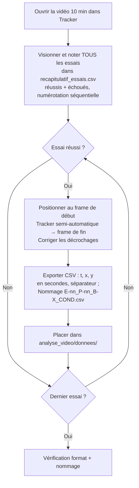

---
aliases:
  - Fiche de codage
  - Segmentation trajectoires
  - Critères de segmentation
tags:
  - procédure
  - méthodologie
  - segmentation
  - tracker
  - codage
type: procédure
statut: actif
date_creation: 2026-03-23
date_modification: 2026-03-23
version: "1.2"
---

# Fiche de codage — Segmentation des trajectoires

> [!abstract] Objet
> Ce document formalise les règles opérationnelles de segmentation des essais d'escalade à partir des vidéos de 10 minutes enregistrées en 4K/60 fps (iPhone 15, objectif x0.9 ultra-grand-angle). La segmentation définit les bornes temporelles de chaque essai réussi à partir desquelles les coordonnées (x, y) de la LED (L4-L5) sont extraites via Tracker. Chaque essai réussi produit un fichier CSV indépendant.

> [!tip] Champ d'application
> La procédure s'applique à l'ensemble des participants (P01–P28), pour les deux blocs (BA et BB) et les deux conditions (F et NF). Elle constitue la référence unique pour le suivi semi-automatique dans Tracker et conditionne la reproductibilité de toute la chaîne analytique en aval (normalisation, SSPD, clustering, score de créativité, variables temporelles).

---

## 1. Définitions opérationnelles des bornes

### 1.1 Frame de début (essais réussis et échoués)

**Définition.** Dernière frame où la LED est en position statique dans la configuration de départ imposée (4 appuis stables sur les prises de départ), immédiatement avant le premier déplacement volontaire vers une prise autre que celles de départ.

**Critère opérationnel.** Le codeur identifie la frame précédant le premier mouvement vertical ou latéral perceptible de la LED depuis la position d'équilibre initial. La phase d'installation sur les prises de départ (ajustements de pieds, replacements de mains) est **exclue** de la trajectoire.

> [!note] Justification
> Cette définition garantit que la trajectoire codée capture exclusivement la phase de résolution motrice du problème, sans contamination par la variabilité de la phase préparatoire ([[Rein et al. (2010)]]).

### 1.2 Frame de fin — essai réussi

**Définition.** Première frame où la LED atteint une position stable lors du contrôle de la prise finale imposée (maintien à deux mains, conformément aux règles IFSC).

**Critère opérationnel.** Le codeur repère la frame où la LED se stabilise en position haute après l'atteinte de la prise finale, c'est-à-dire le moment où aucun déplacement vertical ou latéral significatif n'est observable. Tolérance : ±2 frames (±33 ms à 60 fps).

### 1.3 Frame de fin — essai échoué

**Définition.** Dernière frame où le participant maintient au moins un appui sur le mur, immédiatement avant la chute ou le lâcher volontaire.

**Critère opérationnel.** Le codeur identifie la frame précédant la phase aérienne (aucun contact mur) ou le retour au sol.

> [!warning] Les essais échoués ne sont PAS trackés dans Tracker
> Seuls les essais réussis font l'objet d'un suivi semi-automatique et d'un export CSV. Les essais échoués sont consignés dans le fichier récapitulatif `recapitulatif_essais.csv` avec leur numéro séquentiel, leur durée approximative et un commentaire éventuel.

---

## 2. Convention de nommage des fichiers

### 2.1 Fichiers de trajectoires (essais réussis)

```
E[nn]_P[nn]_B[X]_[COND].csv
```

| Élément | Description | Valeurs possibles |
|---|---|---|
| `E[nn]` | Numéro séquentiel de l'essai | 01, 02, ..., nn |
| `P[nn]` | Code participant | P01, P02, ..., P28 |
| `B[X]` | Identifiant du bloc | BA ou BB |
| `[COND]` | Condition expérimentale | F (fatigué) ou NF (non-fatigué) |

**Exemples :**
- `E01_P12_BA_NF.csv` — Essai 1, Participant 12, Bloc A, Non-Fatigué
- `E04_P12_BA_NF.csv` — Essai 4 (les essais 2 et 3 étaient échoués)
- `E02_P12_BB_F.csv` — Essai 2, Participant 12, Bloc B, Fatigué

> [!danger] Numérotation séquentielle intégrale
> Le numéro d'essai (`nn`) suit l'ordre chronologique de **tous** les essais (réussis ET échoués) pendant la passation de 10 minutes. Si les essais 2, 3 et 5 sont échoués, les fichiers de trajectoires portent les numéros E01, E04 et E06. Cette numérotation préserve la structure temporelle complète de la session, indispensable pour le calcul des variables temporelles (délai avant première réussite, ratio de réussite, temps inter-essai).

### 2.2 Fichier récapitulatif (tous les essais)

Fichier **unique** regroupant **tous les essais** (réussis et échoués) de **tous les participants** :

```
recapitulatif_essais.csv
```

Emplacement : `analyse_video/donnees/recaps/`

Format (séparateur point-virgule, encodage UTF-8) :

```csv
participant;bloc;condition;essai_num;reussite;duree_s;commentaire
P02;BA;NF;1;1;18;
P02;BA;NF;2;0;12;chute prise 5
P02;BA;NF;3;0;8;lâcher volontaire
P02;BA;NF;4;1;22;
P02;BA;NF;5;0;15;
P02;BA;NF;6;1;20;
P05;BA;NF;1;0;10;glissade départ
P05;BA;NF;2;1;25;
P12;BB;F;1;1;19;
P12;BB;F;2;0;14;occultation LED partielle
P12;BB;F;3;1;21;
```

> [!tip] Traitement automatique
> Le script `analyse_temporelle.py` utilise ce fichier de la manière suivante :
> - **Essais réussis (reussite=1)** : les durées notées dans le récapitulatif sont **ignorées**. Les durées exactes sont calculées automatiquement depuis les fichiers CSV de trajectoires (source plus précise).
> - **Essais échoués (reussite=0)** : les durées approximatives notées lors du visionnage sont utilisées pour le calcul des variables temporelles.
> 
> Ce fichier sert donc de **registre complet de la session** : toute la séquence chronologique des essais est documentée en un seul endroit.

> [!note] Si aucun essai échoué pour un participant
> Renseigner tout de même les essais réussis — cela constitue une traçabilité complète même si le script n'a pas besoin de ces lignes.

---

## 3. Format de sortie Tracker

Chaque fichier CSV exporté depuis Tracker contient trois colonnes :

| Colonne | Unité | Description |
|---|---|---|
| `t` | secondes (s) | Temps relatif depuis le frame de début (t₀ = 0) |
| `x` | pixels | Coordonnée horizontale de la LED |
| `y` | pixels | Coordonnée verticale de la LED |

**Paramètres d'export :**
- Séparateur : point-virgule (`;`)
- Décimale : virgule (`,`)
- Première colonne : **temps en secondes** (pas en numéro de frame)

> [!note] Correction de distorsion en aval
> Les coordonnées sont exportées en pixels bruts. La correction de distorsion optique (Zhang, 2000) et la conversion en unités métriques sont appliquées par le script Python de prétraitement (`utils_trajectoire.py`), à partir des paramètres de calibration renseignés dans `config.py`. Cette approche post-tracking préserve la qualité du suivi semi-automatique dans Tracker.

---

## 4. Règles de gestion des cas limites

| Situation | Règle |
|---|---|
| Le participant atteint la prise finale mais la lâche immédiatement (< 1 s de maintien) | Essai **échoué**. Le contrôle stabilisé de la prise est nécessaire. |
| Le participant redescend volontairement sans tomber pour retenter | L'essai en cours est codé **échoué** (frame de fin = début de la redescente volontaire). L'essai suivant est un nouvel essai. |
| Occultation prolongée de la LED (> 20 frames, soit > 333 ms) | Signaler dans la colonne `commentaire`. Interpolation linéaire acceptable si ≤ 30 frames. Au-delà, évaluer l'exclusion au cas par cas. |
| Décrochage du tracking semi-automatique | Correction manuelle frame par frame dans Tracker. Signaler l'intervalle corrigé dans `commentaire`. |
| Essai interrompu par un événement extérieur (consigne, arrêt demandé) | **Exclure** l'essai. Ne pas l'inclure dans la numérotation séquentielle. Documenter dans `commentaire`. |
| Le participant tente un mouvement mais revient à la position de départ sans quitter les prises initiales | **Pas un essai.** Ne pas coder. Le début d'essai requiert un déplacement vers une prise non-initiale. |
| Essai très court (< 2 secondes sur le mur) | Coder normalement s'il y a eu un déplacement volontaire vers une prise non-initiale. La durée courte sera signalée par le contrôle qualité automatisé (tolérance ±30% de la durée médiane). |

---

## 5. Contrôle qualité automatisé

Les prises de départ et de fin étant imposées, la position de la LED au premier et au dernier frame de chaque essai devrait être quasi identique d'un essai à l'autre (variabilité anthropométrique mise à part). Un contrôle automatisé est intégré dans le script de prétraitement Python (`controle_qualite.py`) :

1. **Position médiane de référence.** Pour chaque bloc, calcul de la position médiane de la LED au premier frame (x₀, y₀) et au dernier frame (xf, yf) sur l'ensemble des essais réussis.

2. **Signalement des trajectoires déviantes.** Toute trajectoire dont le point de départ ou d'arrivée s'écarte de plus du seuil défini dans `config.py` (`TOLERANCE_POSITION_PX`, à calibrer empiriquement ~15-20 cm) est signalée automatiquement.

3. **Contrôle des durées.** Les trajectoires dont la durée originale diffère de plus de 30% de la durée médiane de l'ensemble sont signalées pour inspection manuelle ([[Rein et al. (2010)]]), afin d'éviter une déformation excessive lors de la normalisation temporelle.

4. **Inspection et correction.** Les trajectoires signalées sont inspectées manuellement. En cas d'erreur de codage (mauvais frame de début/fin) ou de problème de tracking, la correction est effectuée dans Tracker et le CSV ré-exporté.

> [!tip] Exploiter la contrainte protocolaire
> Ce contrôle qualité exploite la contrainte structurelle du protocole (prises de départ et de fin imposées) pour détecter les erreurs de segmentation avant qu'elles ne se propagent dans le pipeline de clustering SSPD.

---

## 6. Procédure opérationnelle résumée

Pour chaque participant, pour chaque bloc × condition :



---

## 7. Références méthodologiques

- [[Rein et al. (2010)]] — Normalisation temporelle, impact du choix des bornes sur le clustering
- [[Van Bergen et al. (2025)]] — Procédure de délimitation des trajectoires réussies, critère de fonctionnalité (contrôle du top à deux mains)
- [[Orth et al. (2017)]] — Construit de créativité motrice : fonctionnalité + originalité
- Zhang, Z. (2000) — Calibration caméra, correction de distorsion post-tracking

---

*Voir aussi : [[Pipeline Traitement Données — Guide Opérationnel]]*
