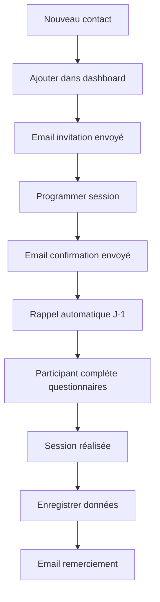

# 🚀 Installation Système Gestion Participants

**Date** : 21 décembre 2024
**Statut** : ✅ Installé et fonctionnel

---

## 📍 Localisation

**Chemin** : `~/Desktop/StageM2/systeme_gestion_participants/`
**URL Dashboard** : http://localhost:5001

---

## ✅ Étapes Réalisées

### 1. Téléchargement et Installation
```bash
cd ~/Desktop/StageM2
unzip systeme_gestion_participants.zip
cd systeme_gestion_participants
```

### 2. Installation des Dépendances
```bash
pip3 install flask
```

### 3. Configuration du Port
- Modifié `app.py` ligne 295 : `port=5001` (port 5000 utilisé par AirPlay)

### 4. Lancement du Système
```bash
python3 app.py
```
✅ **Serveur actif sur http://localhost:5001**

---

## 🎯 Utilisation Quotidienne

### Démarrer le Dashboard
```bash
cd ~/Desktop/StageM2/systeme_gestion_participants
python3 app.py
```
Puis ouvrir : **http://localhost:5001**

### Actions Principales
- **➕ Ajouter un participant** : Bouton dans le dashboard
- **📅 Programmer une session** : Après ajout d'un participant
- **🔔 Envoyer les rappels** : Automatique ou manuel
- **📊 Exporter les données** : Bouton export dans le dashboard

---

## 📂 Structure du Système

```
systeme_gestion_participants/
├── app.py              # Application web (dashboard)
├── database.py         # Gestion base de données
├── emails.py           # Système d'emails
├── automatisation.py   # Scripts automatiques
├── test_system.py      # Tests de validation
├── participants.db     # Base SQLite
└── README.md           # Documentation complète
```

---

## 🔧 Commandes Utiles

### Tester le Système
```bash
python3 test_system.py
```

### Rapport Hebdomadaire
```bash
python3 automatisation.py rapport
```

### Vérifier Cohérence
```bash
python3 automatisation.py verifier
```

### Envoyer Rappels Manuellement
```bash
python3 automatisation.py rappels
```

---

## ⚙️ Configuration Email (À faire)

Pour envoyer de vrais emails (actuellement en mode simulation) :

1. Copier le template de configuration :
```bash
cp .env.example .env
```

2. Éditer `.env` avec vos informations SMTP :
```bash
nano .env
```

3. Configuration Gmail recommandée :
```
SMTP_SERVER=smtp.gmail.com
EMAIL_FROM=votre.email@gmail.com
EMAIL_PASSWORD=mot_de_passe_application
```

**Note** : Générer un "mot de passe d'application" dans les paramètres Google

---

## 📧 Types d'Emails Automatiques

1. **Invitation** : À l'ajout d'un participant
2. **Confirmation** : À la programmation d'une session  
3. **Rappel J-1** : La veille de la session (avec liens questionnaires)
4. **Remerciement** : Après la session

---

## 🎯 Workflow Type



---

## 📊 Statistiques Suivies

- Participants recrutés / 30
- Sessions complétées
- Sessions programmées  
- Niveau IRCRA moyen
- Consentements signés
- Questionnaires complétés

---

## 🔒 Sécurité RGPD

- ✅ Codes anonymes automatiques (ex: P7A3K9B2C5)
- ✅ Séparation données/identités
- ✅ Table de correspondance sécurisée
- ✅ Conformité RGPD intégrée

---

## 🆘 Dépannage

### Port déjà utilisé
```bash
# Modifier le port dans app.py (ligne 295)
app.run(debug=True, host='0.0.0.0', port=5002)
```

### Flask non trouvé
```bash
pip3 install flask
```

### Base de données corrompue
```bash
rm participants.db
python3 database.py  # Recrée la base
```

---

## 📚 Documentation

**Guide complet** : Voir `README.md` dans le dossier

**Support** :
- Dr. Laurent Vigouroux : laurent.vigouroux@univ-amu.fr
- Dr. Cécile Martha : cecile.martha@univ-amu.fr

---

## ✅ Checklist Installation

- [x] Téléchargement et décompression
- [x] Installation Flask
- [x] Configuration port 5001
- [x] Test lancement dashboard
- [ ] Configuration emails SMTP (.env)
- [ ] Configuration LimeSurvey
- [ ] Ajout premiers participants test

---

## 📅 Prochaines Étapes

1. **Configurer LimeSurvey** avec les 3 questionnaires :
   - Notice + Consentement
   - QORS (12 items)
   - ECCI (26 items)

2. **Configurer SMTP** pour envois réels (Gmail ou AMU)

3. **Ajouter participants test** pour valider le workflow

4. **Automatiser rappels** avec cron (optionnel)

---

**Tags** : #stage-m2 #système #installation #gestion-participants
