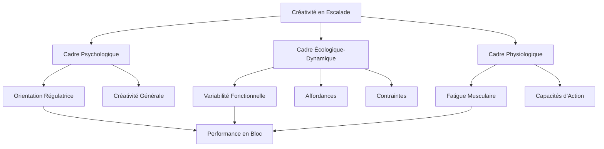
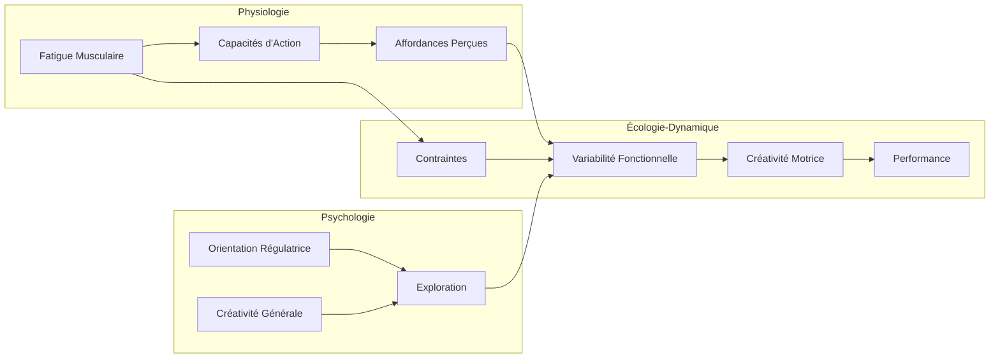

# 🧗 MOC - Créativité et Fatigue en Escalade de Bloc

> *Cette carte de contenu (MOC) structure l'ensemble des cadres théoriques, concepts et articles scientifiques qui fondent l'étude sur les effets de la fatigue musculaire sur la créativité en escalade de bloc.*

---

## Vue d'ensemble : Architecture théorique de l'étude

L'étude proposée se situe à l'intersection de trois champs disciplinaires majeurs : la [[psychologie de la créativité]], la [[dynamique écologique]] du mouvement, et la [[physiologie de la fatigue]]. Cette approche pluridisciplinaire constitue son originalité principale : aucune recherche antérieure n'a examiné simultanément l'interaction entre l'[[état physiologique]], le [[profil psychologique]] et la [[créativité motrice]] en situation réelle d'escalade.

---

# PARTIE I : FONDEMENTS THÉORIQUES

## 1. Le concept de créativité : de la psychologie cognitive à l'action motrice

### 1.1 Définition standard de la créativité

La [[créativité générale|créativité]] constitue un objet d'étude central en [[psychologie cognitive]]. Comme le définissent [[Sternberg & Lubart (1998)]], la créativité désigne la capacité d'un individu à "produire un travail qui est à la fois nouveau (original, inattendu) et approprié (utile)". Cette définition bi-dimensionnelle - originalité et fonctionnalité - est aujourd'hui largement acceptée dans la communauté scientifique et constitue le socle conceptuel de notre étude. (Voir aussi [[Psychologie de la créativité]])

La perspective cognitive traditionnelle, représentée notamment par les travaux de [[Runco (2007)]], conceptualise la créativité comme un trait ou une capacité individuelle, émergeant de processus neurocognitifs distincts. Cette approche a conduit au développement d'outils de mesure standardisés, dont les [[Tâche de pensée divergente|tâches de pensée divergente]] qui demandent aux participants d'imaginer le maximum de solutions possibles à un problème donné.

### 1.2 Le modèle dual de la créativité

[[Nijstad et al. (2010)]] proposent un [[modèle dual de la créativité|modèle dual]] particulièrement éclairant pour comprendre les mécanismes sous-jacents à la créativité. Selon ce modèle, deux voies distinctes mais complémentaires conduisent à la production d'idées créatives :

**La voie de flexibilité** (*flexibility pathway*) implique un traitement cognitif flexible permettant d'explorer différentes catégories de solutions. Cette voie favorise l'[[originalité]] des productions.

**La voie de persistance** (*persistence pathway*) repose sur un traitement systématique et approfondi au sein d'une même catégorie de solutions. Cette voie favorise la [[fonctionnalité]] et le raffinement des solutions.

Ce modèle dual trouve un écho direct dans notre étude : nous postulons que la [[fatigue musculaire]] pourrait affecter différemment ces deux voies, réduisant potentiellement la flexibilité exploratoire tout en maintenant (ou non) la capacité de persistance.

### 1.3 La créativité comme comportement stochastique contraint

[[Simonton (2003)]] propose une conceptualisation statistique de la créativité particulièrement pertinente pour l'étude du mouvement. Selon cet auteur, les productions créatives peuvent être comprises comme des événements (statistiquement) rares émergeant d'un processus de variation stochastique sous contraintes. Plus la variabilité est grande, plus la probabilité qu'une solution créative émerge est élevée.

Cette perspective établit un pont conceptuel crucial entre la psychologie cognitive et l'[[approche écologique-dynamique]] : dans les deux cas, la [[variabilité]] constitue le substrat à partir duquel la créativité peut émerger.

---

## 2. L'approche écologique-dynamique : un nouveau paradigme pour la créativité motrice

### 2.1 Le modèle des contraintes de Newell

L'article fondateur de [[Newell (1986)]] établit le cadre théorique central de l'[[approche écologique-dynamique]]. Selon ce modèle, le comportement moteur émerge de l'interaction dynamique entre trois catégories de [[contraintes]] :

**Les contraintes de l'organisme** concernent les caractéristiques individuelles du pratiquant : morphologie, capacités physiologiques (dont la [[force des doigts]]), niveau d'expertise, état de fatigue, et caractéristiques psychologiques.

**Les contraintes de l'environnement** désignent les caractéristiques physiques du contexte : en escalade, cela inclut la configuration du mur, le type et la disposition des prises, les conditions d'éclairage, etc.

**Les contraintes de la tâche** spécifient les objectifs et règles de l'activité : en compétition de bloc, il s'agit d'atteindre le sommet du passage en un minimum de tentatives dans un temps limité.

Ce modèle est fondamental pour notre étude car il positionne la [[fatigue musculaire]] comme une modification des contraintes de l'organisme, susceptible de transformer l'espace des solutions motrices disponibles.

### 2.2 La variabilité fonctionnelle du mouvement

Contrairement à l'approche traditionnelle de l'apprentissage moteur (voir [[Fitts & Posner, 1967]]) qui considérait la variabilité comme un "bruit" à minimiser, l'[[approche écologique-dynamique]] positionne la [[variabilité fonctionnelle]] comme une propriété adaptative centrale du système moteur.

Comme le synthétisent [[Van Bergen et al. (2025)]] :

> [!PDF|important] [[Van Bergen et al. (2025).fr.pdf#page=1&selection=55,120,56,122&color=important|Van Bergen et al, 2025, p.1]]
> > L'approche de la dynamique écologique positionne la variabilité du mouvement comme ayant des propriétés fonctionnelles permettant ainsi l'adaptation.

[[Bartlett et al. (2007)]] ont démontré que lorsqu'une même tâche est répétée plusieurs fois, les schémas de mouvement ne sont jamais identiques ("répétition sans répétition" selon l'expression de [[Bernstein, 1967]]). Cette variabilité n'est pas une erreur : elle constitue la signature d'un système moteur capable de s'adapter aux fluctuations des contraintes.

En escalade spécifiquement, [[Seifert et al. (2011)]] ont observé que les grimpeurs experts sur glace présentent une plus grande amplitude de mouvement des membres et du tronc que les débutants, suggérant que l'expertise s'accompagne d'une augmentation de la [[variabilité fonctionnelle]].

### 2.3 De la variabilité à la créativité : le processus d'émergence

L'articulation théorique entre [[variabilité fonctionnelle]] et [[créativité motrice]] constitue l'apport majeur des travaux de [[Orth et al. (2017)]]. Ces auteurs proposent de reconceptualiser la créativité motrice non plus comme l'expression d'un processus cognitif préalable, mais comme une propriété émergente de l'exploration motrice :

> [!PDF|green] [[Orth et al. (2017).fr.pdf#page=2&selection=16,0,24,37&color=green|Orth et al. (2017).en.fr, p.2]]
> > Nous contestons l'hypothèse sous-jacente de cette conception (traditionnelle) de la créativité : l'idée que les individus génèrent d'abord une idée dans leur esprit, qui est ensuite mise en œuvre dans le comportement cette notion est également appelée hylémorphisme (Ingold, 2013). Le principal problème de cette notion est qu'elle peut **induire à tort en erreur** et laisser croire que la **créativité est l'idéation** et que **l'action est simplement une expression du processus créatif**, plutôt que d'être partie ou constitutive de la créativité. 

Cette perspective implique que les [[actions créatives]] ne sont pas le produit d'une représentation mentale préalable, mais émergent du [[couplage perception-action]] au cours de l'exploration des contraintes. La créativité motrice peut donc être définie comme :

> "Des actions qui se déroulent et qui sont à la fois **originales** (par rapport à l'individu ou au groupe) et **fonctionnelles** (c'est-à-dire qu'elles contribuent à la réussite de la tâche)."

### 2.4 Le concept d'affordances et les capacités d'action

La théorie des [[affordances]] (Gibson, 1979) est essentielle pour comprendre comment le grimpeur perçoit et exploite les possibilités d'action offertes par l'environnement. Une affordance désigne une possibilité d'action offerte par l'environnement *relativement* aux capacités de l'individu.

[[van Knobelsdorff et al. (2020)]] ont démontré expérimentalement ce lien en escalade :
> [!PDF|important] [[Van Knobelsdorff et al. (2020).fr.pdf#page=9&selection=19,52,24,58&color=important|van Knobelsdorff et al. (2020).fr, p.2493]]
> > Les résultats indiquent que lors de la reconnaissance à vue et de l'escalade de voies dont la difficulté augmente progressivement : les grimpeurs relativement faibles et très forts utilisent des schémas visuo-moteurs moins complexes ; les grimpeurs moyennement forts utilisent des schémas visuo-moteurs plus complexes. 

Cette relation en U inversé entre [[capacités d'action]] et [[complexité visuo-motrice]] est cruciale pour notre étude : elle suggère que la [[fatigue musculaire]], en réduisant les capacités d'action, pourrait modifier la perception des affordances et donc l'exploration créative.

---

## 3. L'escalade de bloc : un terrain d'étude privilégié

### 3.1 Caractéristiques de la discipline

L'[[escalade de bloc olympique]] présente des caractéristiques qui en font un terrain d'étude idéal pour la [[créativité motrice]]. Comme le décrivent [[Augste et al. (2021)]] et [[Hatch et al. (2024)]], cette discipline impose aux grimpeurs :

- La résolution de passages courts mais complexes
- Un temps limité (4 minutes en compétition)
- La possibilité de tentatives multiples
- L'absence de connaissance préalable des passages (format "à vue")
- La nécessité d'adapter les stratégies aux caractéristiques individuelles

[[Künzell et al. (2020)]] ont démontré empiriquement l'importance de la créativité en compétition de haut niveau :

> "La capacité à modifier l'approche d'un problème de mouvement donné lors des compétitions de bloc de haut niveau entraînait des taux de réussite significativement plus élevés."

### 3.2 Les déterminants physiologiques de la performance

Les travaux de [[Draper et al. (2015)]] et [[Levernier et al. (2019)]] ont identifié les principaux déterminants physiologiques de la performance en escalade :

**La force des doigts** constitue le facteur le plus discriminant. La capacité à exercer des forces de haute intensité sur de petites prises est primordiale, particulièrement la [[vitesse de développement de la force]] (*Rate of Force Development* - RFD).

**La puissance des bras** en traction représente le second facteur majeur. [[Devise et al. (2023)]] ont montré que dans la relation puissance = Force × Vitesse, c'est la composante Force qui prédit le mieux la performance.

Ces capacités physiologiques ne sont cependant pas suffisantes : un grimpeur moins "fort" peut compenser par une meilleure capacité à trouver des solutions techniques adaptées à ses capacités du moment.

### 3.3 La créativité comme facteur de performance

Les travaux récents en escalade ont confirmé le rôle crucial de la créativité pour la performance. [[Van Bergen et al. (2025)]] ont démontré que :

> "Les résultats ont révélé que la capacité à présenter une [[variabilité fonctionnelle]] du mouvement (p=0,005) et l'exploration de la [[créativité motrice]] (p=0,002) étaient fortement associées à la performance."

Fait remarquable, cette étude montre que la créativité apporte un gain supplémentaire au-delà de la variabilité brute, confirmant que l'exploration n'est pas seulement quantitative mais aussi qualitative.

[[Medernach et al. (2025)]] ont par ailleurs identifié que la créativité est fonction du niveau d'expertise et des qualités de [[visualisation préalable]] du passage avant la grimpe, établissant un lien entre processus perceptifs et productions créatives.

---

## 4. Le profil psychologique comme modulateur de la créativité

### 4.1 L'orientation régulatrice

La théorie de l'[[orientation régulatrice]] (*Regulatory Focus Theory*) distingue deux modes de régulation du comportement orienté vers un but :

**L'orientation "promotion"** caractérise les individus focalisés sur la recherche active de gains, de progrès et d'accomplissements. Ces individus sont généralement plus enclins à l'exploration et à la prise de risque.

**L'orientation "prévention"** caractérise les individus focalisés sur l'évitement des pertes, des erreurs et des échecs. Ces individus privilégient généralement la sécurité et la prudence.

[[Dannerbo et al. (2025)]] ont démontré une corrélation significative entre l'orientation "promotion" et la créativité générale des grimpeurs (r = 0,568, p < 0,001), suggérant que le profil psychologique pourrait moduler les capacités créatives en situation d'escalade.

Cette dimension psychologique est mesurée dans notre étude par le [[Questionnaire d'Orientation Régulatrice en Sport (QORS)]], développé et validé par [[Debanne (2022)]].

### 4.2 La créativité générale comme trait

Au-delà de l'orientation régulatrice, la [[créativité générale]] peut être conceptualisée comme un trait relativement stable de l'individu. L'[[ECCI-i-FR]] (*Epstein Creativity Competencies Inventory for Individual - version française*) développé par [[Delpech et al. (2020)]] permet d'évaluer quatre dimensions :

- La capacité à capturer les nouvelles idées
- La tendance à relever des défis
- L'ouverture à de nouvelles expériences
- L'aménagement de l'environnement pour stimuler la créativité

Notre étude examine si ces traits généraux prédisent la [[créativité motrice]] mesurée en situation réelle d'escalade, établissant ainsi un pont entre dispositions psychologiques et comportement adaptatif.

---

## 5. La fatigue : le chaînon manquant

### 5.1 La fatigue musculaire et ses effets

La [[fatigue musculaire]] se définit comme une diminution transitoire de la capacité à produire de la force, résultant d'une activité préalable. En escalade, cette fatigue affecte principalement les fléchisseurs des doigts et les muscles impliqués dans la traction.

[[Van Cutsem et al. (2017)]] ont montré que la fatigue affecte simultanément :
- La force maximale disponible
- La précision gestuelle
- Les processus décisionnels
- La perception des affordances

### 5.2 Fatigue et perception des affordances

La réduction des capacités d'action sous l'effet de la fatigue devrait logiquement modifier la perception des [[affordances]]. Une prise qui est "utilisable" en début de séance peut devenir "inutilisable" lorsque la force disponible diminue, transformant ainsi la structure des solutions disponibles.

[[Van Knobelsdorff et al. (2020) extraction]] suggèrent cette relation :

> "Se rapprocher des limites de l'espace d'action accroît la complexité du regard et du comportement d'escalade, tandis que s'en éloigner la réduit."

### 5.3 La lacune actuelle : l'interaction fatigue-créativité

Malgré l'importance évidente de cette interaction, **aucune étude à ce jour n'a examiné l'effet de la fatigue musculaire sur la créativité motrice en escalade**. Cette lacune constitue la justification principale de notre étude.

Comme le souligne l'[[01 - Overview|Overview]] de notre revue de littérature :

> "La fatigue a également tendance à réduire la variabilité motrice et à diminuer l'exploration, rendant les comportements plus stéréotypés [...] Pourtant, aucune étude à ce jour n'a examiné l'effet de la fatigue sur la créativité motrice en escalade, alors que l'enjeu est crucial en situation réelle."

---

# PARTIE II : ARTICULATION MÉTHODOLOGIQUE

## 6. Mesurer la créativité motrice en situation réelle

### 6.1 La tâche d'action divergente

L'approche méthodologique proposée par [[Moraru et al. (2016)]] constitue une innovation majeure : transformer la [[tâche de pensée divergente]] traditionnelle en une [[tâche d'action divergente]]. Plutôt que de demander aux participants d'*imaginer* des solutions, on leur demande de *produire* le maximum de solutions différentes dans l'action.

[[Van Bergen et al. (2025)]] ont appliqué cette méthodologie à l'escalade :
> [!PDF|important] [[Van Bergen et al. (2025).fr.pdf#page=3&selection=17,20,29,20&color=important|Van Bergen et al, 2025, p.3]]
> >  Les études portant sur la créativité motrice ont principalement évalué la créativité à l'aide de tâches de pensée divergente, demandant aux athlètes d'imaginer autant de solutions que possible sans les mettre en pratique. Cependant, la perspective de la dynamique écologique soutient que les solutions motrices créatives se manifestent généralement par l'action, lors de l'exploration des contraintes, plutôt que par une idée cognitive a priori. Ainsi, Moraru et al. (2016) ont transformé une tâche de pensée divergente en une tâche d'action divergente pour évaluer la créativité du mouvement. En conséquence, une tâche d'action divergente a été utilisée dans la présente étude comme test de variabilité fonctionnelle du mouvement, où l'objectif principal était de résoudre un problème de bloc d'autant de manières différentes (c'est-à-dire des trajectoires distinctes) que possible dans un laps de temps de 10 minutes.

### 6.2 Quantification de la variabilité et de la créativité

La méthodologie de [[Van Bergen et al. (2025)]] propose une opérationnalisation rigoureuse :

**La [[variabilité fonctionnelle]]** est définie comme le nombre total de trajectoires réussies distinctes réalisées par chaque participant. Seules les trajectoires aboutissant à la réussite sont comptabilisées, garantissant le critère de fonctionnalité.

**La [[créativité motrice]]** est évaluée par l'[[originalité]] des trajectoires. En utilisant une approche de [[clustering hiérarchique]] basée sur la [[distance segment-chemin symétrique]] ([[Besse et al. (2016)]]), les trajectoires sont regroupées par similarité. L'originalité est ensuite calculée comme l'inverse de la prévalence :

$$Originalité_i = \frac{1}{Prévalence_i} = \frac{Nombre\ total\ de\ participants}{Nombre\ de\ participants\ ayant\ exécuté\ la\ trajectoire\ i}$$

Le **score de créativité** d'un participant est la somme des scores d'originalité de toutes les trajectoires distinctes qu'il a produites.

### 6.3 Le suivi de trajectoire par LED

L'utilisation d'une [[LED]] fixée au niveau des hanches (L4-L5) permet d'enregistrer le déplacement du centre de gravité du grimpeur. Le logiciel [[Kinovea]] transforme ces enregistrements vidéo en données de position 2D, permettant une analyse quantitative objective des trajectoires.

---

## 7. Induire et quantifier la fatigue

### 7.1 Le protocole SmartBoard

Notre étude utilise la [[SmartBoard]], un ergomètre d'escalade instrumenté permettant :

1. **L'évaluation de la force maximale** sur une prise de 12mm (main droite et gauche)
2. **L'induction contrôlée de fatigue** via un protocole standardisé :
   - Phase 1 : 30 secondes de tractions maximales sur prise large
   - Phase 2 : 24 contractions à 80% de la force maximale (10s contraction / 6s repos)
3. **La quantification du niveau de fatigue** par la cinétique de perte de force enregistrée

### 7.2 Justification du protocole

Ce protocole permet de :
- Induire une fatigue spécifique aux muscles sollicités en escalade
- Quantifier objectivement le niveau de fatigue atteint
- Contrôler la reproductibilité entre participants
- Simuler une situation écologiquement valide (fatigue progressive en compétition)

---

## 8. Synthèse : Comment l'étude comble les lacunes identifiées

### 8.1 L'originalité de l'approche intégrative

Notre étude est la **première** à examiner simultanément :

| Dimension                   | Variables                 | Outils                                                      |
| --------------------------- | ------------------------- | ----------------------------------------------------------- |
| État physiologique          | Fatigue musculaire        | [[SmartBoard]]                                              |
| Profil psychologique        | Orientation régulatrice   | [[Questionnaire d'Orientation Régulatrice en Sport (QORS)]] |
| Créativité dispositionnelle | Créativité générale       | [[ECCI-i-FR]]                                               |
| Créativité en action        | Variabilité & originalité | LED + Kinovea                                               |
| Performance                 | Réussite du bloc          | Observation                                                 |

### 8.2 Les hypothèses comme réponse aux lacunes

**Hypothèse 1 (H1a)** : La [[fatigue musculaire]] diminue la capacité des grimpeurs à être créatifs.

*Fondement théorique* : Les travaux sur les [[affordances]] ([[Van Knobelsdorff et al. (2020)]]) et les effets cognitifs de la fatigue suggèrent que la réduction des capacités d'action devrait limiter l'exploration et donc la créativité.

**Hypothèse 2 (H1b)** : Les grimpeurs ayant une [[orientation régulatrice]] tournée davantage vers la "promotion" maintiennent une meilleure créativité malgré la fatigue.

*Fondement théorique* : La corrélation démontrée entre orientation "promotion" et créativité ([[Dannerbo et al. (2025)]]) suggère que ce trait psychologique pourrait constituer un facteur de résilience créative.

---

# PARTIE III : CARTOGRAPHIE DES SOURCES

## 9. Articles fondamentaux par thématique

### 9.1 Cadre écologique-dynamique

| Article                      | Apport principal                  | Lien avec l'étude                   |
| ---------------------------- | --------------------------------- | ----------------------------------- |
| [[Newell (1986)]]            | Modèle des contraintes            | Fondement théorique central         |
| [[Orth et al. (2017)]]       | Créativité comme émergence        | Définition de la créativité motrice |
| [[Bartlett et al. (2007)]]   | Variabilité fonctionnelle         | Justification de la variabilité     |
| [[Hristovski et al. (2011)]] | Créativité aux limites du système | Lien contraintes-créativité         |

### 9.2 Créativité en sport et escalade

| Article | Apport principal | Lien avec l'étude |
|---------|-----------------|-------------------|
| [[Van Bergen et al. (2025)]] | Variabilité et créativité en escalade | Méthodologie directe |
| [[Medernach et al. (2025)]] | Expertise et créativité | Contexte escalade |
| [[Künzell et al. (2020)]] | Créativité en compétition | Pertinence du bloc |
| [[Moraru et al. (2016)]] | Tâche d'action divergente | Innovation méthodologique |

### 9.3 Affordances et capacités d'action

| Article | Apport principal | Lien avec l'étude |
|---------|-----------------|-------------------|
| [[Van Knobelsdorff et al. (2020) extraction]] | Force et complexité visuo-motrice | Lien capacités-exploration |
| [[Orth et al. (2018)]] | Contraintes et exploration | Manipulation des contraintes |
| [[Orth et al. (2019)]] | Recherche efficace sous contraintes | Stratégies d'exploration |

### 9.4 Profil psychologique et créativité

| Article | Apport principal | Lien avec l'étude |
|---------|-----------------|-------------------|
| [[Dannerbo et al. (2025)]] | Orientation régulatrice et créativité | Hypothèse psychologique |
| [[Debanne (2022)]] | Validation du QORS | Outil de mesure |
| [[Delpech et al. (2020)]] | Validation ECCI-i-FR | Outil de mesure |
| [[Nijstad et al. (2010)]] | Modèle dual | Mécanismes de la créativité |

### 9.5 Fatigue et performance

| Article | Apport principal | Lien avec l'étude |
|---------|-----------------|-------------------|
| [[Levernier et al. (2019)]] | Force des doigts et performance | Capacités physiologiques |
| [[Devise et al. (2023)]] | Puissance et performance | Déterminants de la performance |
| [[Van Cutsem et al. (2017)]] | Effets de la fatigue mentale | Effets cognitifs de la fatigue |

---

## 10. Concepts clés et leur interconnexion

### Glossaire des concepts clés

- [[créativité motrice]] : Actions originales et fonctionnelles émergeant de l'exploration motrice
- [[variabilité fonctionnelle]] : Capacité à produire différentes solutions pour une même tâche
- [[Affordances]] : Possibilités d'action offertes par l'environnement relativement aux capacités de l'individu
- [[Contraintes]] : Facteurs (organisme, environnement, tâche) qui canalisent l'émergence du comportement
- [[orientation régulatrice]] : Mode de régulation du comportement orienté vers les gains (promotion) ou l'évitement des pertes (prévention)
- [[fatigue musculaire]] : Diminution transitoire de la capacité à produire de la force

---

## 11. Validation de l'étude par la littérature

### Ce que la littérature établit :

✅ La [[variabilité fonctionnelle]] prédit la performance en escalade ([[Van Bergen et al. (2025)]])

✅ La [[créativité motrice]] apporte un gain au-delà de la variabilité ([[Van Bergen et al. (2025)]])

✅ Les [[capacités d'action]] modulent l'exploration visuo-motrice ([[Van Knobelsdorff et al. (2020)]])

✅ L'[[orientation régulatrice]] "promotion" corrèle avec la créativité ([[Dannerbo et al. (2025)]])

✅ La [[fatigue musculaire]] affecte les processus décisionnels ([[Van Cutsem et al. (2017)]])

### Ce que la littérature ne sait pas encore :

❓ L'effet de la fatigue musculaire sur la créativité motrice en escalade

❓ L'interaction entre profil psychologique et créativité sous fatigue

❓ La capacité de certains profils à maintenir leur créativité malgré la fatigue

### Ce que notre étude apportera :

🎯 Première démonstration empirique de l'effet fatigue → créativité

🎯 Identification de facteurs de résilience créative (orientation régulatrice)

🎯 Modèle intégratif physiologie-psychologie-créativité-performance

---

## 12. Pistes de lecture complémentaires

### Pour approfondir l'approche écologique-dynamique :
- [[Davids et al. (2008)]] - *Dynamics of Skill Acquisition*
- [[Seifert et al. (2017)]] - Route previewing strategies

### Pour approfondir la créativité en sport :
- [[Fardilha et al. (2019)]] - Revue systématique créativité en sport
- [[De Joode et al. (2023)]] - Contraintes et émergence créative

### Pour approfondir la physiologie de l'escalade :
- [[Draper et al. (2015)]] - Grading scales et descripteurs
- [[Vigouroux et al. (2024)]] - Modulation de la force des doigts

---

*Dernière mise à jour : 03/01/2026*
*Document créé pour le projet de recherche Master 2 - Créativité et Escalade*

---

## 13. Articles nouvellement classifiés (mise à jour mars 2026)

La classification systématique de 21 articles précédemment non indexés dans les MOC a permis d'identifier les contributions suivantes, rattachées au pilier créativité et escalade. L'organisation thématique reprend la logique des sections 9.1 à 9.5, en les complétant par de nouvelles entrées et deux sous-sections additionnelles.

### 13.1 Cadre écologique-dynamique — compléments

| Article | Apport principal | Lien avec l'étude |
|---------|-----------------|-------------------|
| [[Gibson (1986)]] | Texte fondateur : affordances, perception directe, complémentarité animal-environnement | Socle théorique de l'ensemble du cadre écologique-dynamique |
| [[Pacheco et al. (2019)]] | Approche Search Strategies — apprentissage comme recherche non-linéaire dans l'espace perceptivo-moteur | Multifinality, fatigue comme contrainte modifiant la topologie du task-space |
| [[Seifert et al. (2014)]] | Dégénérescence et affordances en escalade de glace : multi-stabilité, expertise | Variabilité fonctionnelle inter-membres, coordination adaptative |
| [[Komar et al. (2014)]] | Dégénérescence neurobiologique en natation : pluripotentialité motrice | Validation du clustering de patterns de coordination en contexte sportif |

### 13.2 Créativité motrice et contraintes — nouveaux apports empiriques

| Article | Apport principal | Lien avec l'étude |
|---------|-----------------|-------------------|
| [[Orth et al. (2014)]] | Design des prises et apprentissage de la fluidité en escalade : routes métastables | GIE comme mesure de fluidité ; seules les routes multi-fonctionnelles produisent un apprentissage |
| [[Orth et al. (2017)-2]] | Revue systématique : régulation spatio-temporelle et états d'activité en escalade | Taxonomie des états d'activité ; combinaison mesures de produit et de processus |
| [[Santos et al. (2018)]] | Apprentissage différentiel et créativité tactique en football : programme de 5 mois | Paradoxe variabilité individuelle → régularité collective ; instrument CBATS |
| [[Torrents et al. (2016)]] | Émergence de mouvements créatifs en Contact Improvisation sous contraintes écologiques | Interaction expertise × contraintes : les experts montrent une amplitude exploratoire supérieure |
| [[Torrents et al. (2015)]] | Contraintes instructionnelles opposant les tendances naturelles génèrent davantage de créativité | Dynamic overlap (qstat) comme mesure d'amplitude exploratoire |
| [[Hristovski et al. (2011)]] | Modèle fondateur : créativité motrice = C(d × E), émergence aux limites du système | Formalise le lien métastabilité → nouveauté fonctionnelle ; fatigue identifiée comme contrainte organisationnelle |

### 13.3 Mesure et spécificité de la créativité motrice

| Article | Apport principal | Lien avec l'étude |
|---------|-----------------|-------------------|
| [[Torrents & Calvo-Estelrich (2026)]] | Spécificité de domaine : créativité motrice corrèle faiblement avec créativité générale | Auto-efficacité créative = seul prédicteur (R² = 0,166) ; structure bifactorielle |
| [[Pérez-Calzado et al. (2026)]] | Validation du DICAT pour la créativité motrice en danse : 5 dimensions | Instrument de mesure subjective complémentaire aux analyses de trajectoire |

### 13.4 Biomécanique et analyse du mouvement en escalade

| Article | Apport principal | Lien avec l'étude |
|---------|-----------------|-------------------|
| [[Hacques et al. (2022)]] | Contrôle visuel et variabilité de pratique : regard proactif, GIE, transfert | Lien perception-action et variabilité fonctionnelle en escalade |
| [[Medernach et al. (2021)]] | Prise de décision et résolution de problèmes en bloc : expertise et affordances | Stratégies tactiques et processus décisionnels en compétition |
| [[Sibella et al. (2007)]] | Analyse 3D du centre de masse en escalade : entropie géométrique | Méthodologie de quantification des stratégies motrices par cinématique |
| [[Van Bergen et al. (2022)]] | Variabilité de force de préhension et performance : meta-grip | Spécificité prise-performance, adaptabilité de la préhension |

### 13.5 Fatigue, perception et créativité — articles transversaux

| Article | Apport principal | Lien avec l'étude |
|---------|-----------------|-------------------|
| [[Philippe et al. (2012)]] | Endurance isométrique et ré-oxygénation des fléchisseurs chez grimpeurs élites | Base physiologique du protocole de fatigue ; ré-oxygénation intermittente |
| [[Pijpers et al. (2006)]] | Anxiété modifie perception et réalisation des affordances en escalade | Modèle transposable : état interne → effectivités → affordances ; distinction exploratoire/performatoire |
| [[Boeker et al. (2024)]] | Modélisation prédictive de la fatigue par EMG + trajectoire vidéo en escalade | Progression linéaire de la fatigue avec l'altitude ; position spatiale module dynamique physiologique |

