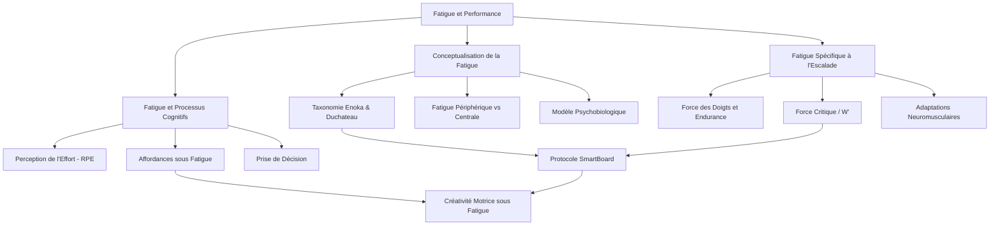
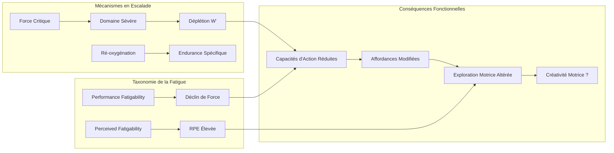

# 💪 MOC - Fatigue et Performance en Escalade de Bloc

> *Cette carte de contenu (MOC) structure l'ensemble des cadres théoriques, concepts et articles scientifiques relatifs au pilier physiologique de l'étude : les mécanismes de la fatigue musculaire, ses effets sur la performance et ses interactions potentielles avec la créativité motrice en escalade de bloc.*

---

## Vue d'ensemble : Architecture du pilier physiologique

La fatigue musculaire constitue la variable indépendante centrale de l'étude. Sa conceptualisation dépasse la simple « perte de force » pour englober un ensemble de modifications physiologiques, perceptuelles et cognitives susceptibles de transformer l'espace des solutions motrices disponibles pour le grimpeur. Ce MOC articule trois niveaux d'analyse : les fondements théoriques de la fatigue (taxonomies, mécanismes), les manifestations spécifiques à l'escalade (déterminants physiologiques, fatigue locale), et l'opérationnalisation méthodologique retenue dans notre protocole.

---

# PARTIE I : FONDEMENTS THÉORIQUES

## 1. Conceptualisation de la fatigue : vers une taxonomie intégrative

### 1.1 La fatigue comme symptôme multidimensionnel

La [[fatigue musculaire]] a longtemps été conceptualisée de manière fragmentée, les chercheurs distinguant « fatigue centrale », « fatigue périphérique » et « fatigue mentale » comme des phénomènes indépendants. [[Enoka & Duchateau (2016)]] proposent une rupture conceptuelle majeure en définissant la fatigue comme un symptôme unique et intégratif :

> « Fatigue is defined as a disabling symptom in which physical and cognitive function is limited by interactions between performance fatigability and perceived fatigability. »

Cette taxonomie repose sur deux attributs interdépendants plutôt que sur des catégories mutuellement exclusives. La **fatigabilité de performance** (*performance fatigability*) désigne le déclin objectif d'une mesure de performance sur une période discrète, dépendant de la fonction contractile musculaire et de l'activation neuromusculaire. La **fatigabilité perçue** (*perceived fatigability*) désigne les changements dans les sensations qui régulent l'intégrité du performeur, basés sur le maintien de l'homéostasie et l'[[État physiologique|état psychologique]].

Cette distinction est fondamentale pour notre étude : elle légitime théoriquement l'examen simultané de la fatigue physique (mesurée objectivement via la [[SmartBoard]]) et des facteurs psychologiques (mesurés par le [[Questionnaire d'Orientation Régulatrice en Sport (QORS)|QORS]] et l'[[ECCI-i-FR]]) dans leur effet conjoint sur la [[créativité motrice]].

### 1.2 Fatigue périphérique et fatigue centrale

La distinction classique entre mécanismes périphériques et centraux demeure utile pour comprendre les sites d'action de la fatigue, même si Enoka et Duchateau (2016) rappellent que ces mécanismes interagissent de manière inextricable en situation réelle.

**La fatigue périphérique** désigne l'ensemble des altérations survenant au niveau du muscle lui-même et de la jonction neuromusculaire : déplétion des substrats énergétiques (phosphocréatine, glycogène), accumulation de métabolites (ions H⁺, phosphate inorganique), altération du couplage excitation-contraction et perturbation de la propagation du potentiel d'action le long du sarcolemme ([[Enoka & Duchateau (2008)]]). En escalade, cette fatigue périphérique affecte principalement les fléchisseurs des doigts et les muscles impliqués dans la traction (voir [[Physiologie de la fatigue]]).

**La fatigue centrale** concerne la réduction de la commande motrice descendante, depuis le cortex moteur jusqu'aux motoneurones spinaux. Elle se manifeste par une diminution de l'activation volontaire maximale et une altération de la coordination inter-musculaire. [[Limonta et al. (2015)]] ont cependant montré que chez les grimpeurs élites, les dynamiques normalisées des signaux EMG et MMG se superposent entre grimpeurs et contrôles, suggérant que la commande motrice centrale opère selon les mêmes principes dans les deux populations, la différence de performance étant davantage d'origine périphérique.

### 1.3 Le modèle psychobiologique de la fatigue

[[Marcora et al. (2009)]] ont démontré expérimentalement que la fatigue — ici mentale, induite par 90 minutes de tâche cognitive exigeante — réduit la performance d'endurance de 15% sans altération des paramètres cardiorespiratoires ni musculoénergétiques. Le mécanisme identifié est exclusivement psychobiologique : une augmentation de la perception de l'effort (RPE) qui conduit les individus à abandonner l'exercice plus précocement pour un même niveau d'effort objectif.

Ce modèle, consolidé par la revue systématique de [[Van Cutsem et al. (2017)]] portant sur 11 études, établit que la fatigue mentale altère la performance d'endurance via une RPE anormalement élevée, sans modification des marqueurs physiologiques classiques (fréquence cardiaque, VO₂, lactate). La motivation envers la tâche physique reste par ailleurs inchangée entre conditions, dissociant l'effet de la fatigue de facteurs motivationnels conscients.

Cette dissociation entre fatigue et motivation est cruciale pour notre hypothèse H2 : si la fatigue agit indépendamment de la motivation, d'autres variables psychologiques individuelles — telles que l'[[orientation régulatrice]] — pourraient moduler la réponse comportementale à la fatigue, en affectant non pas la motivation générale mais les stratégies d'exploration motrice.

### 1.4 Fatigue mentale et performances motrices complexes

[[Pageaux & Lepers (2018)]] étendent le cadre de Marcora à quatre domaines de performance sportive. Leur revue de 29 études démontre que la fatigue mentale altère non seulement l'endurance, mais également les habiletés motrices (précision de passes, coordination œil-main) et la prise de décision tactique (positionnement, sélection de réponses). Seule la production maximale de force reste préservée — confirmant que l'effet est spécifique aux tâches sous-maximales nécessitant une régulation cognitive de l'effort.

Le mécanisme neurophysiologique proposé implique l'accumulation d'adénosine dans le cortex cingulaire antérieur (CCA) après effort cognitif prolongé, induisant une perception d'effort anormalement élevée. Ce mécanisme est contrecarré par la caféine (antagoniste de l'adénosine), offrant un support pharmacologique à l'hypothèse.

Pour notre étude, cette démonstration que la fatigue altère la prise de décision et les habiletés motrices — deux composantes centrales de la résolution créative de problèmes en escalade — renforce la plausibilité de l'hypothèse H1 selon laquelle la fatigue musculaire diminue la [[créativité motrice]].

---

## 2. La fatigue musculaire spécifique à l'escalade

### 2.1 Déterminants physiologiques de la performance

Les travaux de [[Draper et al. (2015)]] et [[Levernier et al. (2019)]] ont identifié les principaux déterminants physiologiques de la performance en escalade. Parmi l'ensemble des facteurs, seules les capacités des doigts et des bras sont très corrélées au niveau des grimpeurs de blocs.

La [[Force des doigts|force des doigts]] constitue le facteur le plus discriminant. La capacité à exercer des forces de haute intensité sur de petites prises est primordiale, particulièrement la [[vitesse de développement de la force]] (*Rate of Force Development* — RFD) qui conditionne la capacité à exploiter les capacités de force dans des fenêtres temporelles restreintes ([[Levernier et al. (2019)]]). La RFD est affectée précocement par la fatigue, potentiellement avant même que la force maximale ne diminue significativement, ce qui pourrait modifier les [[affordances]] perçues lors de mouvements dynamiques.

Du côté des bras, la capacité à développer de la puissance en traction représente le second facteur majeur. [[Devise et al. (2023)]] ont montré que dans la relation puissance = Force × Vitesse, c'est la composante Force qui prédit le mieux la performance. La fatigue des muscles tracteurs réduit donc directement la composante la plus déterminante de la puissance en escalade.

### 2.2 Force critique et seuils métaboliques

Le concept de force critique (FC) constitue un apport majeur pour comprendre les seuils de fatigue en escalade. [[Giles et al. (2019)]] ont validé l'applicabilité du modèle mathématique force-temps aux contractions isométriques intermittentes des fléchisseurs des doigts, démontrant une relation hyperbolique classique avec une FC moyenne de 41% de la [[NOTES PERMANENTES/Concepts/CMV|CMV]] chez des grimpeurs avancés à élites.

La FC définit le seuil au-delà duquel la fatigue musculaire périphérique s'accumule de façon irréversible (domaine sévère d'exercice). En deçà de ce seuil (domaine heavy), un état stable est possible et la récupération intervient lors des phases de relâchement. Au-delà, la capacité de travail limitée (W') s'épuise progressivement jusqu'à l'échec.

[[Giles et al. (2021)]] ont prolongé ces travaux en validant un protocole all-out en session unique sur 129 grimpeurs, démontrant que la FC exprimée en pourcentage de la masse corporelle explique 61% de la variance de performance en escalade sportive et que W' par kilogramme explique 34% de la variance en bloc. Le modèle combiné FC + W' atteint 44% de variance expliquée en bloc, confirmant que la résistance à la fatigue des fléchisseurs constitue un déterminant central de la performance.

Un apport méthodologique crucial de ces travaux est la démonstration que l'utilisation d'intensités exprimées en pourcentage de la CVM — pratique courante en recherche — est problématique : pour certains grimpeurs, 40% de la CVM se situe sous la FC (domaine modéré), pour d'autres au-dessus (domaine sévère), biaisant les comparaisons interindividuelles. Cette limitation justifie l'utilisation de la FC individuelle comme référentiel d'intensité dans les protocoles de fatigue.

### 2.3 Mécanismes neuromusculaires de la fatigue en escalade

[[Limonta et al. (2015)]] ont fourni les premières données détaillées sur la stratégie d'activation des unités motrices des fléchisseurs des doigts chez les grimpeurs élites. En combinant analyses EMG, MMG et de force lors d'une contraction isométrique à 80% CVM, ils démontrent que les grimpeurs présentent une force maximale supérieure, un temps d'endurance prolongé de 43%, et une meilleure stabilité de force. L'ensemble des paramètres converge vers une prévalence fonctionnelle des unités motrices rapides résistantes (type IIa) plutôt que rapides fatigables (type IIb), adaptation induite par des années d'entraînement spécifique.

La dégradation progressive de la stabilité et de la précision de force sous l'effet de la fatigue constitue un mécanisme potentiellement pertinent pour la [[créativité motrice]] : lorsque le contrôle fin de la force se détériore, le grimpeur peut être contraint de rechercher des solutions motrices alternatives mobilisant d'autres groupes musculaires ou d'autres postures.

### 2.4 Ré-oxygénation musculaire et endurance spécifique

[[MacLeod et al. (2007)]] ont identifié la ré-oxygénation musculaire lors des micro-repos entre contractions comme déterminant majeur de l'endurance spécifique en escalade, expliquant 41,1% de la variabilité de l'intégrale force-temps. Les grimpeurs entraînés présentent une capacité vasodilatatoire supérieure permettant une restauration plus rapide de l'oxygénation tissulaire, malgré des forces d'occlusion absolues plus élevées.

Cette caractéristique est directement pertinente pour notre protocole : la fatigue induite par la [[SmartBoard]] (alternance 10 secondes de suspension / 6 secondes de repos) sollicite précisément ce mécanisme de ré-oxygénation intermittente. Lorsque ce mécanisme est dégradé par la fatigue progressive, les [[capacités d'action]] du grimpeur diminuent de manière mesurable.

---

## 3. Fatigue, affordances et créativité : le chaînon manquant

### 3.1 Comment la fatigue transforme la perception des affordances

La réduction des [[capacités d'action]] sous l'effet de la fatigue modifie logiquement la perception des [[affordances]]. Dans le cadre écologique (Gibson, 1979), les affordances sont définies relativement aux capacités de l'organisme : une prise qui est « utilisable » en début de séance peut devenir « inutilisable » lorsque la force disponible diminue, transformant la structure des solutions accessibles.

[[Van Knobelsdorff et al. (2020)]] ont démontré une relation en U inversé entre les capacités d'action et la [[complexité visuo-motrice]] en escalade : les grimpeurs se situant près de leurs limites de force présentent une exploration visuo-motrice plus complexe que ceux évoluant loin de ces limites. Se rapprocher des limites de l'espace d'action accroît la complexité du regard et du comportement d'escalade. La fatigue musculaire, en rapprochant tous les grimpeurs de leurs limites fonctionnelles, devrait donc modifier de manière systématique la dynamique d'exploration.

### 3.2 Fatigue et variabilité motrice

L'[[approche écologique-dynamique]] positionne la [[variabilité fonctionnelle]] comme une propriété adaptative du système moteur. Selon les principes de Bernstein ([[Répétition sans répétition|répétition sans répétition]]), les patterns de mouvement ne sont jamais identiques lorsqu'une même tâche est répétée. Cette variabilité constitue le substrat à partir duquel la [[créativité motrice]] peut émerger.

La question centrale de notre étude est donc : la fatigue musculaire augmente-t-elle ou diminue-t-elle cette variabilité ? Deux hypothèses concurrentes sont envisageables.

La première, qui fonde notre H1, postule que la fatigue **réduit** la variabilité exploratoire. En diminuant les capacités d'action, la fatigue restreint l'espace des solutions accessibles, rendant les comportements plus stéréotypés et moins créatifs. Cette hypothèse s'appuie sur les travaux de [[Pageaux & Lepers (2018)]] montrant que la fatigue altère la prise de décision et les habiletés motrices.

La seconde, alternative, postule que la fatigue **force** l'exploration de nouvelles solutions. En déstabilisant les attracteurs moteurs habituels (les patterns routiniers devenant impossibles à maintenir), la fatigue pourrait contraindre le grimpeur à découvrir des alternatives inédites. Cette perspective s'appuie sur les travaux de [[Hristovski et al. (2011)]] montrant que la créativité émerge aux limites du système.

### 3.3 La lacune : l'interaction fatigue-créativité en situation réelle

Malgré l'importance évidente de cette interaction, **aucune étude à ce jour n'a examiné l'effet de la fatigue musculaire sur la créativité motrice en escalade**. Les travaux existants documentent séparément les effets de la fatigue sur la performance (MacLeod et al., 2007 ; Giles et al., 2019, 2021), les mécanismes cognitifs de la fatigue (Marcora et al., 2009 ; Van Cutsem et al., 2017) et les déterminants de la créativité motrice (Van Bergen et al., 2025 ; Medernach et al., 2025). Notre étude est la première à examiner ces dimensions conjointement.

---

# PARTIE II : ARTICULATION MÉTHODOLOGIQUE

## 4. Induire la fatigue : choix et justification du protocole

### 4.1 Principes de conception du protocole de fatigue

L'induction expérimentale de fatigue en escalade doit répondre à plusieurs exigences simultanées. D'une part, la fatigue doit être **spécifique** aux groupes musculaires sollicités en escalade (fléchisseurs des doigts, muscles tracteurs des bras) pour garantir la validité écologique. D'autre part, elle doit être **quantifiable** objectivement pour assurer la reproductibilité entre participants. Enfin, le niveau de fatigue induit doit être **suffisant** pour modifier les [[capacités d'action]] sans être excessif au point d'empêcher toute tentative de grimpe.

### 4.2 Le protocole SmartBoard de l'étude

Notre étude utilise la [[SmartBoard]], un ergomètre d'escalade instrumenté, selon un protocole en deux phases combinant fatigue générale des membres supérieurs et fatigue spécifique des fléchisseurs des doigts.

**Phase 1 — Fatigue générale (tractions maximales)** : Le participant réalise pendant 30 secondes le nombre maximal de tractions possible sur une prise large « baquet ». Cette phase cible les muscles tracteurs des bras (grand dorsal, biceps, rhomboïdes) et induit une fatigue de puissance mesurée par la perte de force enregistrée au cours des répétitions successives.

**Phase 2 — Fatigue spécifique (suspensions intermittentes)** : Le participant se suspend sur une prise de 12mm et exerce 80% de sa [[NOTES PERMANENTES/Concepts/CMV]] en alternant 10 secondes de suspension et 6 secondes de repos, pendant 24 contractions. Le protocole est calibré individuellement grâce à la mesure préalable de la CVM bilatérale. Cette phase cible spécifiquement les fléchisseurs des doigts et reproduit les caractéristiques intermittentes de l'effort en escalade.

La cinétique de fatigue enregistrée au cours des 24 contractions fournit un indice objectif de la perte de force individuelle, permettant de quantifier précisément la manipulation expérimentale.

### 4.3 Justification physiologique du protocole

Le choix d'une intensité à 80% de la CVM est justifié par plusieurs considérations. D'abord, cette intensité se situe largement au-dessus de la force critique moyenne (41% CVM selon [[Giles et al. (2019)]]), garantissant que tous les participants travaillent dans le domaine sévère d'exercice où la fatigue s'accumule de manière irréversible. Ensuite, le ratio contraction/repos de 10s/6s est proche des ratios documentés en escalade compétitive ([[MacLeod et al. (2007)]]), assurant la validité écologique du stimulus. Enfin, la combinaison fatigue générale (tractions) + fatigue spécifique (suspensions) reflète la réalité de l'escalade de bloc en compétition, où les blocs successifs épuisent simultanément les bras et les doigts.

---

## 5. Quantifier la fatigue : mesures et indicateurs

### 5.1 Mesures directes de la fatigabilité de performance

La SmartBoard fournit des mesures continues de force permettant de calculer plusieurs indicateurs de fatigue périphérique :

**La perte de force maximale** est exprimée comme le ratio entre la force produite lors des dernières contractions et la CVM initiale, fournissant un pourcentage de déclin directement interprétable.

**La cinétique de fatigue** décrit la trajectoire temporelle de la perte de force au fil des 24 contractions, permettant d'identifier des profils de fatigue différents (déclin linéaire, exponentiel, plateau initial suivi de décrochage).

**L'intégrale force-temps** ([[MacLeod et al. (2007)]]) combine force absolue et durée de maintien, offrant une mesure intégrée de l'endurance musculaire.

### 5.2 Mesures de la fatigabilité perçue

Conformément à la taxonomie d'[[Enoka & Duchateau (2016)]], la fatigue ne saurait être réduite à sa composante objective. L'échelle de douleur (1 à 10) utilisée dans notre protocole pour surveiller l'intégrité des participants fournit une mesure complémentaire de la perception de contrainte. L'ajout d'une échelle de perception de l'effort (RPE, Borg 6-20) constituerait un enrichissement méthodologique permettant de dissocier les deux attributs de la fatigue.

### 5.3 Vérification de l'efficacité du protocole

La vérification de l'induction effective de fatigue repose sur le critère objectif d'une perte de force significative mesurée par la SmartBoard. L'absence de récupération complète entre le protocole de fatigue et la tâche d'escalade (enchaînement direct) garantit que les participants grimpent effectivement dans un état physiologique dégradé par rapport à la condition de référence (bloc sans fatigue préalable).

---

## 6. Synthèse : Comment la fatigue interagit avec les autres dimensions de l'étude

### 6.1 Modèle intégratif fatigue-créativité-performance

La fatigue musculaire opère comme une modification des [[Contraintes|contraintes de l'organisme]] au sens de [[Newell (1986)]]. Cette modification produit des effets en cascade sur l'ensemble du système perception-action du grimpeur :

1. **Réduction des capacités d'action** → les forces disponibles diminuent, modifiant les [[affordances]] perçues
2. **Altération de la perception de l'effort** → la RPE augmente ([[Marcora et al. (2009)]]), modifiant les stratégies de régulation de l'engagement
3. **Déstabilisation des patterns moteurs habituels** → les solutions routinières deviennent plus coûteuses ou impossibles
4. **Réorganisation potentielle de l'exploration** → le grimpeur doit soit restreindre son exploration (hypothèse H1a : réduction de la créativité), soit explorer de nouvelles solutions compensatoires (hypothèse alternative)

### 6.2 Interaction avec le profil psychologique

La taxonomie d'Enoka et Duchateau (2016) intègre explicitement les facteurs psychologiques (arousal, fonction exécutive, attentes, humeur, motivation, feedback de performance) comme modulateurs de la fatigabilité perçue. Cette inclusion fournit une base théorique directe pour l'hypothèse H1b : les grimpeurs ayant une [[orientation régulatrice]] tournée vers la « promotion » — caractérisés par une focalisation sur les gains, le progrès et l'exploration — pourraient moduler la fatigabilité perçue de manière à maintenir une exploration créative malgré la fatigue périphérique.

À l'inverse, les grimpeurs orientés « prévention » — focalisés sur l'évitement des erreurs — pourraient manifester une fatigabilité perçue plus élevée, les conduisant à restreindre leur exploration motrice et à privilégier des solutions conservatrices.

---

# PARTIE III : CARTOGRAPHIE DES SOURCES

## 7. Articles fondamentaux par thématique

### 7.1 Conceptualisation et taxonomie de la fatigue

| Article | Apport principal | Lien avec l'étude |
|---------|-----------------|-------------------|
| [[Enoka & Duchateau (2016)]] | Taxonomie unifiée : performance fatigability × perceived fatigability | Cadre théorique principal de la fatigue |
| [[Enoka & Duchateau (2008)]] | Fatigue musculaire : what, why, how | Mécanismes périphériques et centraux |
| [[Marcora et al. (2009)]] | Preuve expérimentale fatigue mentale → performance | Modèle psychobiologique de la RPE |
| [[Van Cutsem et al. (2017)]] | Revue systématique fatigue mentale → performance | Consolidation des effets de la fatigue |

### 7.2 Fatigue mentale et performance sportive

| Article | Apport principal | Lien avec l'étude |
|---------|-----------------|-------------------|
| [[Pageaux & Lepers (2018)]] | Effets sur habiletés motrices et prise de décision | Transposition aux tâches complexes |
| [[Van Cutsem et al. (2017)]] | RPE comme médiateur central | Mécanisme psychobiologique |

### 7.3 Physiologie de la fatigue en escalade

| Article | Apport principal | Lien avec l'étude |
|---------|-----------------|-------------------|
| [[Giles et al. (2019)]] | Validation force critique des fléchisseurs | Seuils métaboliques en escalade |
| [[Giles et al. (2021)]] | Test all-out pour ff-CF et W' | Quantification fatigue spécifique |
| [[Limonta et al. (2015)]] | Stratégie d'activation des unités motrices | Mécanismes neuromusculaires |
| [[MacLeod et al. (2007)]] | Ré-oxygénation et endurance spécifique | Déterminants de l'endurance |
| [[Levernier et al. (2019)]] | Force des doigts et RFD | Capacités physiologiques |
| [[Devise et al. (2023)]] | Puissance et composante Force | Performance en traction |

### 7.4 Déterminants physiologiques de la performance

| Article | Apport principal | Lien avec l'étude |
|---------|-----------------|-------------------|
| [[Draper et al. (2015)]] | Grading scales et descripteurs | Caractérisation des niveaux |
| [[Vigouroux & Devise (2024)]] | Modulation de la force des doigts | Spécificité biomécanique |
| [[Quaine & Vigouroux (2004)]] | Biomécanique de la préhension | Fondements biomécaniques |

### 7.5 Fatigue, affordances et exploration motrice

| Article | Apport principal | Lien avec l'étude |
|---------|-----------------|-------------------|
| [[Van Knobelsdorff et al. (2020) extraction]] | Force et complexité visuo-motrice | Lien capacités-exploration |
| [[Pijpers et al. (2007)]] | Anxiété et perception des affordances | Facteurs psychologiques × affordances |
| [[Hristovski et al. (2011)]] | Créativité aux limites du système | Contraintes et émergence créative |

---

## 8. Concepts clés et leur interconnexion

### Glossaire des concepts clés

- [[fatigue musculaire]] : Diminution transitoire de la capacité à produire de la force, résultant d'une activité contractile préalable
- [[Physiologie de la fatigue]] : Champ disciplinaire étudiant les mécanismes biologiques sous-jacents à la fatigue
- [[NOTES PERMANENTES/Concepts/CMV]] : Contraction Volontaire Maximale — intensité de référence individuelle pour calibrer les protocoles
- [[Force des doigts]] : Capacité à exercer des forces de haute intensité sur de petites surfaces de préhension
- [[vitesse de développement de la force]] : Capacité à produire rapidement un niveau élevé de force (RFD)
- [[SmartBoard]] : Ergomètre d'escalade instrumenté pour évaluation et induction de fatigue
- [[État physiologique]] : Ensemble des caractéristiques fonctionnelles de l'organisme à un instant donné

---

## 9. Validation de l'étude par la littérature

### Ce que la littérature établit :

✅ La fatigue mentale réduit la performance d'endurance via une RPE élevée ([[Marcora et al. (2009)]] ; [[Van Cutsem et al. (2017)]])

✅ La fatigue mentale altère les habiletés motrices et la prise de décision sportive ([[Pageaux & Lepers (2018)]])

✅ La force critique (41% CVM) délimite le seuil de fatigue irréversible chez les grimpeurs ([[Giles et al. (2019)]])

✅ La résistance à la fatigue des fléchisseurs prédit la performance en escalade ([[Giles et al. (2021)]])

✅ Les grimpeurs élites possèdent des adaptations neuromusculaires spécifiques (unités motrices IIa) ([[Limonta et al. (2015)]])

✅ La ré-oxygénation musculaire pendant les micro-repos est un déterminant majeur de l'endurance ([[MacLeod et al. (2007)]])

✅ Les [[capacités d'action]] modulent l'exploration visuo-motrice en escalade ([[van Knobelsdorff et al. (2020) extraction|Van Knobelsdorff et al., 2020]])

### Ce que la littérature ne sait pas encore :

❓ L'effet de la fatigue musculaire sur la variabilité fonctionnelle et la créativité motrice en escalade

❓ Si la fatigue restreint l'exploration (hypothèse de restriction) ou force des solutions nouvelles (hypothèse de déstabilisation)

❓ Comment le profil psychologique module la réponse créative sous fatigue

❓ Quelle composante de la fatigue (performance vs. perçue) affecte le plus la créativité

### Ce que notre étude apportera :

🎯 Première démonstration empirique de l'effet fatigue musculaire → créativité motrice en situation réelle d'escalade

🎯 Dissociation des effets de la fatigue périphérique (mesurée par SmartBoard) et du profil psychologique (mesuré par QORS)

🎯 Test du rôle modulateur de l'orientation régulatrice sur la relation fatigue-créativité

🎯 Intégration des dimensions physiologiques, psychologiques et comportementales dans un modèle unifié

---

## 10. Pistes de lecture complémentaires

### Pour approfondir la taxonomie de la fatigue :
- [[Enoka & Duchateau (2008)]] — Fatigue musculaire : what, why, how
- Kluger, B. M., Krupp, L. B., & Enoka, R. M. (2013). Fatigue and fatigability in neurologic illnesses. *Neurology*, *80*(4), 409–416.

### Pour approfondir la physiologie de l'escalade :
- [[Giles et al. (2019)]] — Force critique des fléchisseurs
- [[Baláš et al. (2024)]] — Critique du protocole all-out ff-CF
- [[Vigouroux et al. (2018)]] — Biomécanique de la préhension en escalade

### Pour approfondir l'interaction fatigue-cognition :
- [[Marcora et al. (2009)]] — Modèle psychobiologique fondateur
- [[Pageaux & Lepers (2018)]] — Extension aux habiletés motrices complexes
- Lorist, M. M., & Tops, M. (2003). Caffeine, fatigue, and cognition. *Brain and Cognition*, *53*(1), 82–94.

---

*Dernière mise à jour : 20/02/2026*
*Document créé pour le projet de recherche Master 2 — Créativité et Escalade*

---

## 11. Articles nouvellement classifiés (mise à jour mars 2026)

L'indexation systématique de 21 articles a permis d'identifier 14 contributions additionnelles pertinentes pour le pilier physiologique de l'étude. Ces articles sont organisés selon une logique thématique complémentaire aux sections 7.1 à 7.5 existantes.

### 11.1 Physiologie de la fatigue en escalade — compléments

| Article | Apport principal | Lien avec l'étude |
|---------|-----------------|-------------------|
| [[Philippe et al. (2012)]] | Endurance isométrique et ré-oxygénation (NIRS) des fléchisseurs chez grimpeurs élites | Ré-oxygénation intermittente comme mécanisme discriminant ; ratio force/poids prédit performance féminine (r² = 0,946) |
| [[Augste et al. (2022)]] | Optimisation d'un test d'endurance intermittent des doigts | Protocole de fatigue et seuils de terminaison en escalade |
| [[Boeker et al. (2024)]] | Modélisation prédictive de la fatigue par EMG + trajectoire vidéo | Progression linéaire de la fatigue avec l'altitude ; position spatiale module dynamique physiologique |

### 11.2 Fatigue, affordances et exploration motrice — compléments

| Article | Apport principal | Lien avec l'étude |
|---------|-----------------|-------------------|
| [[Pijpers et al. (2006)]] | Anxiété modifie perception et réalisation des affordances en escalade (3 expériences) | Modèle transposable : état interne → effectivités → affordances ; rétrécissement attentionnel sous anxiété |
| [[Pacheco et al. (2019)]] | Approche Search Strategies — fatigue comme contrainte organisationnelle modifiant la topologie du task-space | Multifinality : trajectoires divergentes depuis conditions initiales identiques |
| [[Hristovski et al. (2011)]] | Modèle fondateur C(d × E) : créativité aux transitions de phase du système | Fatigue explicitement identifiée comme contrainte modifiant la topologie du paysage d'action |

### 11.3 Biomécanique, variabilité et fatigue en escalade

| Article | Apport principal | Lien avec l'étude |
|---------|-----------------|-------------------|
| [[Van Bergen et al. (2022)]] | Variabilité de force de préhension et performance : meta-grip | Adaptabilité de la préhension ; lien force-variabilité fonctionnelle |
| [[Sibella et al. (2007)]] | Analyse 3D du centre de masse : entropie géométrique | Méthodologie de quantification cinématique des stratégies motrices |
| [[Hacques et al. (2022)]] | Contrôle visuel et variabilité de pratique en escalade | Regard proactif, GIE, transfert entre voies |
| [[Medernach et al. (2021)]] | Prise de décision et résolution de problèmes en bloc | Expertise, affordances et tactiques sous contrainte temporelle |

### 11.4 Cadre écologique-dynamique et fatigue — articles transversaux

| Article | Apport principal | Lien avec l'étude |
|---------|-----------------|-------------------|
| [[Komar et al. (2014)]] | Dégénérescence neurobiologique en natation : pluripotentialité motrice | Clustering de patterns de coordination ; variabilité comme ressource adaptative |
| [[Seifert et al. (2014)]] | Dégénérescence et affordances en escalade de glace : multi-stabilité | Flexibilité coordinative accrue chez experts ; variabilité inter-membres |
| [[Orth et al. (2014)]] | Design des prises et apprentissage de la fluidité : routes métastables | GIE comme mesure de fluidité ; seules les routes multi-fonctionnelles induisent apprentissage |
| [[Orth et al. (2017)-2]] | Régulation spatio-temporelle et états d'activité en escalade (revue) | Taxonomie : immobilité fonctionnelle (récupération active, exploration visuelle) |
| [[Santos et al. (2018)]] | Apprentissage différentiel et créativité tactique en football | Variabilité individuelle → régularité collective sous contraintes |
| [[Torrents et al. (2016)]] | Émergence de mouvements créatifs en danse sous contraintes écologiques | Interaction expertise × contraintes sur amplitude exploratoire |

