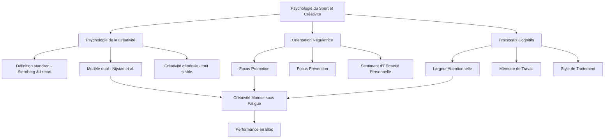
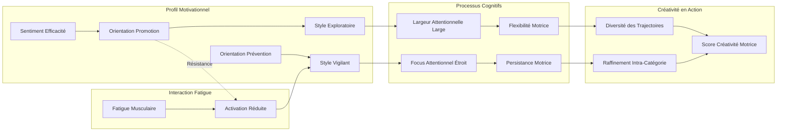

# 🧠 MOC - Psychologie du Sport et Créativité en Escalade

> *Cette carte de contenu (MOC) structure l'ensemble des cadres théoriques, concepts et articles scientifiques relatifs au pilier psychologique de l'étude : les profils motivationnels des grimpeurs, les déterminants cognitifs de la créativité, et leurs interactions potentielles avec la fatigue musculaire et la créativité motrice en escalade de bloc.*

---

## Vue d'ensemble : Architecture du pilier psychologique

Le profil psychologique du grimpeur constitue la seconde variable indépendante de l'étude. Sa conceptualisation dépasse la simple caractérisation de traits de personnalité pour englober un système motivationnel cohérent — l'[[orientation régulatrice]] — dont les deux pôles (promotion et prévention) génèrent des styles de traitement cognitif, des stratégies d'exploration et des réponses émotionnelles qualitativement distincts. Ce MOC articule trois niveaux d'analyse : les fondements théoriques de la psychologie de la créativité (définitions, modèles, processus cognitifs), les mécanismes motivationnels reliant profil psychologique et créativité (orientation régulatrice, sentiment d'efficacité personnelle), et l'opérationnalisation méthodologique retenue dans notre protocole.

---

# PARTIE I : FONDEMENTS THÉORIQUES

## 1. La psychologie de la créativité : cadres conceptuels

### 1.1 Définition standard et bi-dimensionnelle

La [[Psychologie de la créativité]] constitue un champ disciplinaire étudiant les processus cognitifs, les traits de personnalité et les facteurs environnementaux qui sous-tendent la production d'idées nouvelles et appropriées ([[Runco (2007)]]). Depuis les travaux pionniers de Guilford (1967) sur la pensée divergente, une définition consensuelle s'est consolidée : [[Sternberg & Lubart (1998)]] conceptualisent la créativité comme la capacité d'un individu à « produire un travail qui est à la fois nouveau (original, inattendu) et approprié (utile) ». Cette définition bi-dimensionnelle — [[originalité]] et [[fonctionnalité]] — constitue le socle conceptuel de notre étude et se retrouve aussi bien dans les approches cognitives traditionnelles que dans les reconceptualisations écologiques de la [[créativité motrice]].

La perspective cognitive traditionnelle conceptualise la créativité comme un trait individuel ou une capacité cognitive, évaluable par des [[tâche de pensée divergente|tâches de pensée divergente]] standardisées qui demandent aux participants d'imaginer le maximum de solutions possibles à un problème donné. Cependant, cette approche a progressivement été complétée par des perspectives situées — notamment l'[[approche écologique-dynamique]] — qui reconceptualisent la créativité non comme un processus mental préalable mais comme une propriété émergente de l'action ([[Orth et al. (2017)]]). Le pilier psychologique de notre étude se situe à l'interface de ces deux traditions : il mobilise des outils de mesure issus de la psychologie cognitive (questionnaires, profils dispositionnels) pour comprendre comment les caractéristiques individuelles modulent une créativité qui s'exprime dans l'action.

### 1.2 Le modèle dual de la créativité

Le [[modèle dual de la créativité]] proposé par [[Nijstad et al. (2010)]] constitue le cadre cognitif central de référence pour l'étude. Ce modèle postule l'existence de deux voies cognitives distinctes mais complémentaires conduisant à la production d'idées créatives.

**La voie de flexibilité** (*flexibility pathway*) implique un traitement cognitif flexible permettant d'explorer différentes catégories de solutions. Cette voie favorise l'[[originalité]] des productions en facilitant les transitions entre domaines conceptuels distincts. Elle est associée à des états affectifs positifs activants, à un style de traitement global et à une [[largeur attentionnelle]] étendue. Dans le contexte moteur, la flexibilité se traduit par la capacité à produire des trajectoires d'escalade relevant de catégories motrices variées (changements de posture, inversions d'appui, variations de séquençage).

**La voie de persistance** (*persistence pathway*) repose sur un traitement systématique et approfondi au sein d'une même catégorie de solutions. Cette voie favorise la [[fonctionnalité]] et le raffinement des solutions par exploration exhaustive d'un espace restreint. Elle est associée à l'effort cognitif soutenu et aux états affectifs négatifs activants. En escalade, la persistance correspondrait à l'exploration approfondie de variations subtiles au sein d'une même stratégie posturale (ajustements de placement des pieds, micro-variations d'amplitude).

La méta-analyse interne de [[Nijstad et al. (2010)]](20 études, N = 2118) confirme que flexibilité et originalité sont modérément corrélées (r = .34), que la fluidité intra-catégorielle (proxy de la persistance) est également positivement liée à l'originalité (r = .12), et que les deux voies sont orthogonales (r = .01). Ce dernier résultat est toutefois contesté dans le domaine moteur : [[Moraru et al. (2016)]] rapportent une corrélation négative entre flexibilité et persistance (ρ = −.55 à −.73), suggérant que ces deux voies pourraient constituer les extrémités d'un continuum dans les tâches d'action divergente plutôt que deux processus indépendants.

Ce modèle dual est fondamental pour notre étude car il fournit le cadre interprétatif reliant les deux hypothèses : la [[fatigue musculaire]] (H1) pourrait affecter différemment ces deux voies — réduisant potentiellement la flexibilité exploratoire tout en préservant (ou non) la capacité de persistance — et le [[profil psychologique]] (H2) pourrait prédisposer les grimpeurs à emprunter préférentiellement l'une ou l'autre voie.

### 1.3 La créativité générale comme trait dispositionnnel

Au-delà des processus cognitifs engagés en situation, la [[créativité générale]] peut être conceptualisée comme un trait relativement stable de l'individu ([[Runco (2007)]]). Cette perspective dispositionnelle repose sur la *Generativity Theory* d'Epstein (1996), qui postule que la créativité émerge de compétences spécifiques entraînables plutôt que d'un don inné. 

[[Delpech et al. (2020)]] ont validé la version française de l'*Epstein Creativity Competencies Inventory for Individual* ([[ECCI-i-FR]]), identifiant quatre dimensions constitutives de la créativité générale : la capacité à **capturer** les nouvelles idées (*capturing*), la tendance à relever des **défis** (*challenging*), l'**ouverture** à de nouvelles expériences (*broadening*), et l'**aménagement de l'environnement** pour stimuler la pensée créative (*surrounding*). Testée auprès de 280 participants, l'échelle démontre une cohérence interne satisfaisante (α = .82) et une corrélation significative avec l'ouverture à l'expérience (r = .58, p < .001), confirmant la validité convergente avec les théories établies de la personnalité créative.

Dans notre étude, la créativité générale constitue une variable de contrôle permettant d'examiner si les dispositions créatives générales prédisent la [[créativité motrice]] mesurée en situation réelle d'escalade. Cette question de la transférabilité entre créativité générale et créativité domaine-spécifique constitue l'une des lacunes que notre étude vise à combler.

### 1.4 La créativité comme comportement stochastique contraint

[[Simonton (2003)]] propose une conceptualisation statistique de la créativité particulièrement pertinente pour l'étude du mouvement. Selon cet auteur, les productions créatives peuvent être comprises comme des événements statistiquement rares émergeant d'un processus de variation stochastique sous contraintes. Plus la variabilité est grande, plus la probabilité qu'une solution créative émerge est élevée. Cette perspective établit un pont conceptuel crucial entre la psychologie cognitive et l'[[approche écologique-dynamique]] : dans les deux cas, la [[variabilité]] constitue le substrat à partir duquel la créativité peut émerger.

---

## 2. L'orientation régulatrice : le système motivationnel central

### 2.1 La théorie fondatrice de Higgins (1997)

La théorie de l'[[orientation régulatrice]] (*Regulatory Focus Theory*) constitue le cadre motivationnel central de notre étude. [[Higgins (1997)]] propose de dépasser le principe hédonique traditionnel (approcher le plaisir, éviter la douleur) en introduisant le concept de focus régulateur comme principe motivationnel fondamental. Deux orientations régulatrices qualitativement distinctes sont identifiées, chacune ayant des bases développementales propres (besoins de nurturance versus besoins de sécurité) et des conséquences motivationnelles spécifiques.

**L'[[orientation de promotion]]** caractérise les individus motivés prioritairement par l'accomplissement d'aspirations et l'obtention de gains. Cette focalisation régulatrice prédispose à adopter des stratégies d'approche, privilégiant l'exploration d'opportunités et l'engagement dans des comportements orientés vers la croissance personnelle au détriment de considérations sécuritaires. Les profils à dominante promotion se distinguent par leur sensibilité aux feedbacks positifs, leur tolérance aux erreurs d'omission (« rater une occasion ») plutôt qu'aux erreurs de commission (« commettre une faute »), et un style de traitement exploratoire et « risqué » ([[Friedman & Forster (2001)]]).

**L'[[orientation de prévention]]** caractérise les individus motivés prioritairement par le respect d'obligations et l'évitement de pertes. Cette focalisation prédispose à adopter des stratégies de vigilance, privilégiant la minimisation des erreurs et le maintien de l'état actuel. Les profils à dominante prévention se distinguent par leur sensibilité aux feedbacks négatifs, leur intolérance aux erreurs de commission et un style de traitement vigilant et conservateur. Higgins (1997) souligne que les émotions associées diffèrent qualitativement : l'échec sous promotion génère de la déjection (tristesse, déception) tandis que l'échec sous prévention génère de l'agitation (anxiété, tension).

Un point théorique essentiel est l'**orthogonalité** des deux orientations : elles ne constituent pas les pôles opposés d'un continuum mais deux dimensions indépendantes. Chaque individu possède à des degrés variables les deux orientations simultanément, bien que l'une tende à dominer de manière chronique. Cette conceptualisation est confirmée empiriquement par la validation du [[Questionnaire d'Orientation Régulatrice en Sport (QORS)]] ([[Debanne (2022)]]), qui rapporte une corrélation inter-échelles faible (r = .22) entre promotion et prévention.

### 2.2 Orientation régulatrice et créativité : les preuves empiriques

La relation entre orientation régulatrice et créativité constitue l'un des programmes de recherche les plus documentés dans ce champ. Cinq études fondamentales structurent cette littérature et fondent directement l'hypothèse H2 de notre étude.

**[[Friedman & Forster (2001)]]** fournissent la première démonstration multi-méthode que des indices de promotion améliorent la créativité (perspicacité visuelle et génération créative) comparés aux indices de prévention, via un style de traitement plus exploratoire et un biais de réponse plus « risqué ». Crucially, ces effets sont indépendants des états affectifs transitoires, démontrant que c'est le style de traitement — et non l'humeur — qui médie la relation. L'expérience 5 démontre en outre que les différences individuelles chroniques en force de guide de promotion prédisent positivement la performance créative (b = 0,27, p < .003), tandis que celles en prévention la prédisent négativement (b = −0,49, p < .004).

**[[Lam & Chiu (2002)]]** introduisent une nuance essentielle : le focus promotion prédit la **fluence** idéationnelle (r = .45, p < .01) — c'est-à-dire la diversité des solutions produites — mais pas leur originalité. Par ailleurs, le focus prévention soutient davantage la **persévérance** face aux obstacles, les participants en condition prévention manifestant une intention de continuer significativement plus élevée (96% vs 86%) lorsque la probabilité de succès diminue. Cette dissociation entre fluence et persistance selon le focus rejoint directement le [[modèle dual de la créativité]].

**[[Herman & Reiter-Palmon (2011)]]** étendent ces résultats en montrant que la promotion favorise la génération d'idées originales (r = .29, p < .01) et l'évaluation précise de l'originalité, tandis que la prévention favorise l'évaluation précise de la **qualité** des idées (r = −.30, p < .01). Ce résultat complexifie la vision simpliste « promotion = créatif, prévention = non créatif » en montrant que les deux orientations contribuent à des dimensions différentes du processus créatif.

**[[Baas et al. (2011)]]** apportent la nuance la plus importante pour notre étude : le focus prévention peut promouvoir la créativité à un niveau comparable au focus promotion, à condition que le **but ne soit pas encore atteint** (absence de clôture régulatrice). C'est uniquement lorsque le but de prévention est résolu (soulagement) que la créativité chute. Le mécanisme médiateur identifié est l'**activation cognitive** — et non la valence affective — ce qui est crucial pour notre hypothèse H1 : la fatigue musculaire pourrait fonctionner comme un état désactivant analogue à la clôture préventive, réduisant la créativité via une baisse d'activation.

**[[Dannerbo et al. (2025)]]** transposent ces résultats au domaine de l'escalade. Auprès de 99 grimpeurs, ils démontrent que l'orientation promotion présente la corrélation la plus forte avec la créativité (ρ = 0,568, p < 0,001), que la prévention est négativement corrélée (ρ = −0,314, p < 0,01), et surtout que la promotion **médie entièrement** la relation entre auto-efficacité et créativité. Ce résultat signifie que l'auto-efficacité n'agit pas directement sur la créativité : son effet passe par l'activation d'une orientation promotionnelle.

### 2.3 Le sentiment d'efficacité personnelle comme modulateur

Le [[sentiment d'efficacité personnelle]] (Bandura, 1977) constitue un construit complémentaire à l'orientation régulatrice. Défini comme la croyance d'un individu en sa capacité à organiser et exécuter les actions nécessaires pour produire des résultats attendus, il se distingue de l'estime de soi globale par sa spécificité situationnelle. Un grimpeur peut posséder une efficacité élevée pour les blocs techniques tout en manifestant une efficacité réduite pour les séquences dynamiques.

[[Dannerbo et al. (2025)]] démontrent que l'auto-efficacité n'influence la créativité qu'indirectement, via l'activation d'une [[orientation de promotion]]. Ce résultat est théoriquement cohérent : les individus à forte efficacité perçue, se sentant capables de réussir, adoptent un focus promotionnel (recherche d'accomplissement) qui libère l'exploration créative. Inversement, une faible efficacité perçue — potentiellement induite par la [[fatigue musculaire]] — pourrait activer un focus préventionnel de protection, restreignant l'exploration.

### 2.4 La mesure de l'orientation régulatrice : le QORS

Le [[Questionnaire d'Orientation Régulatrice en Sport (QORS)]], développé et validé par [[Debanne (2022)]], constitue l'outil de mesure retenu dans notre étude pour opérationnaliser les orientations régulatrices chroniques des grimpeurs. Cet instrument de 12 items (7 promotion, 5 prévention) est issu d'un processus rigoureux de validation transculturelle en cinq études successives (N total > 900), attestant de la validité concomitante, de construit, de la stabilité temporelle (test-retest à 5 semaines : rs > .80) et de la validité nomologique.

Le QORS apporte deux améliorations majeures par rapport à la mesure originale (GRFM de Lockwood et al., 2002). Premièrement, l'orthogonalité des deux échelles est empiriquement vérifiée par analyse factorielle confirmatoire (AFC : χ²/ddl = 2,40, RMSEA = .07, GFI = .91). Deuxièmement, l'instrument résout l'amalgame entre orientation régulatrice et motivation d'approche-évitement identifié par Summerville & Roese (2008), en se centrant exclusivement sur la conceptualisation par « point de référence ».

La validité nomologique confirme les patterns théoriques attendus : l'orientation promotion corrèle positivement avec l'ouverture (r = .22), la conscienciosité (r = .25), l'extraversion (r = .27) et le système d'activation comportementale BAS (r = .38), tandis que l'orientation prévention corrèle avec le neuroticisme (r = .21) et le système d'inhibition comportementale BIS (r = .27).

---

## 3. Processus cognitifs et créativité motrice

### 3.1 Largeur attentionnelle et exploration créative

La [[largeur attentionnelle]] désigne l'étendue du champ perceptif qu'un individu peut traiter simultanément lors d'une tâche cognitive ou motrice (Memmert & Roca, 2019). Cette propriété du système attentionnel constitue un déterminant critique de la créativité motrice en escalade, comme le démontrent deux lignes de recherche convergentes.

[[Moraru et al. (2016)]] fournissent la première validation empirique du lien entre largeur attentionnelle et créativité motrice dans une tâche d'action divergente : les participants soumis à un amorçage attentionnel large (lecture des grandes lettres dans une tâche de Navon) produisent significativement plus de catégories de locomotion différentes que ceux en condition attention étroite (M = 4,11 vs 3,32 ; d = .82). Ce résultat confirme que la voie de flexibilité du [[modèle dual de la créativité]] opère dans le domaine moteur via l'étendue attentionnelle.

[[Medernach et al. (2025)]] étendent cette démonstration à l'escalade en montrant que les grimpeurs élites maintiennent une exploration visuelle à champ large lors de la [[visualisation préalable]], permettant la détection de prises périphériques peu saillantes. Les grimpeurs avancés, en revanche, adoptent un focus attentionnel étroit sur les sections apparemment difficiles, induisant une [[cécité d'inattention]] sur des éléments pourtant critiques (prise manquée par 60% des avancés versus 10% des élites, p = .008). Ce mécanisme suggère que la largeur attentionnelle n'est pas une propriété fixe mais une compétence développée avec l'expertise, potentiellement dégradable sous [[fatigue musculaire]].

Le lien avec l'orientation régulatrice est théoriquement plausible : le focus promotionnel, caractérisé par un style de traitement exploratoire et global ([[Friedman & Forster (2001)]]), devrait favoriser une largeur attentionnelle étendue, tandis que le focus préventionnel, caractérisé par la vigilance focalisée, pourrait restreindre le champ attentionnel.

### 3.2 Mémoire de travail et planification motrice

La [[mémoire de travail]] désigne un système cognitif de capacité limitée assurant le stockage temporaire et la manipulation active d'informations nécessaires à l'exécution de tâches complexes (Baddeley & Hitch, 1974). Sa capacité limitée — typiquement 7±2 items (Miller, 1956) — est particulièrement sollicitée lors de la phase de preview en escalade : les grimpeurs doivent maintenir une représentation mentale de la configuration spatiale des prises, planifier mentalement des séquences de mouvements et intégrer ces informations avec leur [[répertoire moteur]] préexistant.

[[Moraru et al. (2016)]] rapportent cependant un résultat inattendu : la charge en mémoire de travail (rappel de 2 vs 5 chiffres) n'affecte ni la flexibilité, ni la persistance, ni l'originalité dans une tâche d'action divergente. Les auteurs interprètent ce résultat par le fait que les tâches motrices peu maîtrisées mobilisent déjà un niveau élevé de contrôle conscient, saturant la mémoire de travail indépendamment de la charge imposée. Cette interprétation a des implications importantes pour notre étude : chez des grimpeurs experts dont l'exécution motrice est largement automatisée, la fatigue pourrait libérer un surplus de charge cognitive (via la nécessité de contrôler consciemment des mouvements habituellement automatiques) qui réduirait la capacité disponible pour l'exploration créative.

### 3.3 Style de traitement et blocage mémoriel/moteur

[[Friedman & Forster (2001)]] identifient deux mécanismes cognitifs distincts par lesquels l'orientation régulatrice module la créativité. Le premier est le **biais de réponse** : les individus en focus promotion adoptent un biais « risqué » (tendance à dire « oui ») lors de la récupération en mémoire, tandis que ceux en focus prévention adoptent un biais conservateur (tendance à dire « non »). Le second est la **réduction du blocage mémoriel** : la promotion facilite la récupération de solutions nouvelles après interférence, permettant d'échapper à la fixation sur le matériau initialement activé.

Transposé au domaine moteur, ce mécanisme suggère que les grimpeurs à orientation promotionnelle pourraient plus facilement abandonner un pattern moteur habituel devenu inefficace sous fatigue pour explorer des alternatives inédites, tandis que les grimpeurs à orientation préventionnelle persévéreraient sur des solutions éprouvées même lorsqu'elles ne sont plus optimales.

---

## 4. Personnalité, grit et performance en escalade

### 4.1 Le profil de personnalité des grimpeurs

[[Ionel et al. (2022)]] fournissent les données empiriques les plus complètes sur la relation entre personnalité et performance en escalade. Sur un échantillon de 272 grimpeurs, l'**ouverture à l'expérience** prédit positivement toutes les dimensions de performance en escalade sportive (β entre 2,03 et 3,29, p < .001), tandis que l'**agréabilité** la prédit négativement (β entre −1,79 et −2,08, p < .001). Contrairement aux attentes théoriques, le névrosisme et l'extraversion ne contribuent pas significativement — les auteurs suggèrent un effet de restriction de variance par auto-sélection des pratiquants.

Ce résultat est particulièrement pertinent pour notre étude car l'ouverture à l'expérience — trait associé à la curiosité, à la disposition à essayer de nouvelles approches et à la créativité — est également le corrélat le plus robuste de l'[[orientation de promotion]] (r = .22, [[Debanne (2022)]]) et de la [[créativité générale]] (r = .58, [[Delpech et al. (2020)]]). Cette convergence suggère un profil psychologique cohérent : les grimpeurs les plus performants seraient ceux combinant ouverture, orientation promotionnelle et créativité dispositionnelle élevée.

### 4.2 Le grit comme facteur de résilience

Le **grit** — défini comme la persévérance et la passion pour les objectifs à long terme (Duckworth et al., 2007) — explique 2 à 3% de variance additionnelle en performance au-delà des traits de personnalité du Five Factor Model ([[Ionel et al. (2022)]]). Bien que modeste en magnitude, cette contribution unique valide le grit comme construit distinct de la conscienciosité dans le contexte de l'escalade.

Pour notre étude, le grit offre un cadre complémentaire pour comprendre la **résilience créative** sous fatigue : les grimpeurs à haut grit pourraient maintenir leur engagement exploratoire plus longtemps malgré la fatigue, préservant ainsi leur capacité à produire des solutions motrices originales. Ce mécanisme est conceptuellement proche de la « persévérance face aux obstacles » documentée par [[Lam & Chiu (2002)]] pour le focus prévention.

---

# PARTIE II : ARTICULATION MÉTHODOLOGIQUE

## 5. Mesurer le profil psychologique des grimpeurs

### 5.1 Le QORS : opérationnalisation de l'orientation régulatrice

Le [[Questionnaire d'Orientation Régulatrice en Sport (QORS)]] constitue l'instrument principal de mesure du profil psychologique dans notre protocole. Composé de 12 items répartis en deux échelles orthogonales (7 items promotion, 5 items prévention), il est administré en ligne la veille de l'expérimentation via la plateforme LimeSurvey. Les participants répondent sur une échelle de Likert en 7 points (1 = « ne me correspond pas du tout » ; 7 = « me correspond tout à fait »).

L'opérationnalisation de l'orientation régulatrice suit la procédure utilisée dans le protocole CERSTAPS : le score différentiel est calculé en soustrayant le score de prévention au score de promotion. Les participants sont ensuite répartis en deux groupes par **séparation médiane** : un groupe « dominante promotion » et un groupe « dominante prévention ». Cette procédure, bien que standardisée, implique une perte d'information (dichotomisation d'une variable continue) qui sera discutée dans les limites.

### 5.2 L'ECCI-i-FR : mesure de la créativité dispositionnelle

L'[[ECCI-i-FR]] (*Epstein Creativity Competencies Inventory for Individual — version française*) constitue le second instrument psychologique du protocole. Composé de 26 items répartis en quatre dimensions (*capturing*, *challenging*, *broadening*, *surrounding*), il est administré en ligne conjointement au QORS. Les participants répondent sur une échelle de Likert en 5 points.

Cet instrument permet de tester une hypothèse secondaire cruciale : la créativité générale (trait dispositionnnel) prédit-elle la [[créativité motrice]] (comportement en situation) ? Si cette relation est confirmée, elle établirait un pont empirique entre dispositions psychologiques et comportement adaptatif réel, validant l'utilisation de mesures dispositionnelles comme prédicteurs de la performance créative en situation écologique.

### 5.3 Articulation des deux mesures

La combinaison QORS + ECCI-i-FR permet d'examiner deux niveaux du profil psychologique. Le QORS capture le **système motivationnel** du grimpeur (comment il régule son comportement face aux buts), tandis que l'ECCI-i-FR capture ses **compétences créatives** dispositionnelles (sa capacité générale à produire des idées nouvelles). [[Dannerbo et al. (2025)]] ont montré que ces deux niveaux interagissent : l'orientation promotion médie la relation auto-efficacité → créativité. Notre étude teste si cette architecture motivationnelle se retrouve lorsque la créativité est mesurée en situation réelle d'escalade plutôt que par questionnaire.

---

## 6. Du profil psychologique à la créativité motrice : modèle de médiation

### 6.1 Chaîne causale proposée

L'articulation théorique entre profil psychologique et créativité motrice repose sur une chaîne de médiation à plusieurs niveaux. L'[[orientation régulatrice]] chronique (mesurée par le QORS) détermine un **style de traitement cognitif** (exploratoire vs vigilant) qui module la **largeur attentionnelle** lors de la phase de preview et de grimpe, ce qui influence le nombre et la diversité des [[affordances]] perçues, et donc la [[variabilité fonctionnelle]] des trajectoires produites.

Sous fatigue, cette chaîne est potentiellement perturbée à deux niveaux. La fatigue périphérique réduit les [[capacités d'action]], modifiant objectivement les affordances disponibles. La fatigue perçue (*perceived fatigability*, [[Enoka & Duchateau (2016)]]) module l'activation cognitive, et cette modulation dépend du profil psychologique : les grimpeurs en focus promotion maintiendraient une activation élevée (style exploratoire préservé) tandis que ceux en focus prévention subiraient une désactivation (style conservateur renforcé).

### 6.2 L'hypothèse H2 : formulation et fondements

**H2** : Les grimpeurs ayant une orientation régulatrice tournée davantage vers la « promotion » maintiennent une meilleure créativité malgré la fatigue, et montrent une meilleure performance en escalade de bloc.

Cette hypothèse s'appuie sur la convergence de quatre résultats empiriques : (1) la corrélation promotion-créativité chez les grimpeurs (ρ = 0,568, [[Dannerbo et al. (2025)]]); (2) le maintien de l'activation sous focus promotion indépendamment de la clôture régulatrice ([[Baas et al. (2011)]]); (3) la réduction du blocage mémoriel sous promotion ([[Friedman & Forster (2001)]]); et (4) la supériorité de la fluence idéationnelle sous promotion ([[Lam & Chiu (2002)]]).

L'hypothèse alternative — que le focus prévention pourrait soutenir la créativité via la **persistance** — est théoriquement plausible d'après [[Baas et al. (2011)]] (prévention non résolue = activation maintenue) et [[Lam & Chiu (2002)]] (prévention = persévérance face aux obstacles). Notre design permet de tester laquelle de ces prédictions s'avère valide dans le contexte de l'escalade sous fatigue.

---

# PARTIE III : CARTOGRAPHIE DES SOURCES

## 7. Articles fondamentaux par thématique

### 7.1 Théorie de l'orientation régulatrice

| Article | Apport principal | Lien avec l'étude |
|---------|-----------------|-------------------|
| [[Higgins (1997)]] | Théorie fondatrice : promotion vs prévention | Cadre motivationnel central |
| [[Debanne (2022)]] | Validation du QORS (12 items, francophone) | Outil de mesure principal |
| [[Dannerbo et al. (2025)]] | Promotion médie auto-efficacité → créativité en escalade | Fondement direct de H2 |

### 7.2 Orientation régulatrice et créativité

| Article                           | Apport principal                                                                      | Lien avec l'étude                               |
| --------------------------------- | ------------------------------------------------------------------------------------- | ----------------------------------------------- |
| [[Friedman & Forster (2001)]]     | Promotion → créativité via style exploratoire et réduction du blocage                 | Mécanismes cognitifs de H2                      |
| [[Lam & Chiu (2002)]]             | Promotion → fluence ; Prévention → persévérance                                       | Dissociation voies du modèle dual               |
| [[Herman & Reiter-Palmon (2011)]] | Promotion → originalité ; Prévention → évaluation de la qualité                       | Nuance des rôles différenciés                   |
| [[Baas et al. (2011)]]            | Prévention peut promouvoir créativité si but non atteint ; activation comme médiateur | Hypothèse alternative et mécanisme d'activation |

### 7.3 Psychologie de la créativité

| Article | Apport principal | Lien avec l'étude |
|---------|-----------------|-------------------|
| [[Sternberg & Lubart (1998)]] | Définition bi-dimensionnelle : originalité + fonctionnalité | Socle conceptuel |
| [[Nijstad et al. (2010)]] | Modèle dual : flexibilité + persistance | Cadre interprétatif central |
| [[Delpech et al. (2020)]] | Validation ECCI-i-FR (4 dimensions) | Outil de mesure |
| [[Simonton (2003)]] | Créativité comme processus stochastique contraint | Pont cognition-écologie |

### 7.4 Processus cognitifs et créativité motrice

| Article | Apport principal | Lien avec l'étude |
|---------|-----------------|-------------------|
| [[Moraru et al. (2016)]] | Attention large → flexibilité motrice ; Tâche d'action divergente | Validation du modèle dual en moteur |
| [[Memmert et al. (2019)]] | Créativité tactique et prise de décision en sport | Cadre sport collectif |
| [[Roca et al. (2018)]] | Décision créative et recherche visuelle | Processus perceptuels |
| [[Roca et al. (2014)]] | Capture expertise perceptivo-cognitive | Méthodes de mesure |

### 7.5 Personnalité et performance en escalade

| Article | Apport principal | Lien avec l'étude |
|---------|-----------------|-------------------|
| [[Ionel et al. (2022)]] | Ouverture et grit prédisent performance en escalade | Profil des grimpeurs |
| [[Medernach et al. (2025)]] | Expertise module attention et créativité en bloc | Contexte escalade |
| [[Pizzera et al. (2012)]] | Expérience motrice influence jugements perceptuels | Lien expertise-perception |

### 7.6 Fatigue, cognition et interactions avec le profil psychologique

| Article | Apport principal | Lien avec l'étude |
|---------|-----------------|-------------------|
| [[Enoka & Duchateau (2016)]] | Fatigabilité perçue modulée par facteurs psychologiques | Fondement théorique interaction fatigue × profil |
| [[Van Cutsem et al. (2017)]] | Fatigue mentale altère prise de décision via RPE | Mécanismes cognitifs de la fatigue |
| [[Pageaux & Lepers (2018)]] | Fatigue altère habiletés motrices et décision tactique | Transposition aux tâches complexes |
| [[Pijpers et al. (2007)]] | Anxiété module perception des affordances | Facteurs psychologiques × affordances |

---

## 8. Concepts clés et leur interconnexion

### Glossaire des concepts clés

- [[orientation régulatrice]] : Système motivationnel distinguant la régulation vers les gains (promotion) et l'évitement des pertes (prévention)
- [[orientation de promotion]] : Focalisation sur les aspirations, l'exploration et la prise de risque
- [[orientation de prévention]] : Focalisation sur les obligations, la sécurité et l'évitement des erreurs
- [[modèle dual de la créativité]] : Cadre postulant deux voies vers la créativité : flexibilité (inter-catégories) et persistance (intra-catégorie)
- [[créativité générale]] : Trait dispositionnnel stable évaluant les compétences créatives dans la vie quotidienne
- [[sentiment d'efficacité personnelle]] : Croyance en sa capacité à organiser et exécuter les actions nécessaires pour atteindre un résultat
- [[largeur attentionnelle]] : Étendue du champ perceptif traitable simultanément
- [[mémoire de travail]] : Système cognitif de capacité limitée pour le stockage temporaire et la manipulation d'informations
- [[Profil psychologique]] : Ensemble des caractéristiques dispositionnelles influençant les réponses aux situations

---

## 9. Validation de l'étude par la littérature

### Ce que la littérature établit :

✅ L'orientation promotion corrèle avec la créativité générale chez les grimpeurs (ρ = 0,568, [[Dannerbo et al. (2025)]])

✅ L'orientation prévention est négativement corrélée à la créativité (ρ = −0,314, [[Dannerbo et al. (2025)]])

✅ La promotion médie entièrement la relation auto-efficacité → créativité ([[Dannerbo et al. (2025)]])

✅ Le focus promotion améliore la créativité via un style de traitement exploratoire indépendant de l'affect ([[Friedman & Forster (2001)]])

✅ L'activation cognitive — et non la valence affective — est le médiateur central entre états motivationnels et créativité ([[Baas et al. (2011)]])

✅ Une attention large augmente la flexibilité motrice dans les tâches d'action divergente ([[Moraru et al. (2016)]])

✅ L'ouverture à l'expérience prédit la performance en escalade ([[Ionel et al. (2022)]])

✅ Le QORS est un outil validé pour mesurer les orientations régulatrices en contexte sportif francophone ([[Debanne (2022)]])

### Ce que la littérature ne sait pas encore :

❓ L'effet de l'orientation régulatrice sur la créativité **motrice** mesurée en situation réelle d'escalade (vs créativité générale par questionnaire)

❓ L'interaction profil psychologique × fatigue musculaire sur la créativité motrice

❓ Si le focus promotion protège la créativité motrice sous fatigue (résilience créative)

❓ Le rôle de l'activation cognitive comme médiateur entre fatigue et créativité en contexte moteur

❓ La transférabilité de la créativité générale (ECCI-i-FR) vers la créativité motrice domaine-spécifique

❓ Les mécanismes attentionnels (largeur, mémoire de travail) sous fatigue en escalade

### Ce que notre étude apportera :

🎯 Première démonstration de l'effet de l'orientation régulatrice sur la créativité motrice en situation réelle d'escalade

🎯 Test de l'interaction profil psychologique × fatigue : identification de facteurs de résilience créative

🎯 Validation (ou non) du pont entre créativité générale dispositionnelle et créativité motrice contextualisée

🎯 Intégration des dimensions motivationnelles, physiologiques et comportementales dans un modèle unifié

---

## 10. Pistes de lecture complémentaires

### Pour approfondir la théorie de l'orientation régulatrice :
- [[Higgins (1997)]] — *Beyond Pleasure and Pain* (article fondateur)
- Higgins, E. T. (2012). *Beyond Pleasure and Pain: How Motivation Works*. Oxford University Press.
- Lanaj, K., Chang, C.-H., & Johnson, R. E. (2012). Regulatory focus and work-related outcomes: A review and meta-analysis. *Psychological Bulletin*, *138*(5), 998–1034.

### Pour approfondir le modèle dual de la créativité :
- [[Nijstad et al. (2010)]] — Modèle dual : flexibilité et persistance
- De Dreu, C. K. W., Baas, M., & Nijstad, B. A. (2008). Hedonic tone and activation level in the mood-creativity link. *Journal of Personality and Social Psychology*, *94*(5), 739–756.

### Pour approfondir les processus cognitifs en créativité motrice :
- [[Moraru et al. (2016)]] — Attention et mémoire de travail dans les tâches d'action divergente
- Memmert, D. (2007). Can creativity be improved by an attention-broadening training program? *Journal of Sports Sciences*, *25*(12), 1407–1413.

### Pour approfondir la personnalité en escalade :
- [[Ionel et al. (2022)]] — Personnalité, grit et performance
- Llewellyn, D. J., Sanchez, X., Asghar, A., & Jones, G. (2008). Self-efficacy, risk taking and performance in rock climbing. *Personality and Individual Differences*, *45*(1), 75–81.

---

*Dernière mise à jour : 20/02/2026*
*Document créé pour le projet de recherche Master 2 — Créativité et Escalade*

---

## 11. Articles nouvellement classifiés (mise à jour mars 2026)

L'indexation systématique de 21 articles a permis d'identifier 7 contributions additionnelles pertinentes pour le pilier psychologique de l'étude. Ces articles enrichissent principalement les dimensions écologiques de la psychologie de la créativité et les interactions entre états internes, dispositions individuelles et comportement moteur.

### 11.1 Fondements écologiques de la perception et de l'action

| Article | Apport principal | Lien avec l'étude |
|---------|-----------------|-------------------|
| [[Gibson (1986)]] | Texte fondateur : affordances, perception directe, complémentarité animal-environnement | Fondation conceptuelle du couplage perception-action ; les effectivités (incluant les états psychologiques) déterminent quelles affordances sont perceptibles |
| [[Pijpers et al. (2006)]] | Anxiété modifie la perception et la réalisation des affordances en escalade | Intégration des états émotionnels dans le cadre écologique : l'anxiété n'est pas un biais cognitif mais une composante des effectivités modifiant fonctionnellement la sélection d'affordances |

### 11.2 Spécificité de domaine et mesure de la créativité

| Article | Apport principal | Lien avec l'étude |
|---------|-----------------|-------------------|
| [[Torrents & Calvo-Estelrich (2026)]] | Spécificité de domaine de la créativité motrice : associations limitées avec d'autres comportements créatifs | Auto-efficacité créative = seul prédicteur de la créativité motrice (R² = 0,166) ; structure bifactorielle (performance vs. auto-rapports) |
| [[Pérez-Calzado et al. (2026)]] | Validation du DICAT pour la créativité motrice en danse : 5 dimensions | Instrument de mesure subjective complémentaire ; question de la transférabilité des mesures dispositionnelles |
| [[Torrents et al. (2015)]] | Contraintes instructionnelles et créativité en danse | Contraintes opposant les tendances naturelles génèrent davantage de créativité ; implications pour la relation entre dispositions individuelles et comportement exploratoire |

### 11.3 Variabilité, expertise et profil individuel

| Article                   | Apport principal                                                                         | Lien avec l'étude                                                                                                                                                      |
| ------------------------- | ---------------------------------------------------------------------------------------- | ---------------------------------------------------------------------------------------------------------------------------------------------------------------------- |
| [[Komar et al. (2014)]]   | Dégénérescence neurobiologique en natation : pluripotentialité motrice                   | Variabilité inter-individuelle dans les patterns de coordination ; pertinence des analyses idiographiques                                                              |
| [[Seifert et al. (2014)]] | Dégénérescence et affordances en escalade de glace : interaction expertise × variabilité | Les grimpeurs experts exploitent une flexibilité coordinative plus étendue ; implication pour les différences individuelles dans l'expression de la créativité motrice |

