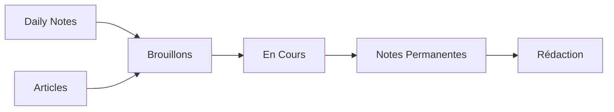
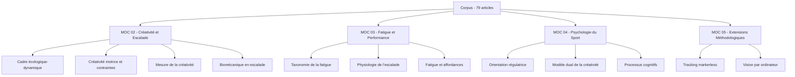

# 🗺️ MOC Principal - Carte de Navigation du Vault

> *Cette note sert de carte centrale pour naviguer dans l'ensemble de ton système de notes Obsidian.*

---

## 📚 Structure du Vault

### 🌱 NOTES COURANTES
*Espaces de travail pour les idées en développement*

- [[00 - Daily Notes|📅 Daily Notes]] - Notes quotidiennes et journal
- [[00 - Brouillons|✏️ Brouillons]] - Idées en cours de rédaction
- [[00 - En Cours|🔄 En Cours]] - Travaux en progression

### 💎 NOTES PERMANENTES
*Connaissances consolidées et synthétisées*

- [[00 - Liens entre les concepts|🔗 Liens entre les concepts]] - Connexions et relations
- [[00 - Rédaction|📝 Rédaction]] - Notes finalisées et polies

### 📖 RESSOURCES
*Matériel de référence et documentation*

- [[00 - ARTICLES|📄 Articles]] - Articles académiques et références bibliographiques
- [[00 - MOC|🗺️ MOCs]] - Autres cartes de contenu thématiques
- [[00 - Visualisation|📊 Visualisation]] - Graphiques et représentations visuelles
- Pièces Jointes - Fichiers médias et documents

### 📋 ORGANISATION
*Planification et gestion de projet*

- [[Organisation Articles première version]] - Structure des articles
- [[Etapes avant de se plonger dans la littérature]] - Méthodologie de recherche

### 🤝 RÉUNION
*Notes de réunions et rencontres*

- [[Réunion kick-off]] - Notes de démarrage de projet

---

## 🎯 Flux de Travail Recommandé

1. **Capture** → Daily Notes (idées quotidiennes)
2. **Développement** → Brouillons (exploration initiale)
3. **Raffinement** → En Cours (structuration)
4. **Consolidation** → Notes Permanentes (synthèse)
5. **Publication** → Rédaction (finalisation)

---

## 📊 Statistiques du Vault

- **Articles de recherche** : Voir [[00 - ARTICLES]]
- **MOCs thématiques** : Voir [[00 - MOC]]
- **Dernière mise à jour** : {{date}}

---

## 🔗 Liens Rapides

### Par Sujet
- [[01 - Overview|📑 Vue d'ensemble du projet]]
- [[Sources pertinentes|🔍 Sources pertinentes]]

### Par Type
- 📄 [[00 - ARTICLES|Base de données d'articles]]
- 🗺️ [[00 - MOC|Index des MOCs]]
- 📊 [[00 - Visualisation|Centre de visualisation]]

---

## 💡 Comment utiliser ce MOC

1. **Navigation** : Utilise les liens ci-dessus pour accéder rapidement aux différentes sections
2. **Contexte** : Consulte cette note pour comprendre l'organisation globale
3. **Mise à jour** : Ajoute de nouveaux liens au fur et à mesure que ton vault évolue
4. **Personnalisation** : Adapte les sections selon tes besoins

---

*Dernière révision : 2025-12-20*

---

## 🔬 MOCs Thématiques — État du corpus (mars 2026)

L'architecture théorique de l'étude repose sur cinq cartes de contenu thématiques, chacune structurant un pilier disciplinaire de la recherche. La classification systématique de l'ensemble des 79 articles du corpus a été achevée en mars 2026, garantissant une couverture exhaustive de la littérature mobilisée.

| MOC | Pilier disciplinaire | Articles indexés | Dernière mise à jour |
|-----|---------------------|-----------------|---------------------|
| [[01 - Overview]] | Vue d'ensemble et articulation des piliers | — | 2025-12 |
| [[02 - MOC Créativité et Escalade]] | Cadre écologique-dynamique, variabilité fonctionnelle, créativité motrice | ~45 | 2026-03 |
| [[03 - MOC Fatigue et Performance]] | Taxonomie de la fatigue, physiologie de l'escalade, affordances sous fatigue | ~30 | 2026-03 |
| [[04 - MOC Psychologie du Sport]] | Orientation régulatrice, modèle dual, processus cognitifs | ~25 | 2026-03 |
| [[05 - MOC Extensions Méthodologiques Post-Master]] | Analyse multi-segmentaire, vision par ordinateur, perspectives doctorales | ~10 | 2026-03 |

*Note : Les totaux excèdent 79 car plusieurs articles sont rattachés à deux ou trois MOC simultanément, reflétant la nature pluridisciplinaire de l'étude.*

### Couverture thématique par pilier

